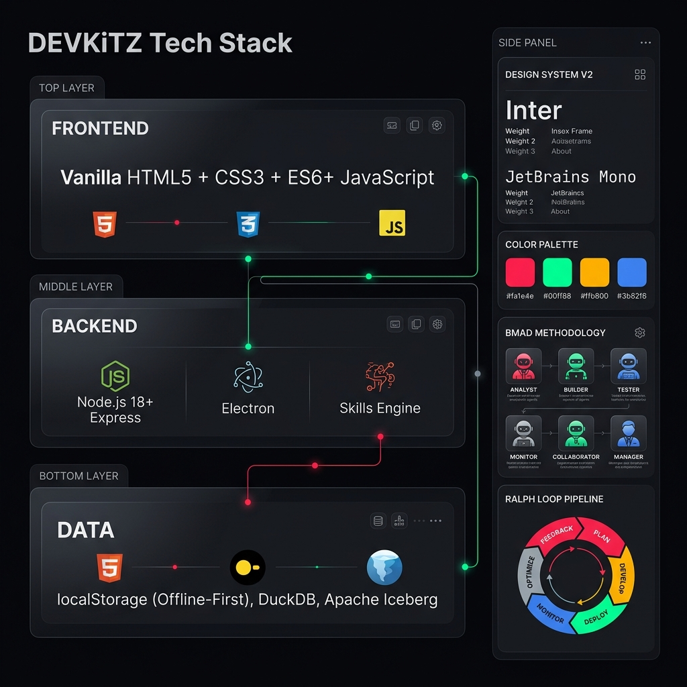
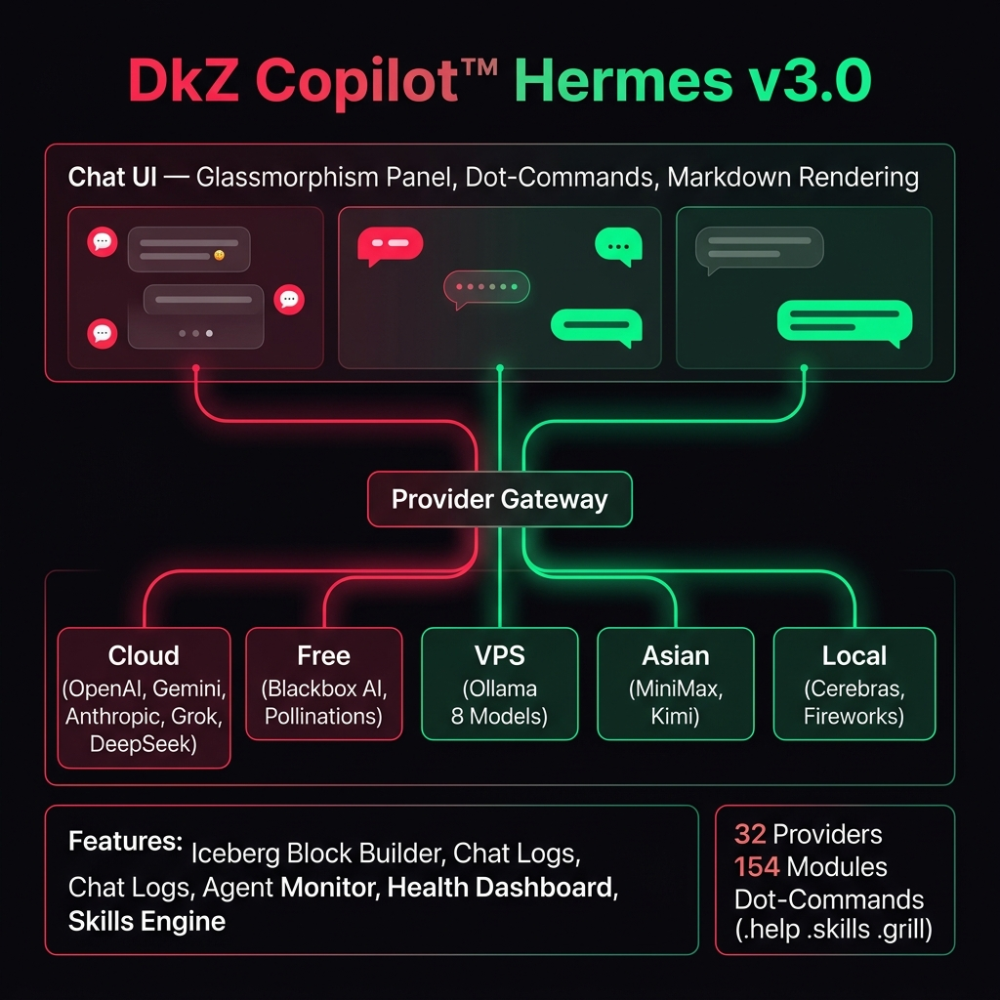
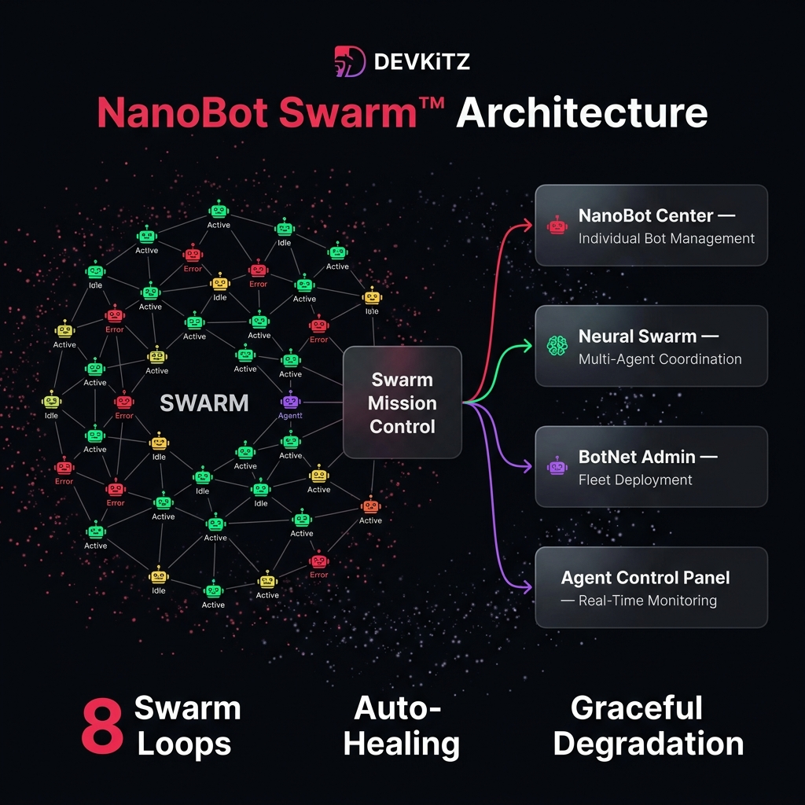
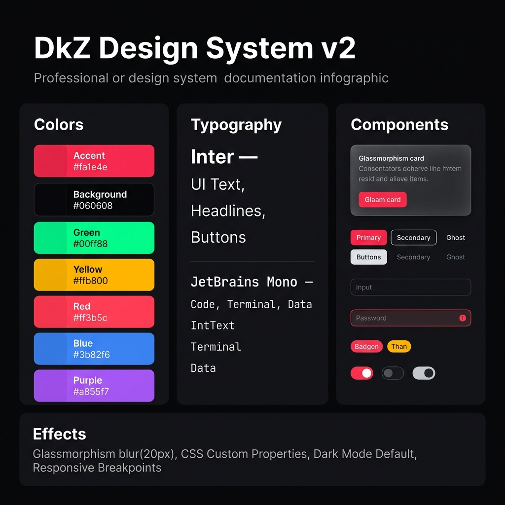
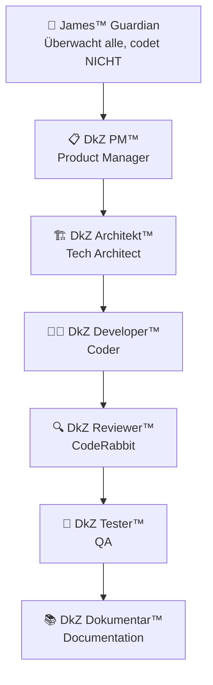
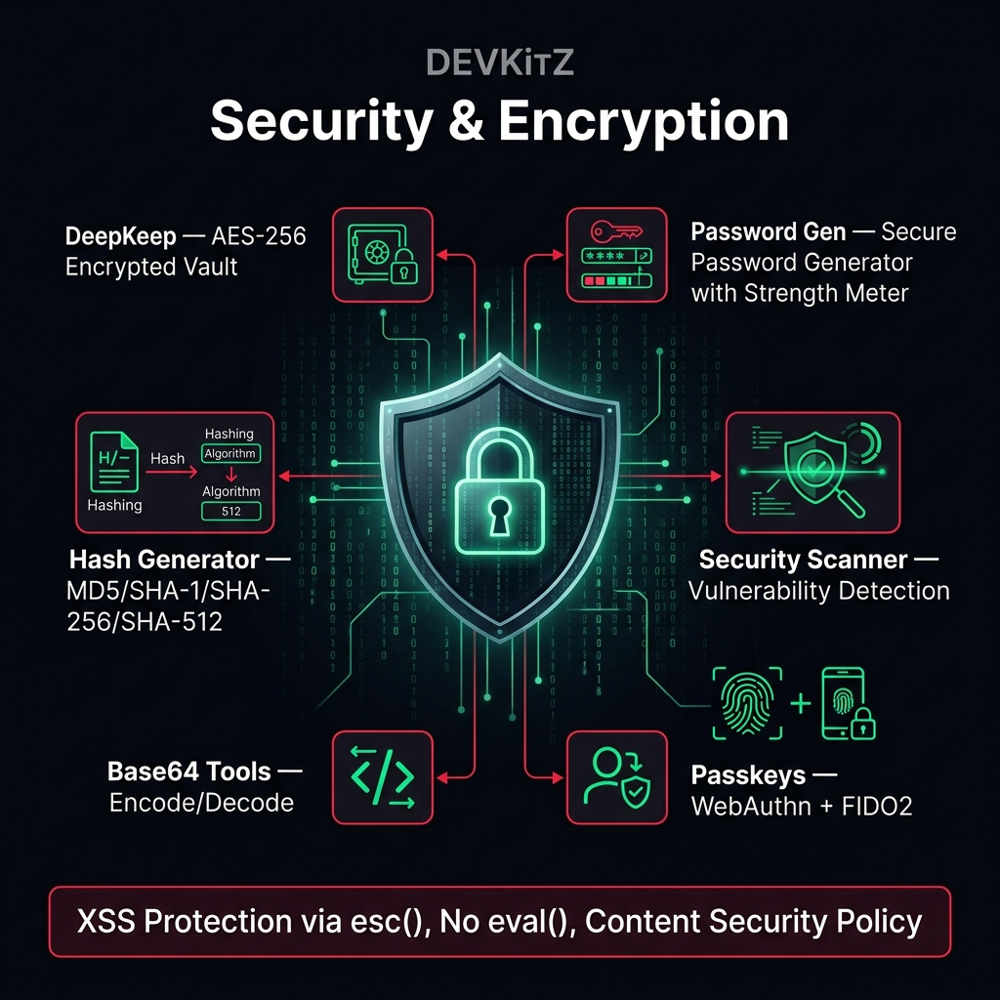

# 📖 DEVKiTZ™ Handbuch

> **Vollstaendiges Benutzer- und Entwicklerhandbuch**
> Version 2.0 · Stand: 2026-06-04

---

## 📋 Inhaltsverzeichnis

1. [Einführung](#einführung)
2. [Schnellstart](#schnellstart)
3. [Architektur](#architektur)
4. [DkZ Copilot™](#dkz-copilot)
5. [NanoBot Schwarm™](#nanobot-schwarm)
6. [Modul-Katalog](#modul-katalog)
7. [Design System v2](#design-system-v2)
8. [BMAD™ Methodik](#bmad-methodik)
9. [Ralph Loop™](#ralph-loop)
10. [Sicherheit](#sicherheit)
11. [API Referenz](#api-referenz)
12. [Troubleshooting](#troubleshooting)

---

## 1. Einführung

**DEVKiTZ™** ist ein vollstaendiges KI-Entwickler-Oekosystem mit **154+ Modulen**, **32 LLM Providern** und einem proprietaeren **Agent-Management-System** (BMAD™).

### Was ist DEVKiTZ™?

- 🏗️ **Ein modulares Dashboard** mit 154+ austauschbaren Modulen
- 🤖 **Ein Multi-LLM Copilot** mit 32 Providern (Cloud, Free, VPS, Local)
- 🐝 **Ein NanoBot-Schwarm** fuer autonome Agenten-Steuerung
- 🎨 **Ein Design System** mit Glassmorphism, Dark Mode, Custom Properties
- 📊 **Ein Wissens-Hub** mit Iceberg-Archiv und Dreifach-Verankerung

### Fuer wen?

| Rolle | Nutzen |
|:------|:-------|
| **Entwickler** | Schnell Module bauen, testen, deployen |
| **AI-Researcher** | 32 LLMs vergleichen, Prompt Engineering, Arena |
| **Designer** | Glassmorphism Components, Design Studio, Templates |
| **DevOps** | VPS Monitor, Docker Ops, Cron Builder, Webhooks |
| **Content Creator** | Blog Commander, Video Generator, Suno AI |

---

## 2. Schnellstart

### Voraussetzungen

| Software | Version | Zweck |
|:---------|:--------|:------|
| **Browser** | Chrome 120+ / Firefox 115+ | Dashboard |
| **Node.js** | 18+ | Backend, Skills Engine |
| **Git** | 2.40+ | Versionskontrolle |
| **VS Code / Cursor** | Latest | Editor (optional) |

### Installation

```bash
# 1. Repository klonen
git clone https://github.com/7IKED/devkitz-workspace.git
cd devkitz-workspace

# 2. Dashboard oeffnen (kein Build noetig!)
start 01_PROJECTS/01_dashboard/index.html

# 3. Optional: Command Center starten
cd dkz-center
npm install
npm start
```

> 💡 **Kein Framework noetig!** Das gesamte Dashboard ist reines Vanilla JS und laeuft direkt im Browser.

### Erster Start

1. **Dashboard oeffnen** → `index.html` im Browser
2. **Intro-Screen** → "Skip" oder durchschauen
3. **Module erkunden** → Sidebar Links oder Suchfeld
4. **Copilot nutzen** → Rechts unten: Chat-Panel oeffnen
5. **NanoBot** → Badge unten links

---

## 3. Architektur



### Schichten-Modell

```
┌─────────────────────────────────────────────┐
│  🌐 Frontend — Vanilla HTML5/CSS3/ES6+      │
│  ├── Dashboard (index.html)                  │
│  ├── 154+ Module (modules/[name]/)           │
│  └── Design System v2 (CSS Custom Props)     │
├─────────────────────────────────────────────┤
│  📦 Shared Scripts (69 Scripts)              │
│  ├── dkz-copilot.js    → Chat + LLM         │
│  ├── dkz-nanobot.js    → Schwarm-Badge       │
│  ├── dkz-james.js      → Guardian Agent      │
│  ├── dkz-navbar.js     → Navigation          │
│  ├── dkz-persist.js    → localStorage        │
│  ├── dkz-debug.js      → Debug Panel         │
│  └── dkz-guide.js      → Onboarding          │
├─────────────────────────────────────────────┤
│  ⚡ Backend — Node.js 18+ / Express          │
│  ├── dkz-center (CLI + Server)               │
│  ├── Skills Engine (4 Skills)                 │
│  └── ONTHERUN™ MCP Server                    │
├─────────────────────────────────────────────┤
│  💾 Data — Offline-First                     │
│  ├── localStorage (Browser)                  │
│  ├── DuckDB (Analytics)                      │
│  └── Apache Iceberg (Archiv)                 │
└─────────────────────────────────────────────┘
```

### Ordnerstruktur

```
C:\DEVKiTZ\
├── 01_PROJECTS\
│   ├── 01_dashboard\          # Haupt-Dashboard
│   │   ├── index.html         # Einstiegspunkt
│   │   ├── modules\           # 154+ Module
│   │   │   ├── ai_chat\
│   │   │   ├── copilot\
│   │   │   ├── ...
│   │   └── shared\            # 69 Shared Scripts
│   │       ├── dkz-copilot.js
│   │       ├── dkz-nanobot.js
│   │       └── ...
│   ├── dkz-chat\              # Standalone Chat App
│   ├── dkz-keep\              # Notes App
│   └── dkz-files\             # File Manager
├── dkz-center\                # Command Center CLI
├── .agents\                   # BMAD Agent Config
├── 04_SYSTEM\                 # System-Dateien
│   └── DEVKITZ_WIKI\          # Wiki
├── 99_ARCHIVE\                # Archiv (nie loeschen!)
├── CLAUDE.md                  # Agent-Regeln
├── GEMINI.md                  # Agent-Gedaechtnis
└── REGELWERK.md               # Projekt-Regelwerk
```

---

## 4. DkZ Copilot™



### Ueberblick

Der **DkZ Copilot™ Hermes v3.0** ist ein Multi-LLM Chat-Assistent mit 32 Providern, integriert in jedes Modul.

### Provider

| Kategorie | Provider | Modelle |
|:----------|:---------|:--------|
| ☁️ Cloud | OpenAI | GPT-4o, GPT-4o-mini |
| ☁️ Cloud | Anthropic | Claude 3.5 Sonnet |
| ☁️ Cloud | Google | Gemini 1.5 Pro, Flash |
| ☁️ Cloud | xAI | Grok-4.3 |
| ☁️ Cloud | DeepSeek | DeepSeek V3, Coder |
| 🆓 Free | Blackbox AI | Blackbox (unbegrenzt) |
| 🆓 Free | Pollinations | Diverse Modelle |
| 🆓 Free | MiniMax | MiniMax Free |
| 🆓 Free | Kimi | Moonshot Free |
| 🖥️ VPS | Ollama | Qwen3 4B/14B/32B, Gemma3 4B |
| ⚡ Local | Cerebras | Ultra-Fast Inference |
| ⚡ Local | Fireworks | Serverless |

### Dot-Commands

```
.help          → Alle Befehle anzeigen
.skills        → Verfuegbare Skills auflisten
.grill         → Grill-Modus (Qualitaetspruefung)
.grill-me      → Interaktives Interview
.clear         → Chat leeren
.model [name]  → Provider wechseln
.export        → Chat als JSON exportieren
.iceberg       → Prompt Block Builder oeffnen
```

### Integration in Module

Jedes Modul bindet den Copilot ein:

```html
<!-- Am Ende jeder index.html -->
<script src="../../shared/dkz-copilot.js"></script>
<script src="../../shared/dkz-nanobot.js"></script>
<script src="../../shared/dkz-navbar.js"></script>
```

---

## 5. NanoBot Schwarm™



### Konzept

Der **NanoBot Schwarm** ist ein dezentrales Multi-Agent-System. Jeder Bot ist ein autonomer Agent mit spezifischer Aufgabe.

### Komponenten

| Modul | Funktion |
|:------|:---------|
| **NanoBot Center** | Zentrale Bot-Verwaltung |
| **Neural Swarm** | Multi-Agent-Koordination |
| **BotNet Admin** | Fleet-Deployment |
| **Agent Control Panel** | Echtzeit-Monitoring |
| **Swarm Mission Control** | Task-Verteilung |
| **Supervisor Panel** | Agent-Aufsicht |

### Bot-Status

```
🟢 Gruen  = Aktiv (Bot arbeitet)
🟡 Gelb   = Idle (wartet auf Task)
🔴 Rot    = Fehler (Restart noetig)
⚫ Grau   = Offline
```

### 8 Loops

| Loop | Intervall | Funktion |
|:-----|:----------|:---------|
| Ralph Loop | On-Demand | Task-Execution Pipeline |
| Copilot Suggest | 30s | Proaktive Vorschlaege |
| Auto-Save | 60s | localStorage Persistence |
| Backup | 5min | Git Auto-Commit |
| Health | 2min | Service Health Check |
| Update | 10min | Module Update Check |
| Triage | On-Event | Issue Priorisierung |
| Dual-Agent | On-Demand | 2-Agenten Verifikation |

---

## 6. Modul-Katalog

### 🏗️ Builder & Tools (28 Module)

| Modul | Beschreibung | Highlights |
|:------|:-------------|:-----------|
| **Action Builder** | Visuelle Workflow-Erstellung | Drag & Drop, JSON Export |
| **Agent Builder** | Multi-LLM Agent-Konfiguration | Deploy, Monitor, Test |
| **App Builder** | Rapid App Scaffolding | Templates, Live Preview |
| **AppScript Builder** | Google Apps Script IDE | OAuth, Drive Integration |
| **Black8 Builder** | Dark Theme UI Builder | Minimal Design, Components |
| **Blog Commander** | CMS Dashboard | Markdown Editor, Publish |
| **Blog Designer** | Theme Builder | Live Preview, Export |
| **Changelog Builder** | Auto Release Notes | Git Log Parser |
| **Cron Builder** | Visueller Cron Editor | Schedule Preview, Syntax |
| **CSS Generator** | Visual CSS Properties | Live Preview, Copy |
| **Flash UI** | Rapid Prototyping | Component Library |
| **Hood Builder** | Community Pages | Templates, Social |
| **Leadership Builder** | OKR & Goals | KPI Tracking |
| **Nexuz Builder** | Advanced Builder | Plugin System |
| **NLM Builder** | NotebookLM Integration | Sources, Audio |
| **Pattern Hub** | Design Patterns | Component Library |
| **Skill Builder** | Agent Skills Generator | SKILL.md, Config |
| **Team Builder** | Team Management | Rollen, Skills |
| **Template Hub** | Template Library | Categories, Preview |
| **Tenor Builder** | Media Builder | GIF, Animation |
| **Workflow Builder** | Process Designer | Automation |

### 🤖 AI & Chat (24 Module)

| Modul | Beschreibung | Highlights |
|:------|:-------------|:-----------|
| **AI Chat** | Multi-Provider Chat | History, Export |
| **Copilot** | Haupt-Chat-Assistent | 32 Provider, Dot-Commands |
| **Free AI Hub** | 19+ kostenlose APIs | Kein API-Key noetig |
| **Grok Chat** | xAI Grok Integration | Reasoning Mode |
| **LLM Arena** | Side-by-Side LLM Test | A/B Vergleich |
| **Hermes 3D** | Three.js Brain Viz | 3D Gehirn-Ansicht |
| **Whisper TTS** | OpenAI Whisper STT | Multi-Language |
| **Suno AI** | Musik-Generation | AI Musik, Export |

### 🛠️ Utilities (35 Module)

| Modul | Beschreibung | Highlights |
|:------|:-------------|:-----------|
| **JSON Formatter** | Pretty Print + Validate | Minify, Tree View |
| **Regex Tester** | Pattern Testing | Match Preview, Flags |
| **QR Generator** | Custom QR Codes | Logo, Farben, SVG |
| **Color Picker** | HSL/RGB/HEX Picker | Palette Generator |
| **Code Differ** | Side-by-Side Diff | Syntax Highlighting |
| **Base64 Tools** | Encode/Decode | Image Preview |
| **Hash Generator** | MD5/SHA/SHA-256 | File Hash |
| **SEO Toolkit** | Meta Analysis | Performance Score |

### 🎨 Design & Media (18 Module)

| Modul | Beschreibung | Highlights |
|:------|:-------------|:-----------|
| **Design Studio** | Visual Builder | Live CSS Editor |
| **Hyperreal Canvas** | Interactive Art | WebGL + Canvas |
| **Image Forge** | AI Bild-Generation | Multi-Provider |
| **Video Generator** | Video Creation | Export Tools |
| **OBS FX Overlay** | Stream Overlays | Real-Time FX |
| **Icon Creator** | SVG Designer | Custom Icon Sets |

### 📊 Data & Research (22 Module)

| Modul | Beschreibung | Highlights |
|:------|:-------------|:-----------|
| **WissenHub** | Zentrales Wissen | Search, Filter, Tags |
| **Iceberg** | Prompt Block Builder | AI Catalog, Archive |
| **Second Brain** | Obsidian Vault | Agent Memory |
| **Graphify** | Knowledge Graph | D3.js Force Layout |
| **DeepKeep** | Encrypted Vault | AES-256 |
| **Kanban Board** | Task Management | Drag & Drop |

### ⚙️ System (19 Module)

| Modul | Beschreibung | Highlights |
|:------|:-------------|:-----------|
| **Cloud Control** | VPS Dashboard | Multi-Provider |
| **Docker Ops** | Container Management | Start/Stop/Logs |
| **Domain Control** | 49+ Domains | DNS + SSL |
| **VPS Monitor** | Server Health | Resource Usage |
| **Loop Dashboard** | Ralph Loop Tracker | Phase Tracking |

---

## 7. Design System v2



### Farben

```css
:root {
    --accent: #fa1e4e;       /* Primaer-Akzent */
    --bg: #060608;           /* Hintergrund */
    --bg-card: #0d0d12;      /* Card Background */
    --bg-hover: #1a1a2e;     /* Hover State */
    --green: #00ff88;        /* Erfolg, Aktiv */
    --yellow: #ffb800;       /* Warnung */
    --red: #ff3b5c;          /* Fehler */
    --blue: #3b82f6;         /* Info, Links */
    --purple: #a855f7;       /* Sekundaer */
    --text: #e0e0e0;         /* Standard Text */
    --text-muted: #888;      /* Gedaempfter Text */
    --border: rgba(255,255,255,0.06);
}
```

### Glassmorphism

```css
.glass-card {
    background: rgba(13, 13, 18, 0.8);
    backdrop-filter: blur(20px);
    -webkit-backdrop-filter: blur(20px);
    border: 1px solid rgba(255, 255, 255, 0.06);
    border-radius: 16px;
    box-shadow: 0 8px 32px rgba(0, 0, 0, 0.4);
}
```

### Typografie

| Font | Einsatz | Gewichte |
|:-----|:--------|:---------|
| **Inter** | UI Text, Headlines, Buttons | 400, 500, 600, 700 |
| **JetBrains Mono** | Code, Terminal, Daten | 400, 500 |

```css
@import url('https://fonts.googleapis.com/css2?family=Inter:wght@400;500;600;700&family=JetBrains+Mono:wght@400;500&display=swap');

body { font-family: 'Inter', sans-serif; }
code, pre, .mono { font-family: 'JetBrains Mono', monospace; }
```

### Button-Styles

```css
/* Primaer */
.btn-primary {
    background: var(--accent);
    color: white;
    border: none;
    border-radius: 8px;
    padding: 10px 20px;
    font-weight: 600;
    transition: all 0.3s ease;
}
.btn-primary:hover {
    transform: translateY(-2px);
    box-shadow: 0 4px 20px rgba(250, 30, 78, 0.4);
}

/* Ghost */
.btn-ghost {
    background: transparent;
    color: var(--text);
    border: 1px solid var(--border);
}
.btn-ghost:hover {
    background: var(--bg-hover);
    border-color: var(--accent);
}
```

---

## 8. BMAD™ Methodik

### 7 Agenten



| Agent | Rolle | Input | Output |
|:------|:------|:------|:-------|
| 🎯 **James™** | Guardian | Alles | Entscheidungen, Routing |
| 📋 **PM™** | Product Manager | User Stories | spec.md, PRD |
| 🏗️ **Architekt™** | Tech Architect | spec.md | plan.md, Architektur |
| 👨‍💻 **Developer™** | Coder | plan.md | Code, Features |
| 🔍 **Reviewer™** | CodeRabbit | Code | Review, Feedback |
| 🧪 **Tester™** | QA | Code | Tests, Bugs |
| 📚 **Dokumentar™** | Docs | Alles | README, Wiki, Learnings |

---

## 9. Ralph Loop™

### 6 Phasen

```
 ┌──────────────────────────────────────┐
 │         🔄 RALPH LOOP™              │
 │                                      │
 │  1. LESEN    → PRD + Constitution    │
 │  2. SPAWN    → Frischer Kontext      │
 │  3. EXECUTE  → Developer™ codet     │
 │  4. VERIFY   → Tester™ prueft       │
 │  5. COMMIT   → Git + PRD Update      │
 │  6. LOOP     → Naechster Task        │
 │                                      │
 │  Kernprinzip: Jeder Task bekommt     │
 │  frischen Kontext — kein Drift!      │
 └──────────────────────────────────────┘
```

---

## 10. Sicherheit



### Eiserne Regeln

1. **`esc()`** bei JEDEM User-Input vor `innerHTML` — XSS-Schutz
2. **Kein `eval()`** — NIEMALS
3. **Kein `innerHTML` ohne Sanitierung**
4. **Content Security Policy** in allen HTML-Dateien
5. **HTTPS** fuer alle externen API-Calls
6. **API-Keys** nie im Frontend — immer ueber Backend Proxy
7. **localStorage** fuer sensible Daten verschluesseln

### esc() Funktion

```javascript
// PFLICHT bei jedem User-Input!
function esc(str) {
    const div = document.createElement('div');
    div.textContent = str;
    return div.innerHTML;
}

// Verwendung:
element.innerHTML = `<span>${esc(userInput)}</span>`;
```

---

## 11. API Referenz

### Shared Scripts API

#### dkz-copilot.js

```javascript
// Provider wechseln
DkZCopilot.setProvider('gpt-4o-mini');

// Nachricht senden
DkZCopilot.send('Erklaere mir XYZ');

// Chat exportieren
DkZCopilot.exportChat('json');

// Modul-Registry
DkZCopilot.getModules();        // Alle 154 Module
DkZCopilot.getModule('ai_chat'); // Einzelnes Modul
```

#### dkz-nanobot.js

```javascript
// NanoBot Status
NanoBot.getStatus();     // { active: 5, idle: 2, error: 0 }
NanoBot.deploy('task-1'); // Bot deployen
NanoBot.recall('bot-3');  // Bot zurueckrufen
```

#### dkz-persist.js

```javascript
// localStorage Wrapper
DkZPersist.save('key', { data: 'value' });
DkZPersist.load('key');     // { data: 'value' }
DkZPersist.remove('key');
DkZPersist.clear();
```

---

## 12. Troubleshooting

### Haeufige Probleme

| Problem | Loesung |
|:--------|:--------|
| **Module laden nicht** | Browser-Cache leeren (Ctrl+Shift+R) |
| **Copilot antwortet nicht** | Provider prüfen: `.model` Command |
| **NanoBot zeigt 🔴** | Service neustarten, Health-Tab pruefen |
| **Git Push scheitert** | `git config http.postBuffer 524288000` |
| **Drive-Uploads haengen** | Drive neustarten, Cache bereinigen |
| **Fonts laden nicht** | Internet-Verbindung pruefen (Google Fonts) |

### Debug-Modus

```javascript
// Debug Panel aktivieren
localStorage.setItem('DKZ_DEBUG', 'true');
// Seite neu laden → Debug-Panel erscheint

// Oder ueber Konsole:
DkZDebug.enable();
DkZDebug.log('test', { data: 'value' });
```

---

*DEVKiTZ™ Handbuch v2.0 · Generiert am 2026-06-04*
*© 777 · github.com/7IKED/devkitz-workspace*
