# 🚀 DEVKiTZ™ — Ecosystem Präsentation

> **154+ Module · 32 LLM Provider · 7 Agent-Methodik · Glassmorphism Design System v2**

---

## 📊 Ecosystem Übersicht

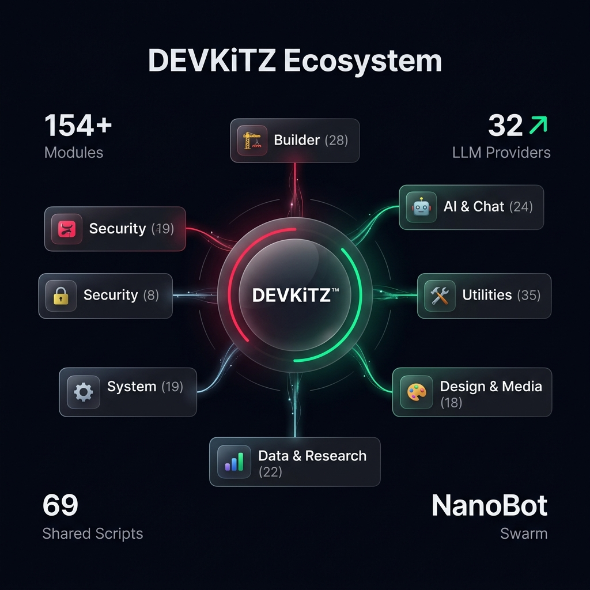

---

## 🧠 Ecosystem Mindmap

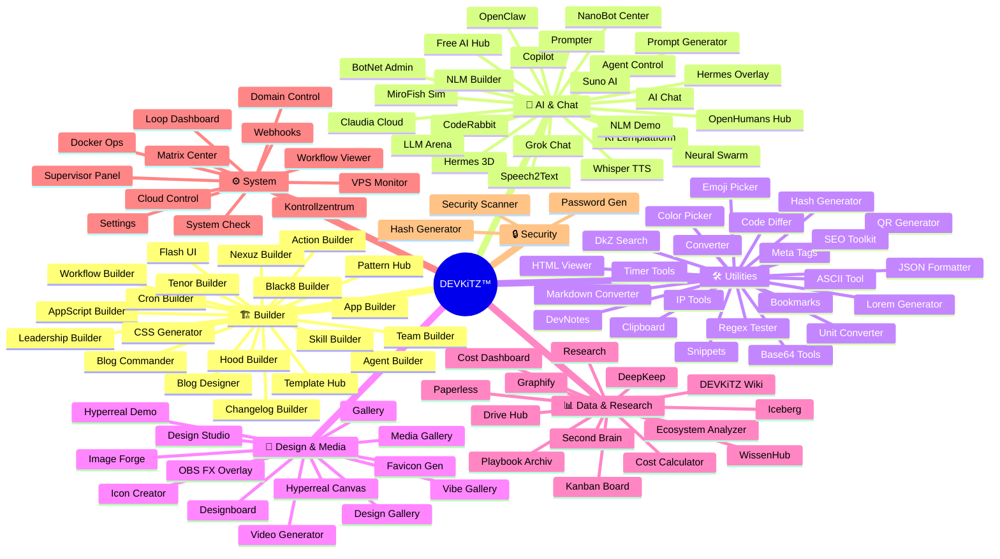

---

## 🤖 AI & Chat Module (24)

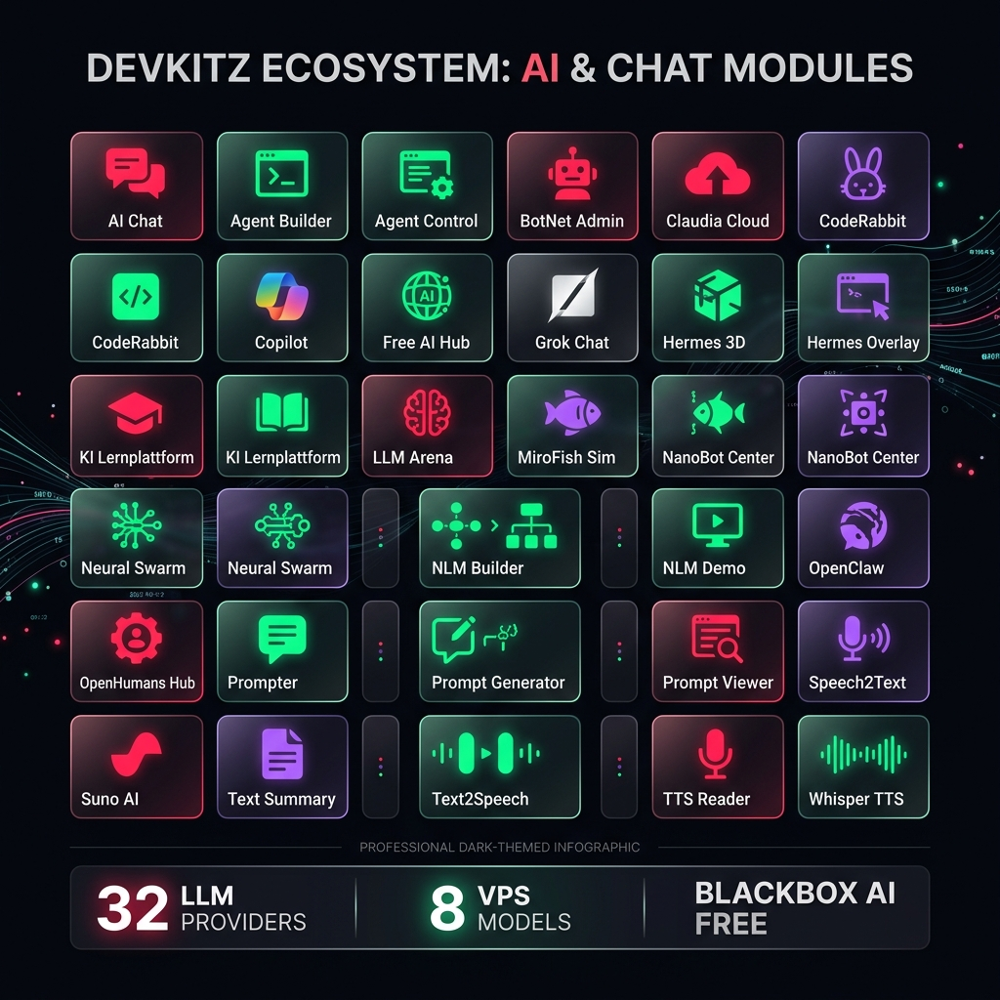

### LLM Provider Architektur

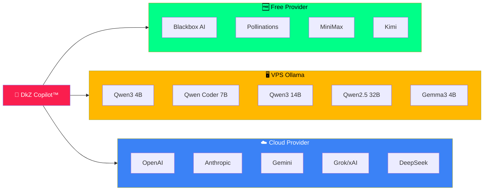

---

## 🏗️ Builder Module (28)

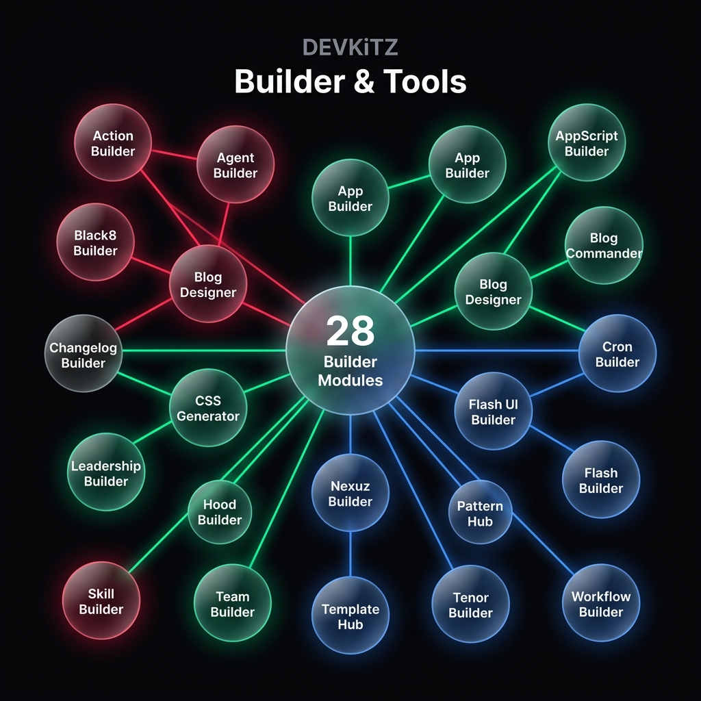

---

## 🛠️ Utilities (35)

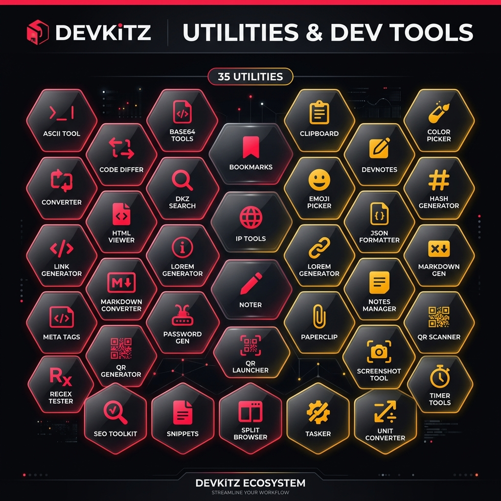

---

## 📊 Data & ⚙️ System

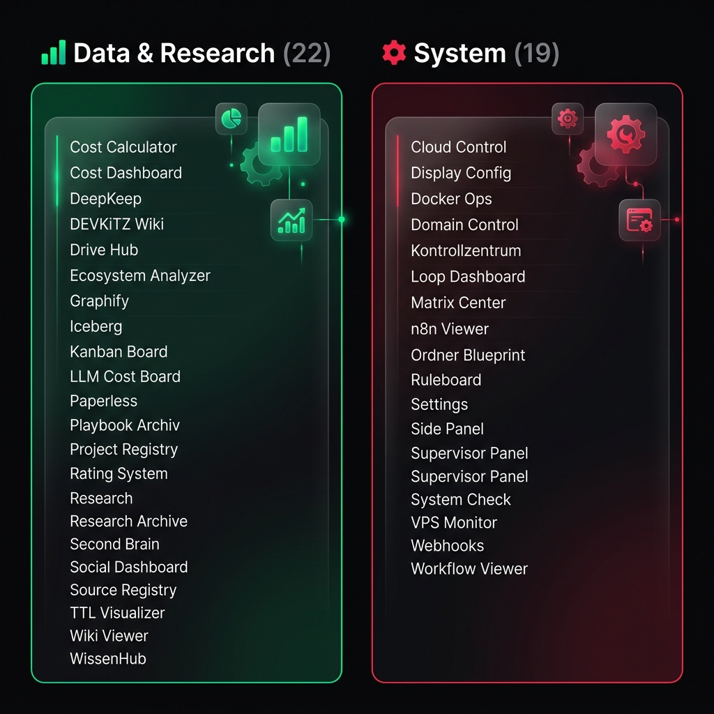

---

## 🎨 Design & Media (18)

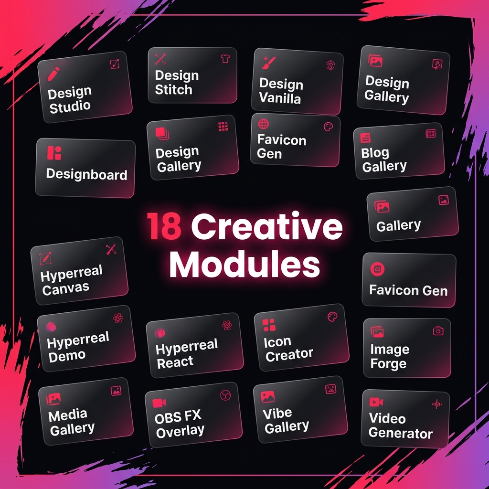

---

## 🏗️ Tech Stack

### Architektur-Schichten

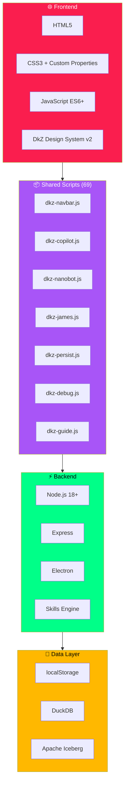

---

## 🔄 Ralph Loop™ Pipeline

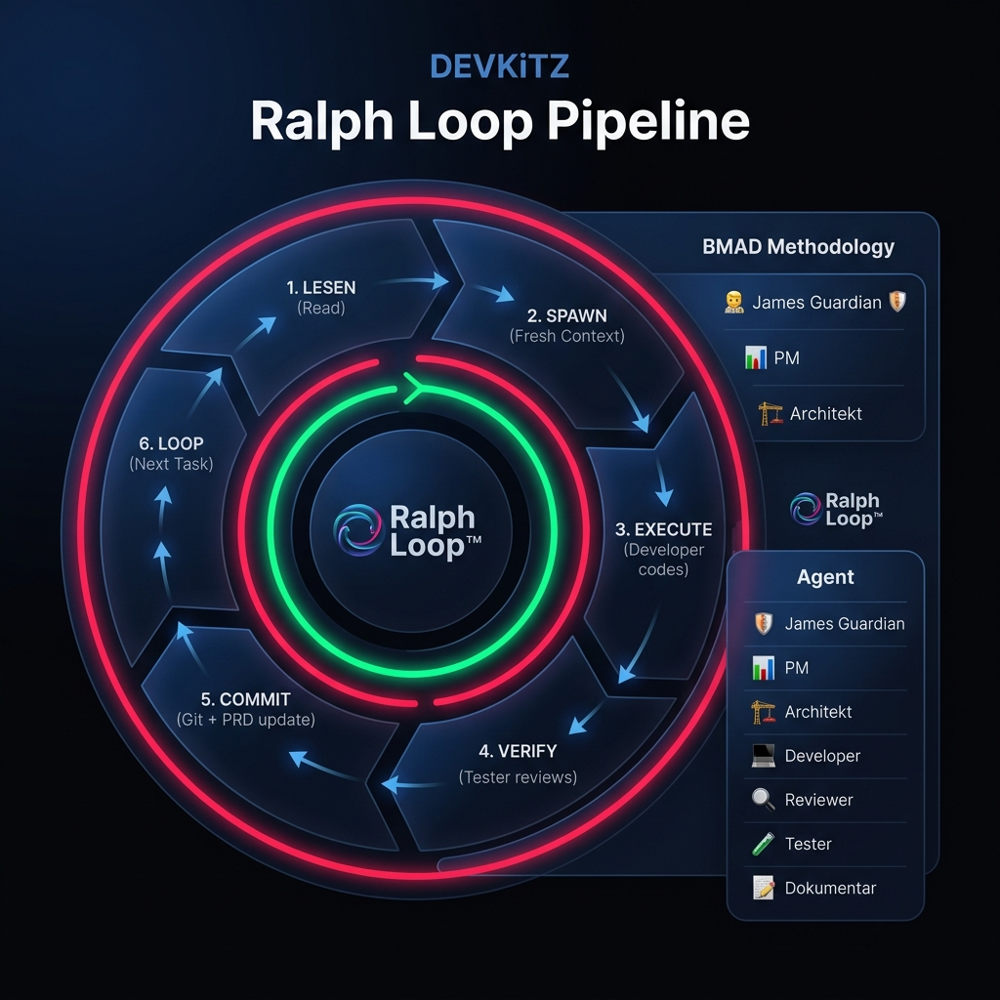

### 6 Phasen

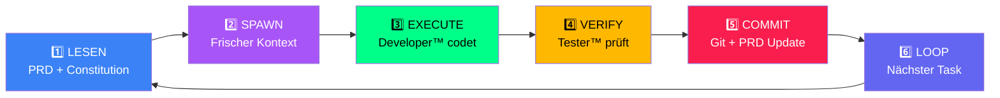

---

## 🤖 BMAD™ Methodik — 7 Agenten

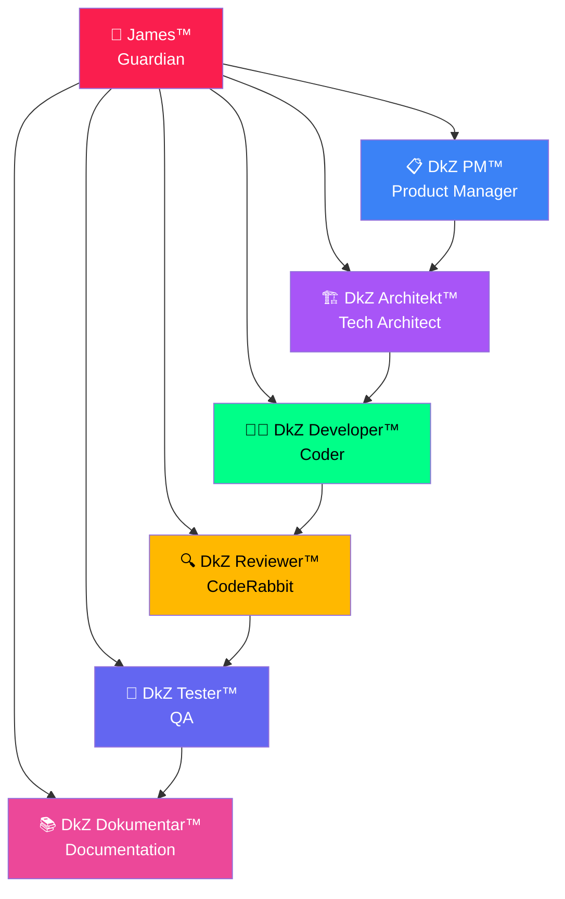

---

## 📈 Ecosystem Metriken

| Metrik | Wert |
|:-------|:-----|
| 📦 Module | **154+** |
| 🔗 GitHub Repos | **176** |
| 🤖 LLM Provider | **32** |
| 📜 Shared Scripts | **69** |
| 🧠 AI Agenten | **7 (BMAD)** |
| 🔄 Pipeline Phasen | **6 (Ralph Loop)** |
| 🎨 Design System | **v2** |
| 📝 Conversations | **76+** |
| 📸 Screenshots | **3.608+** |
| 📁 Total Files | **7.708+** |

---

## 🔗 Links

- **GitHub:** [github.com/7IKED/devkitz-workspace](https://github.com/7IKED/devkitz-workspace)
- **Dashboard:** `C:\DEVKiTZ\01_PROJECTS\01_dashboard\`
- **Command Center:** [dkz-command-center](https://github.com/7IKED/dkz-command-center)

---

*Generiert am 2026-06-04 · DEVKiTZ™ NLM Builder*
