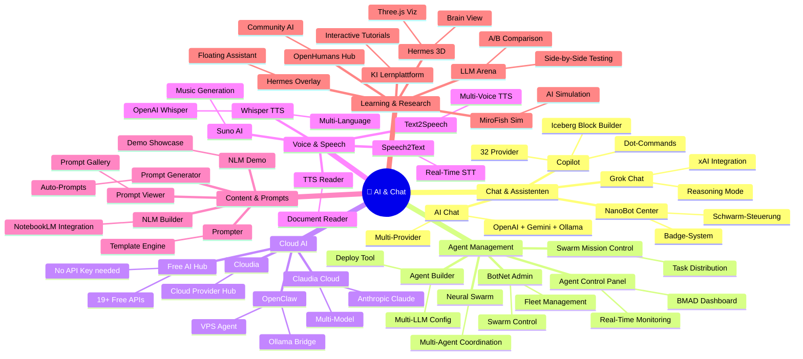
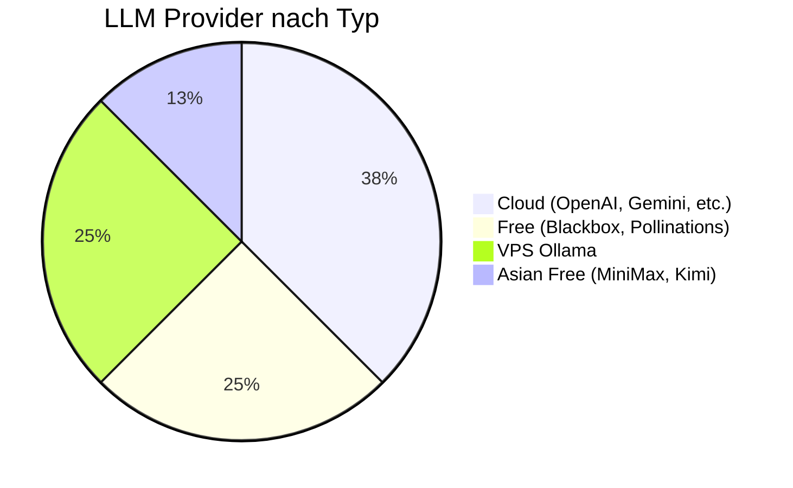
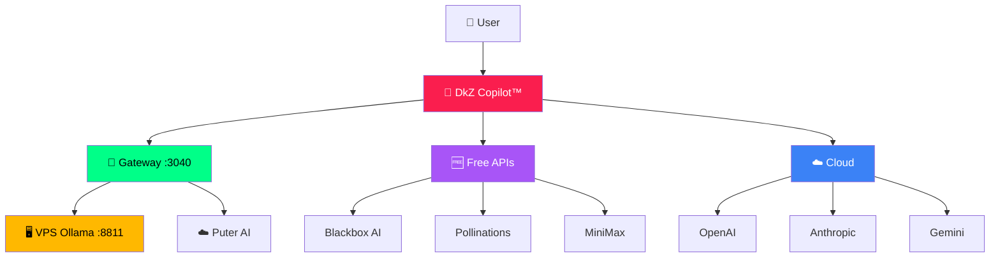

# 🤖 AI & Chat Module — Mindmap

> 24 Module · 32 LLM Provider · DEVKiTZ™ Ecosystem

---

```mermaid
mindmap
  root((🤖 AI & Chat))
    Chat & Assistenten
      AI Chat
        Multi-Provider
        OpenAI + Gemini + Ollama
      Copilot
        32 Provider
        Dot-Commands
        Iceberg Block Builder
      NanoBot Center
        Schwarm-Steuerung
        Badge-System
      Grok Chat
        xAI Integration
        Reasoning Mode
    Agent Management
      Agent Builder
        Multi-LLM Config
        Deploy Tool
      Agent Control Panel
        Real-Time Monitoring
        BMAD Dashboard
      BotNet Admin
        Fleet Management
        Swarm Control
      Neural Swarm
        Multi-Agent Coordination
      Swarm Mission Control
        Task Distribution
    Cloud AI
      Claudia Cloud
        Anthropic Claude
        Multi-Model
      Cloudia
        Cloud Provider Hub
      Free AI Hub
        19+ Free APIs
        No API Key needed
      OpenClaw
        VPS Agent
        Ollama Bridge
    Voice & Speech
      Whisper TTS
        OpenAI Whisper
        Multi-Language
      Speech2Text
        Real-Time STT
      Text2Speech
        Multi-Voice TTS
      TTS Reader
        Document Reader
      Suno AI
        Music Generation
    Content & Prompts
      Prompter
        Template Engine
      Prompt Generator
        Auto-Prompts
      Prompt Viewer
        Prompt Gallery
      NLM Builder
        NotebookLM Integration
      NLM Demo
        Demo Showcase
    Learning & Research
      KI Lernplattform
        Interactive Tutorials
      LLM Arena
        Side-by-Side Testing
        A/B Comparison
      MiroFish Sim
        AI Simulation
      OpenHumans Hub
        Community AI
      Hermes 3D
        Three.js Viz
        Brain View
      Hermes Overlay
        Floating Assistant
```

---

## Provider-Verteilung

```mermaid
pie title LLM Provider nach Typ
    "Cloud (OpenAI, Gemini, etc.)" : 12
    "Free (Blackbox, Pollinations)" : 8
    "VPS Ollama" : 8
    "Asian Free (MiniMax, Kimi)" : 4
```

---

## Architektur

```mermaid
flowchart TB
    USER["👤 User"] --> COP["🤖 DkZ Copilot™"]
    COP --> GATE["🚪 Gateway :3040"]
    GATE --> VPS["🖥️ VPS Ollama :8811"]
    GATE --> PUTER["☁️ Puter AI"]
    COP --> FREE["🆓 Free APIs"]
    FREE --> BB["Blackbox AI"]
    FREE --> POL["Pollinations"]
    FREE --> MM["MiniMax"]
    COP --> CLOUD["☁️ Cloud"]
    CLOUD --> OAI["OpenAI"]
    CLOUD --> ANT["Anthropic"]
    CLOUD --> GEM["Gemini"]
    style COP fill:#fa1e4e,color:#fff
    style GATE fill:#00ff88,color:#000
    style VPS fill:#ffb800,color:#000
    style FREE fill:#a855f7,color:#fff
    style CLOUD fill:#3b82f6,color:#fff
```
