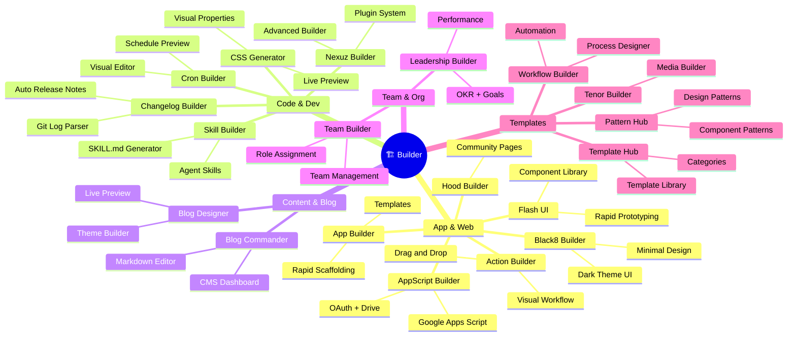
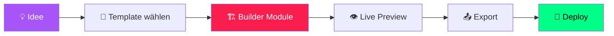

# 🏗️ Builder Module — Mindmap

> 28 Module · Rapid Development Tools · DEVKiTZ™ Ecosystem

---

```mermaid
mindmap
  root((🏗️ Builder))
    App & Web
      Action Builder
        Visual Workflow
        Drag and Drop
      App Builder
        Rapid Scaffolding
        Templates
      AppScript Builder
        Google Apps Script
        OAuth + Drive
      Flash UI
        Rapid Prototyping
        Component Library
      Hood Builder
        Community Pages
      Black8 Builder
        Dark Theme UI
        Minimal Design
    Code & Dev
      CSS Generator
        Visual Properties
        Live Preview
      Changelog Builder
        Auto Release Notes
        Git Log Parser
      Cron Builder
        Visual Editor
        Schedule Preview
      Skill Builder
        Agent Skills
        SKILL.md Generator
      Nexuz Builder
        Advanced Builder
        Plugin System
    Content & Blog
      Blog Commander
        CMS Dashboard
        Markdown Editor
      Blog Designer
        Theme Builder
        Live Preview
    Team & Org
      Team Builder
        Team Management
        Role Assignment
      Leadership Builder
        OKR + Goals
        Performance
    Templates
      Template Hub
        Template Library
        Categories
      Pattern Hub
        Design Patterns
        Component Patterns
      Workflow Builder
        Process Designer
        Automation
      Tenor Builder
        Media Builder
```

---

## Builder Pipeline

```mermaid
flowchart LR
    IDEA["💡 Idee"] --> TEMPLATE["📄 Template wählen"]
    TEMPLATE --> BUILDER["🏗️ Builder Module"]
    BUILDER --> PREVIEW["👁️ Live Preview"]
    PREVIEW --> EXPORT["📤 Export"]
    EXPORT --> DEPLOY["🚀 Deploy"]
    style IDEA fill:#a855f7,color:#fff
    style BUILDER fill:#fa1e4e,color:#fff
    style DEPLOY fill:#00ff88,color:#000
```
