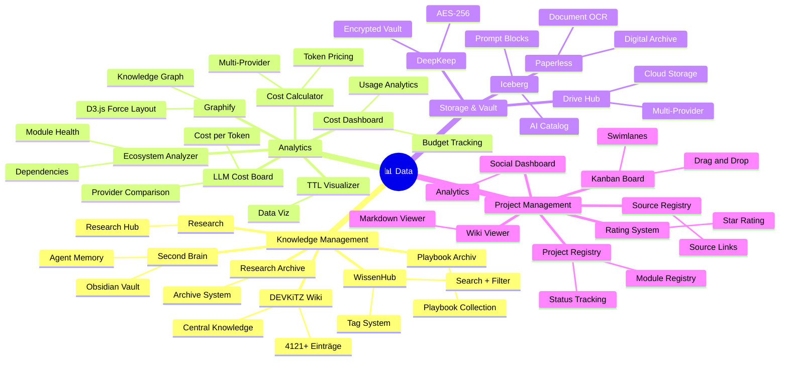
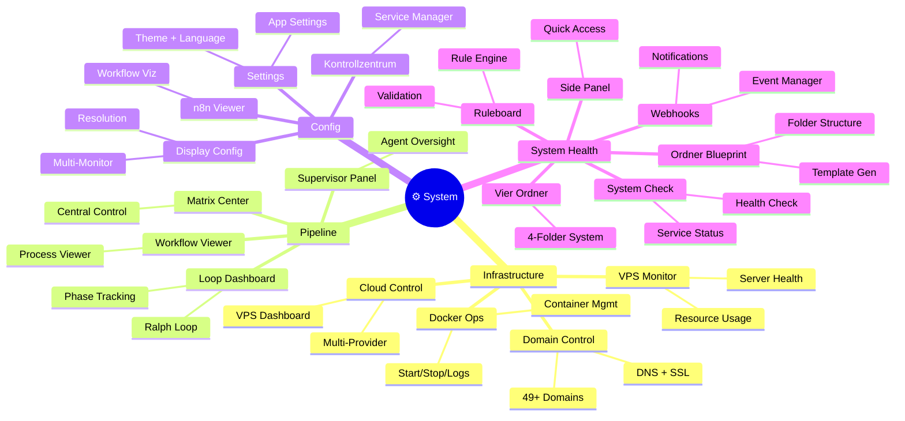
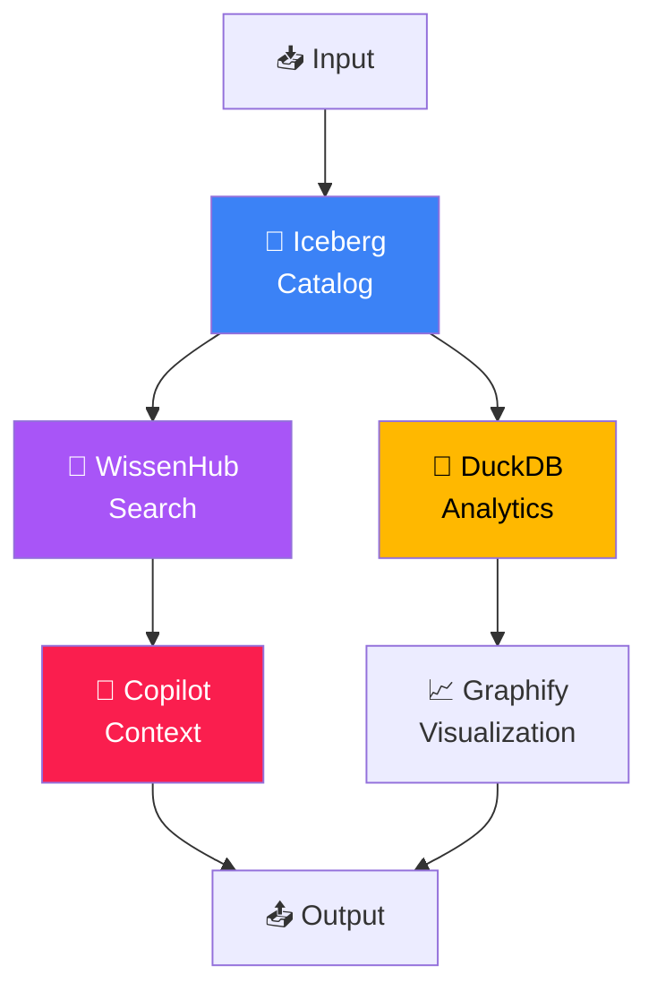

# 📊 Data & Research + ⚙️ System — Mindmap

> 41 Module · Knowledge & Infrastructure · DEVKiTZ™ Ecosystem

---

## 📊 Data & Research (22)

```mermaid
mindmap
  root((📊 Data))
    Knowledge Management
      WissenHub
        Search + Filter
        Tag System
      DEVKiTZ Wiki
        Central Knowledge
        4121+ Einträge
      Second Brain
        Obsidian Vault
        Agent Memory
      Research
        Research Hub
      Research Archive
        Archive System
      Playbook Archiv
        Playbook Collection
    Analytics
      Cost Calculator
        Token Pricing
        Multi-Provider
      Cost Dashboard
        Usage Analytics
        Budget Tracking
      LLM Cost Board
        Provider Comparison
        Cost per Token
      Graphify
        Knowledge Graph
        D3.js Force Layout
      TTL Visualizer
        Data Viz
      Ecosystem Analyzer
        Module Health
        Dependencies
    Storage & Vault
      Iceberg
        Prompt Blocks
        AI Catalog
      DeepKeep
        Encrypted Vault
        AES-256
      Drive Hub
        Cloud Storage
        Multi-Provider
      Paperless
        Document OCR
        Digital Archive
    Project Management
      Kanban Board
        Drag and Drop
        Swimlanes
      Project Registry
        Module Registry
        Status Tracking
      Source Registry
        Source Links
      Social Dashboard
        Analytics
      Rating System
        Star Rating
      Wiki Viewer
        Markdown Viewer
```

---

## ⚙️ System (19)

```mermaid
mindmap
  root((⚙️ System))
    Infrastructure
      Cloud Control
        VPS Dashboard
        Multi-Provider
      Docker Ops
        Container Mgmt
        Start/Stop/Logs
      Domain Control
        49+ Domains
        DNS + SSL
      VPS Monitor
        Server Health
        Resource Usage
    Pipeline
      Loop Dashboard
        Ralph Loop
        Phase Tracking
      Workflow Viewer
        Process Viewer
      Supervisor Panel
        Agent Oversight
      Matrix Center
        Central Control
    Config
      Settings
        App Settings
        Theme + Language
      Display Config
        Multi-Monitor
        Resolution
      Kontrollzentrum
        Service Manager
      n8n Viewer
        Workflow Viz
    System Health
      System Check
        Health Check
        Service Status
      Webhooks
        Event Manager
        Notifications
      Ruleboard
        Rule Engine
        Validation
      Side Panel
        Quick Access
      Ordner Blueprint
        Folder Structure
        Template Gen
      Vier Ordner
        4-Folder System
```

---

## Data Flow

```mermaid
flowchart TB
    INPUT["📥 Input"] --> ICEBERG["🧊 Iceberg<br/>Catalog"]
    ICEBERG --> WISSEN["🧠 WissenHub<br/>Search"]
    ICEBERG --> DUCK["🦆 DuckDB<br/>Analytics"]
    WISSEN --> COPILOT["🤖 Copilot<br/>Context"]
    DUCK --> GRAPH["📈 Graphify<br/>Visualization"]
    COPILOT --> OUTPUT["📤 Output"]
    GRAPH --> OUTPUT
    style ICEBERG fill:#3b82f6,color:#fff
    style WISSEN fill:#a855f7,color:#fff
    style COPILOT fill:#fa1e4e,color:#fff
    style DUCK fill:#ffb800,color:#000
```
