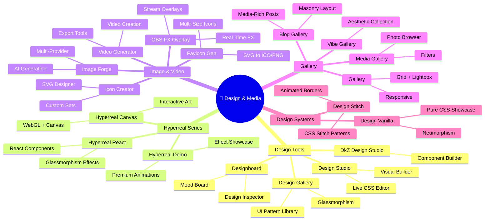
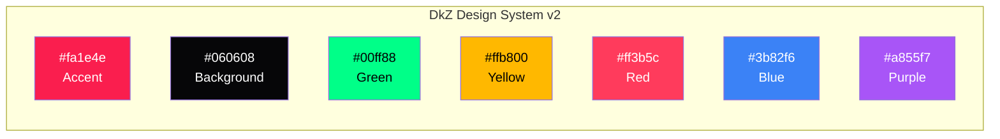

# 🎨 Design & Media — Mindmap

> 18 Module · Creative Tools · DEVKiTZ™ Ecosystem

---

---

## Design System v2 — Farb-Palette

---

## Fonts

| Font | Einsatz | Stil |
|:-----|:--------|:-----|
| **Inter** | UI Text, Buttons, Labels | Sans-Serif, variabel |
| **JetBrains Mono** | Code, Terminal, Monospace | Ligatures, geradlinig |
