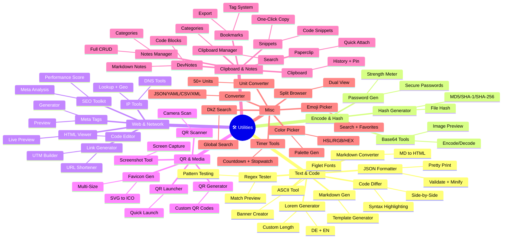
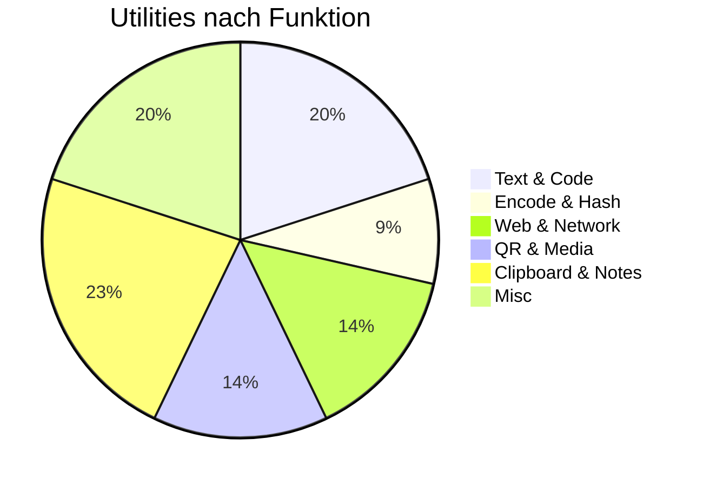

# 🛠️ Utilities — Mindmap

> 35 Module · Dev Tools & Helpers · DEVKiTZ™ Ecosystem

---

```mermaid
mindmap
  root((🛠️ Utilities))
    Text & Code
      ASCII Tool
        Figlet Fonts
        Banner Creator
      Markdown Converter
        MD to HTML
      Markdown Gen
        Template Generator
      Lorem Generator
        DE + EN
        Custom Length
      Code Differ
        Side-by-Side
        Syntax Highlighting
      Regex Tester
        Pattern Testing
        Match Preview
      JSON Formatter
        Pretty Print
        Validate + Minify
    Encode & Hash
      Base64 Tools
        Encode/Decode
        Image Preview
      Hash Generator
        MD5/SHA-1/SHA-256
        File Hash
      Password Gen
        Secure Passwords
        Strength Meter
    Web & Network
      HTML Viewer
        Live Preview
        Code Editor
      IP Tools
        Lookup + Geo
        DNS Tools
      Link Generator
        URL Shortener
        UTM Builder
      SEO Toolkit
        Meta Analysis
        Performance Score
      Meta Tags
        Generator
        Preview
    QR & Media
      QR Generator
        Custom QR Codes
      QR Launcher
        Quick Launch
      QR Scanner
        Camera Scan
      Screenshot Tool
        Screen Capture
      Favicon Gen
        Multi-Size
        SVG to ICO
    Clipboard & Notes
      Clipboard
        History + Pin
      Clipboard Manager
        Categories
        Search
      Bookmarks
        Tag System
        Export
      DevNotes
        Markdown Notes
        Code Blocks
      Notes Manager
        Full CRUD
        Categories
      Snippets
        Code Snippets
        One-Click Copy
      Paperclip
        Quick Attach
    Misc
      Color Picker
        HSL/RGB/HEX
        Palette Gen
      Converter
        JSON/YAML/CSV/XML
      Unit Converter
        50+ Units
      Timer Tools
        Countdown + Stopwatch
      Emoji Picker
        Search + Favorites
      Split Browser
        Dual View
      DkZ Search
        Global Search
```

---

## Nutzungs-Verteilung

```mermaid
pie title Utilities nach Funktion
    "Text & Code" : 7
    "Encode & Hash" : 3
    "Web & Network" : 5
    "QR & Media" : 5
    "Clipboard & Notes" : 8
    "Misc" : 7
```
