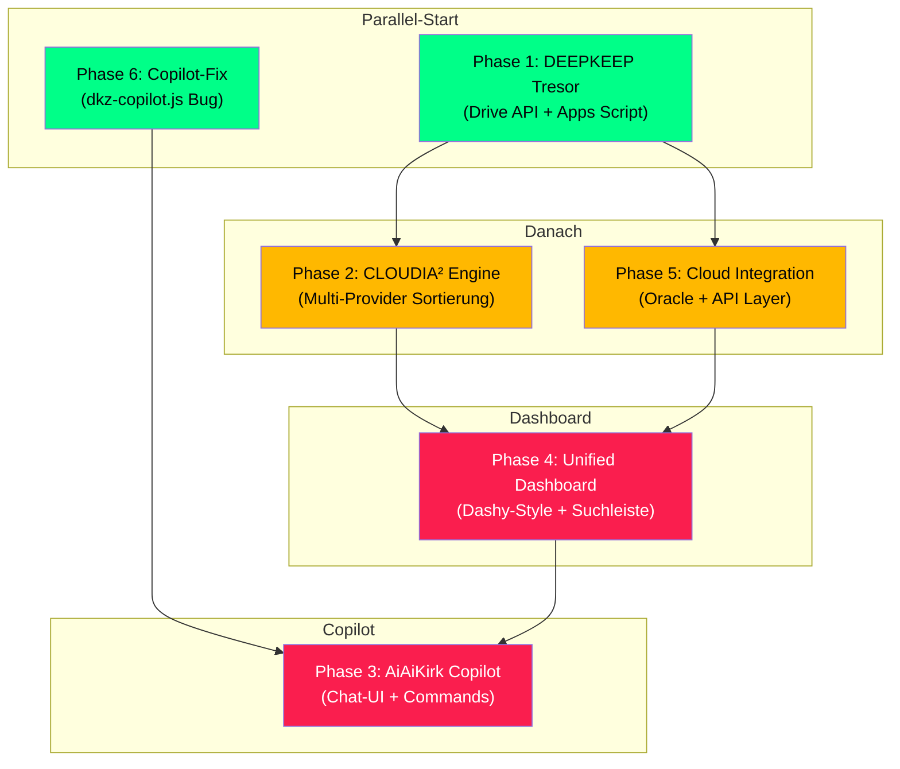

# CLOUDIA™ Masterplan — DEEPKEEP + CLOUDIA² + AiAiKirk

> Erstellt: 2026-05-29T10:16 CEST · Grill-Session Ergebnis
> Basierend auf: 3 Research-Agenten · Cloud-Landkarte · Domain Glossary
> Methodik: /superpowers /grill-with-docs · Parallele Subagenten

---

## Vision

```
┌─────────────────────────────────────────────────────────────────────────┐
│                        CLOUDIA™ ECOSYSTEM                               │
│                                                                         │
│   ┌──────────────┐    ┌──────────────┐    ┌──────────────┐             │
│   │  DEEPKEEP™   │───▶│   CLOUDIA²   │───▶│  DASHBOARD   │             │
│   │  RAW-Tresor  │    │  Sortierer   │    │  Visualizer  │             │
│   │  (Drive)     │    │  (Multi-     │    │  (Dashy)     │             │
│   │  Write-Once  │    │   Provider)  │    │              │             │
│   └──────────────┘    └──────────────┘    └──────────────┘             │
│          ▲                    ▲                    ▲                     │
│          │                    │                    │                     │
│   ┌──────┴──────────────────┴────────────────────┴──────┐              │
│   │                    AiAiKirk™                         │              │
│   │              Chatbot / Copilot / Steuermann          │              │
│   └──────────────────────────────────────────────────────┘              │
│          │                    │                    │                     │
│   ┌──────▼──────┐    ┌──────▼──────┐    ┌──────▼──────┐              │
│   │  🔍 Unified │    │  ☁️ Cloud   │    │  📊 Oracle  │              │
│   │    Search   │    │  Sync       │    │    DB       │              │
│   └─────────────┘    └─────────────┘    └─────────────┘              │
└─────────────────────────────────────────────────────────────────────────┘
```

---

## Subsysteme (6 Parallel-Phasen)

### Phase 1: 🏗️ DEEPKEEP™ Tresor-Engine

> **Ziel:** Unantastbarer RAW-Ordner auf Google Drive — Write-Once, Read-Many

#### Architektur

```
Google Drive
└── [DEEPKEEP]/                          ← STAMM-ORDNER (schreibgeschuetzt)
    ├── 01_PROJECTS/                     ← Spiegel von C:\DEVKiTZ\01_PROJECTS
    ├── 02_RESEARCH/                     ← Research-Archive
    ├── 03_MEDIA/                        ← Bilder, Videos, Audio
    ├── 04_SYSTEM/                       ← Configs, Scripts
    ├── 05_DESKTOP_KEEP/                 ← Desktop-Dateien (7-Tage-Regel)
    ├── 06_DOWNLOADS_KEEP/               ← Download-Dateien (7-Tage-Regel)
    ├── 07_EMAIL_DRAFTS/                 ← Email-Entwuerfe
    ├── 08_BLOGS/                        ← Blog-Content (RAW Research)
    ├── 99_ARCHIVE/                      ← Legacy + Archiviertes
    └── _INBOX/                          ← Unsortierter Eingang (CLOUDIA² sortiert)
```

#### Regeln (Eisern)

| Regel | Beschreibung |
|:------|:-------------|
| **R-DK-1** | Dateien koennen IN DEEPKEEP verschoben werden, aber NIEMALS geloescht |
| **R-DK-2** | Dateien koennen umbenannt werden (Metadaten, Tags) |
| **R-DK-3** | Dokumentation in Google Sheets (Katalog, Metadaten, Changelog) |
| **R-DK-4** | Lokal nur Links + INI mit ASCII-Mindmap |
| **R-DK-5** | Desktop/Downloads: 7-Tage-Regel (Dashboard-Funktion, KEIN Auto-Scan) |

#### Technische Umsetzung

| Komponente | Tech | Beschreibung |
|:-----------|:-----|:-------------|
| **deepkeep-sync.gs** | Google Apps Script | Drive-Ordner ueberwachen, Write-Protection erzwingen |
| **deepkeep-catalog.gs** | Google Apps Script | Google Sheet als Katalog pflegen |
| **deepkeep-local.js** | Node.js CLI | Lokale INI-Dateien generieren (ASCII-Mindmap) |
| **deepkeep-dashboard** | Vanilla HTML/CSS/JS | DkZ Dashboard Modul (Glassmorphism) |
| **deepkeep.js** | Existiert bereits | Security Sanitizer (erweitern um Drive-Sync-Trigger) |

#### Dateien

##### [NEW] `01_PROJECTS/01_dashboard/modules/deepkeep/index.html`
Haupt-Dashboard: Tresor-Uebersicht, Dateien-Browser, Upload-Zone, Suchleiste

##### [NEW] `01_PROJECTS/01_dashboard/modules/deepkeep/deepkeep-engine.js`
Core-Engine: Drive API, Write-Protection, Katalog-Sync, INI-Generator

##### [NEW] `01_PROJECTS/01_dashboard/modules/deepkeep/features.json`
Feature-Registry fuer das Dashboard

##### [MODIFY] `.agents/scripts/deepkeep.js`
Erweitern: Nach Sanitize → Drive-Sync triggern

##### [NEW] `01_PROJECTS/01_dashboard/modules/appscript-builder/scripts/deepkeep-sync.gs`
Google Apps Script: Drive-Ordner ueberwachen, Write-Protection, Sheet-Katalog

---

### Phase 2: 📂 CLOUDIA² Sortier-Engine

> **Ziel:** Multi-Provider Dokumenten-Strukturierung

#### Provider-Matrix

| Provider | API | Auth | Status |
|:---------|:----|:-----|:-------|
| **Google Drive** | Drive API v3 / Apps Script | OAuth 2.0 | 🟡 Code vorhanden, Auth fehlt |
| **Cloudflare R2** | S3-kompatibel | Access Key | 🟡 Code vorhanden, Keys fehlen |
| **GitHub** | REST API v3 | PAT Token | 🟡 Token abgelaufen |
| **Nextcloud** | WebDAV | Basic Auth | ⬜ Nicht konfiguriert |
| **Lokal** | fs / Node.js | — | 🟢 Immer verfuegbar |

#### Sortier-Regeln (Jeff Su 5x99 + DkZ)

```
Eingang: [DEEPKEEP]/_INBOX/
    │
    ├── Dateityp-Erkennung
    │   ├── .md, .txt, .pdf    → 02_RESEARCH/ oder 01_PROJECTS/
    │   ├── .jpg, .png, .svg   → 03_MEDIA/images/
    │   ├── .mp4, .webm        → 03_MEDIA/videos/
    │   ├── .mp3, .wav         → 03_MEDIA/audio/
    │   ├── .zip, .tar.gz      → 99_ARCHIVE/
    │   ├── .js, .py, .html    → 01_PROJECTS/ (nach Projekt-Match)
    │   └── .eml, .msg         → 07_EMAIL_DRAFTS/
    │
    ├── Metadaten-Enrichment
    │   ├── Dateiname → Tags
    │   ├── Erstelldatum → Chronologie
    │   ├── Groesse → Storage-Tier
    │   └── Content-Hash → Duplikat-Erkennung
    │
    └── Sheet-Eintrag
        └── Google Sheet: Datei, Pfad, Tags, Datum, Groesse, Hash
```

#### Dateien

##### [NEW] `01_PROJECTS/01_dashboard/modules/cloudia/index.html`
CLOUDIA² Dashboard: Provider-Status, Sortier-Queue, Regeln-Editor

##### [NEW] `01_PROJECTS/01_dashboard/modules/cloudia/cloudia-engine.js`
Multi-Provider Sortier-Engine mit Rule-System

##### [NEW] `01_PROJECTS/01_dashboard/modules/cloudia/providers/`
Provider-Adapter: `drive.js`, `r2.js`, `github.js`, `nextcloud.js`, `local.js`

##### [MODIFY] `01_PROJECTS/01_dashboard/drive-organizer/organizer.gs`
Bestehenden Drive-Organizer in CLOUDIA² integrieren (nicht ersetzen)

---

### Phase 3: 🤖 AiAiKirk™ Copilot

> **Ziel:** Chatbot/Assistent der DEEPKEEP + CLOUDIA² steuert

#### Architektur

```
AiAiKirk UI (Vanilla HTML/CSS/JS)
├── Chat-Interface (Glassmorphism, DkZ Design)
├── Command-Palette (/, @, #)
├── Status-Bar (Drive, R2, GitHub, Oracle, VPS)
└── Preview-Panel (Dateien, Bilder, Sheets)
    │
    ├── DEEPKEEP Commands
    │   ├── /keep <datei>          → In DEEPKEEP verschieben
    │   ├── /search <query>        → Unified Search
    │   ├── /catalog                → Sheet-Katalog oeffnen
    │   ├── /7day                   → Desktop/Downloads 7-Tage-Check
    │   └── /mindmap                → INI-Mindmaps aktualisieren
    │
    ├── CLOUDIA² Commands
    │   ├── /sort                   → Inbox sortieren
    │   ├── /rules                  → Sortier-Regeln anzeigen/editieren
    │   ├── /providers              → Provider-Status
    │   └── /sync <provider>        → Manueller Sync
    │
    └── System Commands
        ├── /health                 → Cloud-Gesundheit
        ├── /backup                 → Manuelles Backup
        └── /blog <content>         → Auf DEEPKEEP Blog publizieren
```

#### Dateien

##### [NEW] `01_PROJECTS/01_dashboard/modules/aiaikirk/index.html`
AiAiKirk Copilot Dashboard (ersetzt den alten React-Build)

##### [NEW] `01_PROJECTS/01_dashboard/modules/aiaikirk/kirk-engine.js`
Chat-Engine, Command-Parser, Provider-Integration

##### [NEW] `01_PROJECTS/01_dashboard/modules/aiaikirk/kirk-ui.js`
UI-Komponenten: Chat-Panel, Status-Bar, Preview, Glassmorphism

---

### Phase 4: 📊 Unified Dashboard

> **Ziel:** Dashy-Style Visualisierung ALLER Bibliotheken

#### Dashboard-Bereiche

| Bereich | Datenquelle | Visualisierung |
|:--------|:------------|:---------------|
| 🗂️ Drive Libraries | Google Drive API | Ordner-Karten mit Thumbnails, Datei-Counts |
| 🖼️ Bilder | Drive 03_MEDIA/images | Galerie-Grid mit Lightbox |
| 🎬 Videos | Drive 03_MEDIA/videos | Video-Thumbnails mit Player |
| 🎵 Musik | Drive 03_MEDIA/audio | Waveform-Player |
| 📄 Dokumente | Drive 01_PROJECTS + 02_RESEARCH | Markdown-Preview, PDF-Viewer |
| 📦 ZIPs/Archives | Drive 99_ARCHIVE | Groesse-Karten, Unpack-Option |
| ☁️ Cloudflare | CF API | R2 Bucket Status, DNS, WAF |
| 🔮 Oracle DB | Oracle API | Tabellen-Uebersicht, Query-Tool |
| 🧠 SecondBrain | Obsidian Vault (lokal) | Markdown-Suche, Graph-View |
| 📝 Blogs | Blogger API / statisch | Post-Liste, Draft-Editor |
| 🏠 Homepages | Statisch | devkitz.eu/space/cloud/blog/sites |
| 💻 GitHub | GitHub API | Repo-Cards, Commit-History |
| 📧 Email-Drafts | Drive 07_EMAIL_DRAFTS | Draft-Liste, Send-Queue |

#### Unified Search

```
┌────────────────────────────────────────────────────────┐
│  🔍 Suche: _________________________________________  │
│                                                        │
│  Quellen: ☑ Drive  ☑ GitHub  ☑ Lokal  ☑ SecondBrain  │
│           ☑ Blogs  ☑ Email   ☑ Oracle                 │
│                                                        │
│  Filter:  📁 Typ  📅 Datum  📏 Groesse  🏷️ Tags     │
└────────────────────────────────────────────────────────┘
```

#### Dateien

##### [NEW] `01_PROJECTS/01_dashboard/modules/cloudia-dashboard/index.html`
Haupt-Dashboard mit allen Bereichen

##### [NEW] `01_PROJECTS/01_dashboard/modules/cloudia-dashboard/unified-search.js`
Unified Search Engine ueber alle Provider

##### [NEW] `01_PROJECTS/01_dashboard/modules/cloudia-dashboard/library-cards.js`
Visuelle Karten fuer jede Bibliothek (Thumbnails, Counts, Status)

---

### Phase 5: ☁️ Cloud Integration Layer

> **Ziel:** Drive + R2 + Oracle + GitHub + VPS als einheitliche API

#### API-Layer

```
cloudia-api.js (Unified Interface)
├── DriveProvider    → Google Drive API v3 / Apps Script
├── R2Provider       → Cloudflare R2 (S3-kompatibel)
├── OracleProvider   → Oracle DB Connection
├── GitHubProvider   → GitHub REST API v3
├── VPSProvider      → SSH / ONTHERUN™ MCP (localhost:9880)
├── BlogProvider     → Blogger API v3
├── ObsidianProvider → Lokaler Vault (fs-basiert)
└── EmailProvider    → Gmail API / IMAP
```

#### Oracle DB Schema

```sql
CREATE TABLE deepkeep_catalog (
    id            VARCHAR(36) PRIMARY KEY,
    filename      VARCHAR(255) NOT NULL,
    path          VARCHAR(1024),
    provider      VARCHAR(50),      -- drive, r2, github, local
    file_type     VARCHAR(50),
    size_bytes    BIGINT,
    content_hash  VARCHAR(64),
    tags          JSON,
    created_at    TIMESTAMP,
    modified_at   TIMESTAMP,
    accessed_at   TIMESTAMP,
    is_protected  BOOLEAN DEFAULT TRUE,
    metadata      JSON
);

CREATE TABLE cloudia_sort_rules (
    id            VARCHAR(36) PRIMARY KEY,
    pattern       VARCHAR(255),      -- Glob oder Regex
    target_path   VARCHAR(1024),
    priority      INT,
    provider      VARCHAR(50),
    is_active     BOOLEAN DEFAULT TRUE
);

CREATE TABLE cloudia_sync_log (
    id            VARCHAR(36) PRIMARY KEY,
    action        VARCHAR(50),       -- move, rename, catalog, sort
    source        VARCHAR(1024),
    target        VARCHAR(1024),
    provider      VARCHAR(50),
    timestamp     TIMESTAMP,
    status        VARCHAR(20)
);
```

#### Dateien

##### [NEW] `01_PROJECTS/01_dashboard/shared/cloudia-api.js`
Unified Cloud API (alle Provider)

##### [NEW] `01_PROJECTS/01_dashboard/shared/cloudia-oracle.js`
Oracle DB Adapter

---

### Phase 6: 🔧 Copilot-Fix + INI-System

> **Ziel:** dkz-copilot.js Bug fixen + lokales INI-Mindmap-System

#### Copilot-Bug

- **Symptom:** JavaScript-Fehler beim Laden von `dkz-copilot.js`
- **Aktion:** Fehler identifizieren, Root-Cause-Analyse, Fix

#### INI-Mindmap-System

Jeder lokale Ordner (00-99) bekommt eine `DIRECTORY.ini`:

```ini
; DEVKiTZ Ordner-Spiegel — Auto-generiert von CLOUDIA²
; Letzte Aktualisierung: 2026-05-29T10:30:00
; Drive-Link: https://drive.google.com/drive/folders/xxx

[META]
ordner = 01_PROJECTS
drive_id = 1abc...xyz
letzte_sync = 2026-05-29T10:30:00
dateien_total = 1.337
groesse_total = 4.2 GB

[MINDMAP]
01_PROJECTS/
├── 01_dashboard/           ; 138 Module, 12.4 GB
│   ├── modules/            ; 138 Ordner
│   ├── shared/             ; 14 Scripts
│   ├── hub/                ; Landing Page
│   └── tests/              ; Playwright + TestCafe
├── 03_devkitz_cloud/       ; Cloud Functions, APIs
├── 05_hermes/              ; 7 Hermes-Projekte
├── 07_dkz/                 ; DkZ Kern (Wiki, OpenClaw)
├── 08_aiaikirk/            ; → wird DEEPKEEP/AiAiKirk
├── 09_puter/               ; Puter VPS Integration
├── 12_playground/          ; Experimente
├── 13_stitch/              ; Design-Projekte
├── 14_cloudia2/            ; CLOUDIA² (Drive Auto-Sorter)
└── 17_BAZE²/               ; BAZE² Projekte

[LINKS]
drive = https://drive.google.com/drive/folders/xxx
github = https://github.com/7IKED/devkitz-workspace
dashboard = https://devkitz.sites
```

#### Dateien

##### [MODIFY] `01_PROJECTS/01_dashboard/shared/dkz-copilot.js`
JavaScript-Fehler beim Laden fixen

##### [NEW] `01_PROJECTS/01_dashboard/shared/cloudia-ini.js`
INI-Generator: ASCII-Mindmap fuer alle lokalen Ordner

##### [NEW] `.agents/scripts/generate-ini.js`
CLI-Tool: `node .agents/scripts/generate-ini.js` → INI-Dateien fuer alle Ordner

---

## Dependency-Graph



---

## Entscheidungen fuer 777

> [!IMPORTANT]
> Folgende Punkte muessen VOR der Implementierung geklaert werden:

| # | Frage | Optionen |
|:--|:------|:---------|
| 1 | **Google Drive OAuth** — Wie authentifizieren? | A) Apps Script URL (einfach) B) OAuth 2.0 Client (komplex) C) Service Account |
| 2 | **Oracle DB** — Wo laeuft sie? | A) Auf VPS 1298466 (Docker) B) Oracle Cloud Free Tier C) Lokal (DuckDB stattdessen?) |
| 3 | **DEEPKEEP Blog** — Wie publizieren? | A) Blogger API B) Manuell via Dashboard C) RSS/Atom Feed |
| 4 | **Drive-Mount** — Soll Google Drive lokal gemountet werden? | A) Ja (DriveFS) B) Nein, nur via API C) Rclone Mount |
| 5 | **Email-Drafts** — Welcher Email-Provider? | A) Gmail B) Outlook C) Anderer |
| 6 | **Nextcloud** — Gibt es eine Nextcloud-Instanz? | A) Ja, auf VPS B) Nein, spaeter C) Nicht benoetigt |

---

## Verifikationsplan

### Automatisierte Tests (pro Phase)

| Phase | Test | Tool |
|:------|:-----|:-----|
| 1 | DEEPKEEP Drive-Ordner erstellt, Write-Protection aktiv | Apps Script Test |
| 2 | CLOUDIA² sortiert 10 Test-Dateien korrekt | Playwright E2E |
| 3 | AiAiKirk `/keep`, `/search`, `/sort` Commands funktionieren | Playwright E2E |
| 4 | Dashboard zeigt alle 13 Bereiche, Suchleiste findet Dateien | Playwright E2E |
| 5 | Oracle DB Schema erstellt, CRUD-Operationen funktionieren | Node.js Unit Tests |
| 6 | dkz-copilot.js laedt ohne Fehler, INI-Dateien generiert | Playwright + CLI Test |

### Manuelle Verifikation

- 777 testet Drive-Ordner Permissions in Google Drive UI
- 777 testet AiAiKirk Chat-UI mit echten Befehlen
- 777 verifiziert Oracle DB Verbindung
- 777 testet 7-Tage-Regel mit Desktop-Dateien

---

## Zeitschaetzung

| Phase | Aufwand | Abhaengigkeiten |
|:------|:--------|:----------------|
| Phase 1: DEEPKEEP Tresor | ~4h | OAuth-Klaerung |
| Phase 2: CLOUDIA² Engine | ~6h | Phase 1 |
| Phase 3: AiAiKirk Copilot | ~8h | Phase 6 |
| Phase 4: Unified Dashboard | ~10h | Phase 2 + 5 |
| Phase 5: Cloud Integration | ~6h | Phase 1 |
| Phase 6: Copilot-Fix + INI | ~2h | Keine |
| **Gesamt** | **~36h** | |

---

*CLOUDIA™ Masterplan — erstellt 2026-05-29 mit /superpowers /grill-with-docs*
