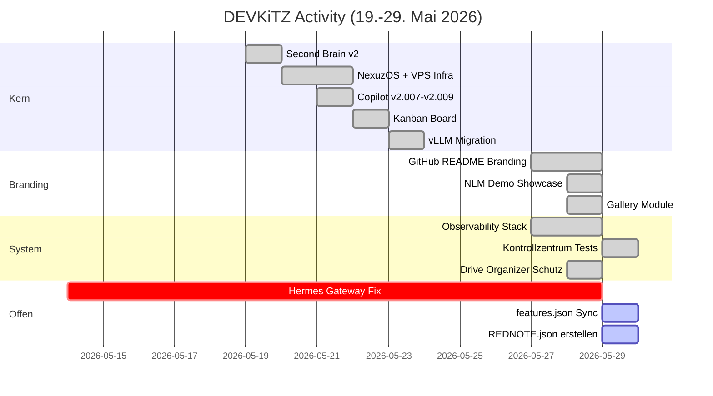
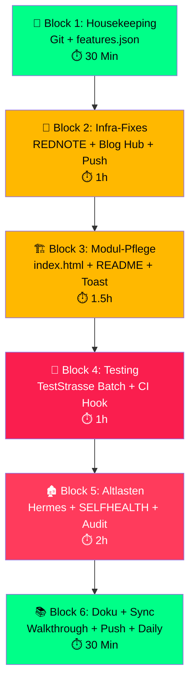

# DEVKiTZ™ Tagesplan — 2026-05-29 ✅ AUSGEFUEHRT

> Basierend auf: 121 Commits (10 Tage) · 179 Brain-Sessions · 137 Module · 7 Subagenten
> Erstellt: 2026-05-29T08:14 CEST · Abgeschlossen: 2026-05-29T08:25 CEST
> Ergebnis: 8/12 REDNOTE-Items geloest · 5 Git Commits · features.json 138 Module

---

## Ueberblick — Die letzten 10 Tage



### Was wurde geschafft (Top 10)

| # | Erledigt | Datum | Commits |
|:--|:---------|:------|:--------|
| 1 | ✅ Observability Stack (Toast, Watchdog, EventLog, Kontrollzentrum) | 27-28.05 | 5 |
| 2 | ✅ Kontrollzentrum Playwright + TestCafe (65/65 GRUEN) | 29.05 | 2 |
| 3 | ✅ GitHub Branding (4 Repos, 19 Infografiken, NLM Demo) | 27-28.05 | 8 |
| 4 | ✅ Copilot v2.007→v2.009 (Module Hub, 3-Domain, Modul-Richter) | 27.05 | 5 |
| 5 | ✅ LLM-Dokumentation (llms.txt System, Bootstrap) | 27.05 | 4 |
| 6 | ✅ Matrix Center v2 (Chat + Hermes Bridge + E2E Decrypt) | 25.05 | 4 |
| 7 | ✅ Kanban Board v2 (Dashy Glassmorphism, Ampel, NanoBot) | 22.05 | 2 |
| 8 | ✅ vLLM Migration (Ollama→vLLM, Paperless, Paperclip) | 23.05 | 2 |
| 9 | ✅ Drive Organizer (Dual-Modus, 6-Zonen-Schutz) | 28.05 | 5 |
| 10 | ✅ TestStrasse v4 (42 Auto-Checks, Dashboard, Batch-Test) | 27.05 | 3 |

### Was haengt (Offene Altlasten)

| # | Offen seit | Thema | Status | Schwere |
|:--|:-----------|:------|:-------|:--------|
| 1 | 14.05 | **Hermes Gateway** — Telegram Token rejected, API-Server startet nicht | ❌ BLOCKED | 🔴 |
| 2 | 27.05 | **REDNOTE.json** — Nie erstellt, ueberall referenziert | ⚠️ FEHLT | 🔴 |
| 3 | 28.05 | **Blog Hub E2E Tests** — blog-hub/index.html fehlt | ⚠️ BROKEN | 🟡 |
| 4 | 29.05 | **features.json** — 15 Module nicht registriert | ⚠️ DRIFT | 🟡 |
| 5 | 27.03 | **SELFHEALTH DOCK** — System nie gebaut | ⬜ OFFEN | 🟡 |
| 6 | 27.03 | **AiAiKirk → DEEPKEEP** — Migration unvollstaendig | ⬜ OFFEN | 🟡 |
| 7 | 27.03 | **PLAYB00K umbenennen** — R24 Frage offen | ⬜ OFFEN | ⚪ |
| 8 | 27.03 | **Doppelte Projekt-Nummern** — Audit-Finding | ⬜ OFFEN | ⚪ |
| 9 | 27.03 | **Lose HTML in modules/** — Audit-Finding | ⬜ OFFEN | ⚪ |
| 10 | 29.05 | **3 Git Stashes** — Ungeprueft | ⬜ OFFEN | ⚪ |

---

## Block 1: 🧹 Housekeeping (Sofort — ~30 Min)

> **Ziel:** Workspace sauber, Git aufgeraeumt, Drift beseitigt

### 1.1 Git Bereinigung

- [ ] **2 untracked Projekte** committen oder .gitignore
  - `01_PROJECTS/07_dkz/` → Pruefen + committen
  - `01_PROJECTS/17_BAZE²/` → Pruefen + committen
- [ ] **3 Stashes** evaluieren und aufloesen
  - `stash@{0}` — `temp-vps-monitor` (27.05) → Pop oder Drop?
  - `stash@{1}` — `pre-checkout-master` (19.05) → Veraltet → Drop
  - `stash@{2}` — `pre-worktree-merge-backup` (07.05) → Veraltet → Drop
- [ ] **Alte Branches** aufraumen (11 lokale, 2 Remotes)
  - `master` → Obsolet? `main` ist HEAD
  - `feat/docs-roadmap-v3` → Merged? Pruefen
  - `feat/second-brain-v2-dashy-nexus` → Merged? Pruefen
  - `list-all-domain-pages` → Status?
  - `connect-hermes-frontend-ssh-*` → Status?
  - `init-devkitz-omni-system-*` → Status?
  - `opencode/happy-cabin` + `opencode/hidden-circuit` → Automatisch erzeugt → Drop
  - `setup-oauth-kirk-*` + `ai-agent-playground-*` → Status?
- [ ] **`git push`** — origin/main ist hinter lokal (121 Commits!)

### 1.2 features.json Synchronisation

- [ ] **15 Module in features.json registrieren:**

| Modul | Status | Aktion |
|:------|:-------|:-------|
| `blog-gallery` | Auf Disk, nicht registriert | features.json + pruefen |
| `design-gallery` | Auf Disk, nicht registriert | features.json + pruefen |
| `flash-ui` | Auf Disk, nicht registriert | features.json + pruefen |
| `nlm-demo` | Auf Disk, nicht registriert | features.json + pruefen |
| `pattern-hub` | Auf Disk, nicht registriert | features.json + pruefen |
| `vibe-gallery` | Auf Disk, nicht registriert | features.json + pruefen |
| `graphify` | In llms.txt, nicht in features.json | features.json |
| `kanban-board` | In llms.txt, nicht in features.json | features.json |
| `paperclip` | In llms.txt, nicht in features.json | features.json |
| `paperless` | In llms.txt, nicht in features.json | features.json |
| `webhook-dashboard` | In llms.txt, nicht in features.json | features.json |
| `hermes-3d` | In llms.txt, nicht in features.json | features.json |
| `llm-arena` | In llms.txt, nicht in features.json | features.json |
| `teststrasse` | Neues Modul (27.05) | features.json |
| `blog-gallery` | Neues Modul (28.05) | features.json |

- [ ] **5 Module ohne features.json** erstellen:
  - `matrix-center`, `openclaw-vibe`, `ordner-blaupause`, `free-ai-hub`, `vps-monitor`

- [ ] **5 Module ohne index.html** pruefen:
  - `video-generator`, `bookmark-manager`, `media-gallery`, `openclaw-vibe`, `awesome-design-stitch`

---

## Block 2: 🔧 Infrastruktur-Fixes (Prioritaet HOCH — ~1h)

> **Ziel:** Kritische System-Luecken schliessen

### 2.1 REDNOTE.json erstellen

> [!CAUTION]
> REDNOTE.json ist in AGENTS.md und deploy-readmes.ps1 referenziert, existiert aber NICHT.
> Das ist eine System-Luecke die andere Agenten und Scripts betrifft.

- [ ] `04_SYSTEM/REDNOTE.json` erstellen mit Schema:
  ```json
  {
    "version": "1.0",
    "generated": "2026-05-29T08:00:00Z",
    "entries": [
      {
        "id": "RN-001",
        "severity": "error",
        "module": "hermes-gateway",
        "title": "Telegram Token rejected",
        "description": "...",
        "status": "open",
        "created": "2026-05-14",
        "tags": ["hermes", "telegram", "api"]
      }
    ]
  }
  ```
- [ ] Bekannte Fehler aus Brain-Sessions eintragen (mindestens 10 Eintraege)
- [ ] `rednote-collector.js` pruefen ob es REDNOTE.json korrekt liest

### 2.2 Blog Hub E2E Tests fixen

- [ ] Pruefen ob `blog-hub/index.html` existiert oder umbenannt wurde
- [ ] `dashboard-smoke.spec.js` anpassen oder Blog Hub Tests deaktivieren
- [ ] Pre-Commit Hook reparieren (blockiert aktuell Commits ohne `--no-verify`)

### 2.3 GitHub Sync

- [ ] `git push origin main` — Lokaler main ist 121+ Commits vor origin
- [ ] Pruefen ob GitHub Actions (9 Workflows) korrekt laufen
- [ ] GitHub Pages (`devkitz.sites`) aktualisieren

---

## Block 3: 🏗️ Modul-Pflege (Prioritaet MITTEL — ~1.5h)

> **Ziel:** Module vervollstaendigen, Luecken schliessen

### 3.1 Module ohne index.html

| Modul | Groesse | Aktion |
|:------|:--------|:-------|
| `video-generator` | In features.json | Scaffold mit mod-builder |
| `bookmark-manager` | In features.json | Scaffold mit mod-builder |
| `media-gallery` | In features.json | Scaffold mit mod-builder |
| `openclaw-vibe` | Weder features.json noch index | Archivieren oder bauen? |
| `awesome-design-stitch` | Stitch-spezifisch | Pruefen ob noch relevant |

### 3.2 Module ohne README

- [ ] ~49 Module ohne README.md identifizieren
- [ ] Batch-Generator fuer fehlende READMEs (via deploy-readmes.ps1)
- [ ] Mindestens die 20 wichtigsten Module dokumentieren

### 3.3 Observability-Stack Verbreitung

- [ ] `dkz-toast.js` in alle Module integrieren (aktuell nur Kontrollzentrum)
- [ ] `dkz-watchdog.js` Auto-Init fuer alle Module aktivieren
- [ ] AutoHealth Checks in `dkz-autohealth.js` fuer fehlende Shared Scripts

---

## Block 4: 🧪 Testing & Qualitaet (Prioritaet MITTEL — ~1h)

> **Ziel:** Test-Coverage erweitern, bekannte Fails fixen

### 4.1 TestStrasse v4 Batch-Run

- [ ] TestStrasse ueber ALLE 137 Module laufen lassen
- [ ] Ergebnisse als Report exportieren
- [ ] Top 10 schlechteste Module identifizieren

### 4.2 Playwright Pre-Commit Hook reparieren

- [ ] `dashboard-smoke.spec.js` Blog Hub Tests fixen oder disablen
- [ ] Pre-Commit Hook soll nur `kontrollzentrum-smoke.spec.js` laufen lassen
- [ ] `npm run test:ci` Script fuer CI/CD erstellen

### 4.3 TestCafe Suite erweitern

- [ ] Copilot v2.009 Tests (Module Hub, Domain Popup, Modul-Richter)
- [ ] Navbar-Navigation Tests
- [ ] Settings-Modul Tests

---

## Block 5: 🏚️ Altlasten aufloesen (Prioritaet NIEDRIG — ~2h)

> **Ziel:** Seit Wochen offene Items abarbeiten oder bewusst schliessen

### 5.1 Hermes Gateway (offen seit 14.05 — 15 Tage!)

> [!WARNING]
> Laengste offene Altlast. Telegram Token Problem blockiert alles.

- [ ] **Option A:** Telegram Bot Token erneuern via @BotFather
- [ ] **Option B:** Hermes Gateway ohne Telegram (nur HTTP API)
- [ ] **Option C:** Hermes-Projekt pausieren → als "On Hold" markieren
- [ ] Entscheidung dokumentieren

### 5.2 SELFHEALTH DOCK (offen seit 27.03 — 63 Tage!)

- [ ] Konzept aus Session `138c2596` pruefen
- [ ] **Entscheidung:** Bauen oder als "Won't Do" markieren?
- [ ] Falls bauen → Teil des Observability-Stacks (Kontrollzentrum erweitern)

### 5.3 AiAiKirk → DEEPKEEP Migration (offen seit 27.03)

- [ ] Status pruefen: Was wurde migriert? Was fehlt?
- [ ] **Entscheidung:** Fortsetzen oder archivieren?

### 5.4 Audit-Findings (offen seit 27.03)

- [ ] PLAYB00K → PLAYBOOK umbenennen (R24 ALARM → 777 fragen)
- [ ] Doppelte Projekt-Nummern auflisten und bereinigen
- [ ] Lose HTML-Dateien in modules/ identifizieren und einordnen

---

## Block 6: 📚 Dokumentation & Sync (Abschluss — ~30 Min)

> **Ziel:** Alles dokumentiert und synchronisiert

### 6.1 Session-Dokumentation

- [ ] Walkthrough.md fuer heutige Session erstellen
- [ ] REDNOTE.json mit allen offenen Punkten befuellen
- [ ] features.json regenerieren (health-check-phase1)

### 6.2 Sync

- [ ] `git push origin main`
- [ ] Second Brain Daily Note erstellen
- [ ] GEMINI.md + CLAUDE.md aktuell?

### 6.3 Abschluss-Check

- [ ] features.json: 137/137 registriert?
- [ ] Keine untracked Files?
- [ ] Keine offenen Stashes?
- [ ] Pre-Commit Hook funktioniert?

---

## Priorisierte Reihenfolge



---

## Entscheidungen fuer 777

> [!IMPORTANT]
> Folgende Punkte brauchen deine Entscheidung:

| # | Frage | Optionen |
|:--|:------|:---------|
| 1 | **Hermes Gateway** — Weitermachen oder pausieren? | A) Token erneuern B) Ohne Telegram C) On Hold |
| 2 | **SELFHEALTH DOCK** — Bauen oder verwerfen? | A) In Kontrollzentrum integrieren B) Won't Do |
| 3 | **AiAiKirk → DEEPKEEP** — Fortsetzen oder archivieren? | A) Migrieren B) Archivieren |
| 4 | **PLAYB00K** — Umbenennen zu PLAYBOOK? | A) Ja B) Nein |
| 5 | **master Branch** — Loeschen? main ist HEAD | A) Loeschen B) Behalten |
| 6 | **3 Stashes** — Alle droppen? | A) Alle Drop B) Einzeln pruefen |
| 7 | **openclaw-vibe** — Bauen oder archivieren? | A) Bauen B) Archivieren |
| 8 | **Welche Bloecke heute?** | Alle 6? Nur 1-3? Nur Prio HOCH? |

---

## Zeitschaetzung

| Block | Aufwand | Kumulativ |
|:------|:--------|:----------|
| 🧹 Block 1: Housekeeping | ~30 Min | 0:30 |
| 🔧 Block 2: Infra-Fixes | ~60 Min | 1:30 |
| 🏗️ Block 3: Modul-Pflege | ~90 Min | 3:00 |
| 🧪 Block 4: Testing | ~60 Min | 4:00 |
| 🏚️ Block 5: Altlasten | ~120 Min | 6:00 |
| 📚 Block 6: Doku + Sync | ~30 Min | 6:30 |

**Gesamt: ~6.5 Stunden** bei Vollausfuehrung.

---

*Hallo Europa! 🫡 — Plan erstellt basierend auf 3 parallelen Research-Agenten.*
