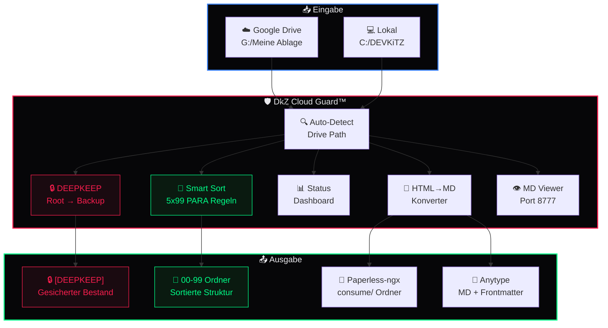

<div align="center">

# 🛡️ DkZ Cloud Guard™

**Portable EXE für Drive-Schutz & intelligente Sortierung**

*Schütze deinen Google Drive. Sortiere dein digitales Leben. Ohne Cloud-Token.*

[](https://github.com/D-VKITZ/agent-swarm)
[](LICENSE)
[](https://python.org)
[](#-installation)
[](#-installation)
[](#)
[](#-cli-referenz)
[](#-deepkeep-mode)
[](#-smart-sort)
[](#-md-viewer)
[](#-drive-erkennung)
[](#-paperless-ngx-export)
[](#-anytype-export)
[](#-sicherheit)
[](#-sicherheit)
[](#-sicherheit)
[](https://github.com/D-VKITZ/agent-swarm)

---


</div>

---

## 📖 Beschreibung

**DkZ Cloud Guard™** ist ein portables Windows-Tool aus dem DEVKiTZ™ Ökosystem, das deinen Google Drive Ordner schützt und intelligent sortiert. Es arbeitet vollständig **offline** — kein Cloud-Token, keine Google-API-Keys, kein Authentifizierungsstress. Cloud Guard erkennt automatisch deinen lokalen Google Drive Sync-Ordner und bringt mit dem **Jeff Su 5x99 PARA System** Ordnung in das Dateichaos.

Das Kernprinzip ist radikal einfach: Erst **sichern** (`DEEPKEEP`), dann **sortieren** (`sort`). Alles andere — HTML-Konvertierung, Paperless-ngx Export, Anytype-Integration, Markdown-Viewer — sind Bonus-Werkzeuge für den täglichen Workflow. Standardmäßig läuft jede Operation im **Dry-Run Modus** — nichts passiert, bis du bewusst `--execute` setzt.

---

## ✨ Features

| Feature | Beschreibung | Modus |
|:--------|:-------------|:------|
| 🔒 **DEEPKEEP Mode** | Verschiebt alles aus Root in `[DEEPKEEP]` mit Timestamp-Backup und Inventar-JSON | Sofort sicher |
| 📂 **Smart Sort** | Sortiert Dateien nach Jeff Su 5x99 PARA System — Name- und Extension-basiert | Dry-Run Default |
| 🚫 **NEVER TOUCH** | `[DEEPKEEP]` und `raw/` werden **niemals** verändert, verschoben oder gelöscht | Immer aktiv |
| ⚠️ **Duplikat-Schutz** | Duplikate werden **markiert**, nie gelöscht — Zero Data Loss | Automatisch |
| 📝 **HTML → Markdown** | Konvertiert HTML-Dateien zu sauberem Markdown (Bulk-Operation) | Dry-Run Default |
| 📎 **Paperless Export** | Erzeugt `consume`-Ordner für Paperless-ngx Import (PDF, Bilder, Dokumente) | Dry-Run Default |
| 🧠 **Anytype Export** | Generiert Markdown mit YAML-Frontmatter für Anytype Import | Dry-Run Default |
| 👁️ **MD Viewer** | Startet lokalen Webserver auf Port 8777 mit DkZ-Design zum Markdown-Lesen | Live |
| 📊 **Drive Status** | Dashboard mit Ordner-Übersicht, Datei-Zählung, DEEPKEEP-Analyse | Nur lesen |
| 🔒 **Dry-Run Default** | Jede destruktive Operation ist standardmäßig eine Vorschau | Sicherheitsnetz |

---

## 🏗️ Architektur



---

## 🚀 Installation

### Voraussetzungen

- **Python 3.10+** (für Entwicklung)
- **Windows 10/11** (für portable EXE)
- **Google Drive Desktop** (optional, für Auto-Erkennung)

### Via pip (Entwicklung)

```bash
# Repository klonen
git clone https://github.com/D-VKITZ/agent-swarm.git
cd dkz-cloud-guard

# Direkt ausführen — keine Dependencies nötig!
python cloud_guard.py status
```

### Portable EXE bauen (Produktion)

```bash
# PyInstaller installieren
pip install pyinstaller

# Portable EXE erzeugen
pyinstaller --onefile --name dkz-cloud-guard --icon=assets/shield.ico cloud_guard.py

# EXE liegt in dist/
dist/dkz-cloud-guard.exe status
```

> **💡 Tipp:** Die EXE braucht **kein Python** auf dem Zielrechner. Einfach auf einen USB-Stick kopieren und überall nutzen — daher *portable*.

---

## 🖥️ CLI Referenz

| Befehl | Beschreibung | Beispiel |
|:-------|:-------------|:---------|
| `status` | Drive-Status und Ordner-Übersicht anzeigen | `dkz-cloud-guard status` |
| `deepkeep` | Alles aus Root → `[DEEPKEEP]` sichern | `dkz-cloud-guard deepkeep` |
| `sort` | Smart Sort aus `[HELLO WORLD]` (Dry-Run) | `dkz-cloud-guard sort` |
| `sort --execute` | Smart Sort **tatsächlich** ausführen | `dkz-cloud-guard sort --execute` |
| `sort --source-dir "Ordner"` | Aus benutzerdefiniertem Ordner sortieren | `dkz-cloud-guard sort --source-dir "00_INBOX"` |
| `export-md` | HTML → Markdown konvertieren (Dry-Run) | `dkz-cloud-guard export-md` |
| `export-md --execute` | HTML → Markdown **tatsächlich** konvertieren | `dkz-cloud-guard export-md --execute --overwrite` |
| `paperless` | Paperless-ngx Export vorbereiten (Dry-Run) | `dkz-cloud-guard paperless` |
| `paperless --execute` | Dateien in `consume/` exportieren | `dkz-cloud-guard paperless --execute` |
| `anytype` | Anytype Markdown-Export (Dry-Run) | `dkz-cloud-guard anytype` |
| `anytype --execute` | Markdown + Frontmatter erzeugen | `dkz-cloud-guard anytype --execute` |
| `viewer` | MD Viewer im Browser starten (Port 8777) | `dkz-cloud-guard viewer` |
| `viewer --port 9000` | Viewer auf anderem Port starten | `dkz-cloud-guard viewer --port 9000` |
| `--path /pfad` | Benutzerdefinierter Pfad (bei allen Befehlen) | `dkz-cloud-guard status --path D:/MeinDrive` |
| `--version` | Version anzeigen | `dkz-cloud-guard --version` |

---

## 📂 Ordner-Struktur (Jeff Su 5x99 PARA)

Cloud Guard erstellt und nutzt diese standardisierte Ordner-Hierarchie:

```
📂 Drive Root/
├── 📂 [DEEPKEEP]/              🔒 Gesicherter Bestand (NEVER TOUCH)
│   └── 📂 backup_2026-05-28_1500/
│       └── 📋 _INVENTAR.json
├── 📂 raw/                     🔒 Rohdaten (NEVER TOUCH)
├── 📂 00_INBOX/                📥 Eingang — unsortierte Dateien
├── 📂 01_PROJECTS/             🏗️ Aktive Projekte
│   ├── 📂 01_active/
│   ├── 📂 02_templates/
│   ├── 📂 03_shared/
│   └── 📂 99_archived/
├── 📂 02_RESEARCH/             🔬 Recherche & Wissen
│   ├── 📂 01_ai_agents/
│   ├── 📂 02_tutorials/
│   ├── 📂 03_frameworks/
│   ├── 📂 04_blueprints/
│   ├── 📂 05_notebooklm/
│   └── 📂 99_archived/
├── 📂 03_MEDIA/                🎨 Medien
│   ├── 📂 01_images/
│   ├── 📂 02_video/
│   ├── 📂 03_audio/
│   ├── 📂 04_ai_generated/
│   └── 📂 99_archived/
├── 📂 04_SYSTEM/               ⚙️ Konfiguration & Scripts
│   ├── 📂 01_configs/
│   ├── 📂 02_scripts/
│   ├── 📂 03_exports/
│   ├── 📂 04_backups/
│   └── 📂 99_archived/
├── 📂 05_INTERN/               📋 Interne Dokumente
├── 📂 06_NOTEPAD/              📝 Notizen
├── 📂 07_PRIVAT/               🔐 Privat
└── 📂 99_ARCHIVE/              🗄️ Archiv
```

---

## 📋 Sortier-Regeln

### Name-basierte Regeln (Priorität 1)

| Pattern | Ziel-Ordner | Beispiel-Dateien |
|:--------|:------------|:-----------------|
| `dashboard`, `panel`, `hub`, `app`, `builder` | `01_PROJECTS/01_active` | `my-dashboard.zip` |
| `template`, `vorlage`, `boilerplate` | `01_PROJECTS/02_templates` | `email-vorlage.docx` |
| `agent`, `agenten`, `bmad`, `ralph` | `02_RESEARCH/01_ai_agents` | `agent-swarm-notes.md` |
| `blueprint`, `blaupause`, `architektur` | `02_RESEARCH/04_blueprints` | `system-architektur.pdf` |
| `gemini`, `gpt`, `claude`, `grok`, `deepseek` | `02_RESEARCH/01_ai_agents` | `claude-prompts.md` |
| `tutorial`, `guide`, `anleitung` | `02_RESEARCH/02_tutorials` | `python-tutorial.html` |
| `image`, `bild`, `foto`, `screenshot` | `03_MEDIA/01_images` | `screenshot_2026.png` |
| `video`, `film`, `clip`, `recording` | `03_MEDIA/02_video` | `demo-recording.mp4` |
| `config`, `setting`, `env` | `04_SYSTEM/01_configs` | `app-config.yaml` |
| `backup`, `dump` | `04_SYSTEM/04_backups` | `db-backup-full.sql` |

### Extension-basierte Regeln (Fallback)

| Extension | Ziel-Ordner | Extension | Ziel-Ordner |
|:----------|:------------|:----------|:------------|
| `.pdf` `.md` `.txt` `.doc` `.docx` | `02_RESEARCH` | `.json` `.yaml` `.yml` | `04_SYSTEM/01_configs` |
| `.png` `.jpg` `.jpeg` `.svg` `.webp` | `03_MEDIA/01_images` | `.js` `.py` `.ps1` `.sh` | `04_SYSTEM/02_scripts` |
| `.mp4` `.webm` `.avi` `.mov` | `03_MEDIA/02_video` | `.csv` `.xlsx` `.xls` | `04_SYSTEM/03_exports` |
| `.mp3` `.wav` `.ogg` | `03_MEDIA/03_audio` | `.zip` `.rar` `.7z` `.tar` | `04_SYSTEM/04_backups` |

---

## 🔍 Drive-Erkennung

Cloud Guard sucht automatisch nach dem Google Drive Ordner in dieser Reihenfolge:

```python
# Drive-Pfade (automatisch erkannt)
G:/Meine Ablage          # Standard Google Drive (Deutsch)
G:/My Drive              # Standard Google Drive (Englisch)
~/Google Drive            # Home-Ordner Variante
~/Google Drive/My Drive   # Verschachtelte Variante
D:/Google Drive           # Alternatives Laufwerk
E:/Google Drive           # Alternatives Laufwerk

# Lokale DEVKiTZ Pfade
C:/DEVKiTZ               # Standard
~/DEVKiTZ                # Home-Ordner
D:/DEVKiTZ               # Alternatives Laufwerk
```

Falls keiner gefunden wird, nutze `--path /dein/pfad` bei jedem Befehl.

---

## 🔒 Sicherheit

| Prinzip | Umsetzung |
|:--------|:----------|
| **Offline-First** | Kein Netzwerk-Zugriff, keine API-Calls, keine Cloud-Authentifizierung |
| **No Cloud Auth** | Arbeitet auf dem lokalen Sync-Ordner von Google Drive Desktop — kein OAuth Token nötig |
| **Dry-Run Default** | Jede Datei-Operation zeigt nur eine Vorschau, bis explizit `--execute` gesetzt wird |
| **NEVER TOUCH** | `[DEEPKEEP]` und `raw/` sind unantastbar — kein Befehl modifiziert diese Ordner |
| **Duplikat-Sicherheit** | Dateien werden bei Namenskollision **markiert und übersprungen**, nie überschrieben oder gelöscht |
| **Inventar-Logging** | Jede DEEPKEEP-Operation schreibt ein `_INVENTAR.json` mit Dateinamen, Größen und Timestamps |
| **Zero Dependencies** | Nur Python Standard-Bibliothek — kein `pip install`, keine Third-Party-Angriffsfläche |

---

## 🔗 Integrationen

### 📎 Paperless-ngx Export

```bash
# Vorschau: welche Dateien exportiert würden
dkz-cloud-guard paperless

# Export tatsächlich ausführen
dkz-cloud-guard paperless --execute

# Ergebnis: _EXPORT_PAPERLESS/consume/ mit allen PDFs und Bildern
# → PAPERLESS_CONSUMPTION_DIR auf diesen Ordner setzen
```

Paperless-ngx scannt den `consume`-Ordner automatisch und importiert PDFs, Bilder und Dokumente mit OCR-Erkennung.

### 🧠 Anytype Export

```bash
# Vorschau
dkz-cloud-guard anytype

# Export mit YAML-Frontmatter
dkz-cloud-guard anytype --execute

# Ergebnis: _EXPORT_ANYTYPE/ mit Markdown-Dateien
# → In Anytype: File → Import → Markdown
```

Jede exportierte Datei erhält automatisch YAML-Frontmatter mit `title`, `type`, `source`, `date` und `tags`.

---

## 💡 Verwendung

```bash
# 1. Status prüfen — was haben wir?
dkz-cloud-guard status

# 2. Alles sichern — DEEPKEEP Mode
dkz-cloud-guard deepkeep

# 3. Vorschau der Sortierung
dkz-cloud-guard sort

# 4. Sortierung ausführen
dkz-cloud-guard sort --execute

# 5. HTML-Dateien zu Markdown konvertieren
dkz-cloud-guard export-md --execute

# 6. Markdown im Browser lesen
dkz-cloud-guard viewer
```

---

## 🔗 DEVKiTZ™ Ökosystem

DkZ Cloud Guard™ ist Teil des [**DEVKiTZ™ Agent Swarm**](https://github.com/D-VKITZ/agent-swarm) — einem vollständigen KI-Entwickler-Ökosystem mit über 80 Modulen, 7 BMAD™-Agenten und dem Ralph-Loop™ Workflow.

| Projekt | Beschreibung |
|:--------|:-------------|
| [**Agent Swarm**](https://github.com/D-VKITZ/agent-swarm) | Multi-Agenten Orchestrierung & Workflows |
| **DkZ Dashboard** | Zentrales Control Panel mit 80+ Modulen |
| **DkZ Cloud Guard™** | Drive-Schutz & Sortierung *(dieses Repo)* |
| **ONTHERUN™ MCP** | Model Context Protocol Server |
| **James™ Guardian** | KI-Überwachungsagent für den Ralph-Loop™ |

---

<div align="center">

---

**DkZ Cloud Guard™** · Built with 🛡️ by **777**

Part of the [**DEVKiTZ™**](https://github.com/D-VKITZ/agent-swarm) Ecosystem

`Schützen · Sortieren · Exportieren`

<sub>© 2026 DEVKiTZ™ · MIT License · Made in Germany 🇩🇪</sub>

</div>
