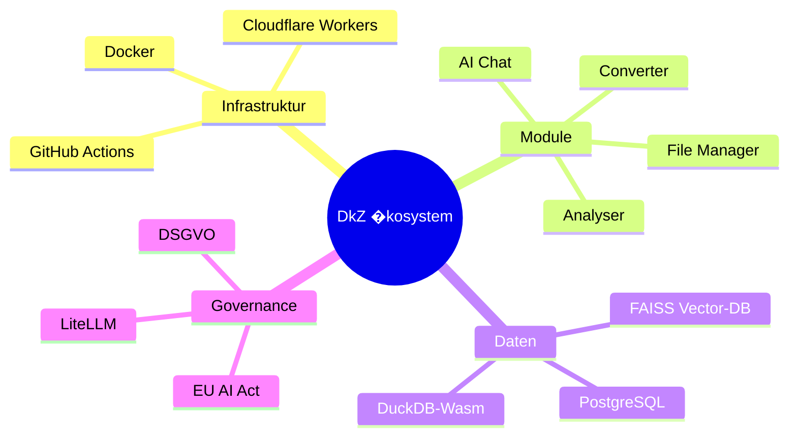
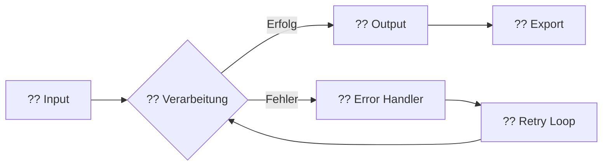

# ? DKZ PLAYBOOK � Output Rules & Design Standards

> **Version:** v1.01.2_01 � **Erstellt:** 2026-03-08 � **Autor:** DkZ devkitz  
> **Geltungsbereich:** Alle Chat-Ausgaben, Berichte, Module, Dashboards, Dokumentationen  
> **Status:** ?? VERBINDLICH

---

## -------------------------------------------
## SEKTION 01 � OUTPUT-FORMATIERUNG
## -------------------------------------------

### 1.1 Der 7-Block-Standard (Pflicht f�r jeden Output)

Jeder strukturierte Output folgt diesem Schema. Kein Block darf �bersprungen werden.

| # | Block | Pflicht | Min. Zeichen | Inhalt |
|---|-------|---------|-------------|--------|
| ? | **Metadaten-Header** | ? JA | 80 | Tags, Projekt, Kategorie, Version, Datum |
| ? | **Einf�hrung / Problem** | ? JA | 120 | Kontext setzen, Relevanz erkl�ren |
| ? | **Ziel / Nutzen** | ? JA | 80 | Was wird erreicht, warum ist es wichtig |
| ? | **Strukturierte Erkl�rung** | ? JA | 200 | Kerninhalt, Analyse, Details |
| ? | **Visuelle Darstellung** | ? JA | � | Tabelle, Diagramm, Mindmap oder Code-Block |
| ? | **Anwendung / Beispiel** | ?? EMPF. | 100 | Praxisbezug, Use-Case, Demo |
| ? | **Fazit + Next Steps** | ? JA | 60 | Zusammenfassung, Export-Optionen, Weiterf�hrung |

### 1.2 Metadaten-Header-Template

Jeder Output beginnt mit folgendem Header:

```markdown
---
?? METADATEN
+- ??? Projekt:    [Projektname]
+- ?? Kategorie:  [A�P Code] � [Name]
+- ?? Version:    v[major].[minor].[session]_[step]
+- ?? Datum:      [YYYY-MM-DD]
+- ?? Autor:      [Ersteller]
+- ?? Status:     [?? AKTIV | ?? DEV | ?? ARCHIV]
+- ??? Tags:       #tag1 #tag2 #tag3 ... (min. 10)
---
```

### 1.3 Mindest-Zeichenanzahl pro Element

| Element | Min. Zeichen | Beispiel |
|---------|-------------|----------|
| **Dokumenten-Titel** | 30 | `DKZ Ecosystem Blueprint � Architektur-�bersicht v2` |
| **Sektions-�berschrift** | 15 | `Modularer System-Aufbau` |
| **Absatz / Paragraph** | 120 | Mindestens 2-3 vollst�ndige S�tze |
| **Listenpunkt** | 40 | Genug Kontext f�r Standalone-Verst�ndnis |
| **Tabellenzelle (Text)** | 10 | Keine Einwort-Zellen (au�er Status/Tags) |
| **Tag** | 3 | `#ai`, `#cloud`, `#module` |
| **Code-Kommentar** | 20 | Erkl�render Inline-Kommentar |
| **Fazit** | 60 | Mindestens 1 vollst�ndiger Satz + Aktion |

---

## -------------------------------------------
## SEKTION 02 � BERICHTSDARSTELLUNG
## -------------------------------------------

### 2.1 Berichtsaufbau-Schema

```
+-------------------------------------------------+
�  ? TITEL � Projekt/Thema                       �
�  ? Version � Datum � Status-Badge               �
+-------------------------------------------------�
�  ?? METADATEN-BLOCK                             �
�  Tags, Kategorie, Projekt                       �
+-------------------------------------------------�
�  ?? INHALT (5�7 Bl�cke)                        �
�  +- Block 1: Einf�hrung                        �
�  +- Block 2: Analyse / Erkl�rung               �
�  +- Block 3: Visuelle Darstellung              �
�  +- Block 4: Beispiele / Use-Cases             �
�  +- Block 5: Empfehlungen                      �
�  +- Block 6: Erweiterungen (optional)          �
�  +- Block 7: Fazit + Next Steps                �
+-------------------------------------------------�
�  ?? EXPORT-OPTIONEN                             �
�  [?? PDF] [?? MD] [?? CSV] [?? Drive]         �
+-------------------------------------------------�
�  ?? CREATIVE AREA                               �
�  Weiterverarbeitungs-Vorschl�ge                 �
+-------------------------------------------------+
```

### 2.2 Status-Ampel-System

In allen Berichten, Tabellen und �bersichten gelten diese Status-Indikatoren:

| Symbol | Status | Farbe | Verwendung |
|--------|--------|-------|------------|
| ?? | **AKTIV / OK / LIVE** | `--dkz-success` `#00FF88` | Produktiv, funktionsf�hig |
| ?? | **IN ARBEIT / DEV** | `--dkz-warning` `#FFB800` | In Entwicklung, teilweise fertig |
| ?? | **FEHLER / STOP / ARCHIV** | `--dkz-error` `#FF3366` | Kritisch, blockiert, archiviert |
| ?? | **INFO / GEPLANT** | `--dkz-blue-heart` `#55ACEE` | Zur Kenntnis, noch nicht gestartet |
| ? | **NEUTRAL / N/A** | `--dkz-gray-02` `#71717a` | Nicht relevant, kein Status |

### 2.3 Header-Struktur-Hierarchie

```markdown
# ? Dokument-Titel (H1 � nur 1x pro Dokument)

## --- SEKTION [Nr] � [NAME] (H2 � Hauptbereiche)

### [Nr].[Sub] Untertitel (H3 � Unterbereiche)

#### Detail-Element (H4 � selten, nur bei Bedarf)
```

**Regeln:**
- ? Immer ein Emoji vor dem H1-Titel
- --- Immer die Trennlinie `---` vor H2-Sektionen
- `[Nr].[Sub]` Nummerierung ist Pflicht f�r alle H3
- Trennlinie `---` zwischen Hauptsektionen verwenden

---

## -------------------------------------------
## SEKTION 03 � MINDMAPS & DIAGRAMME
## -------------------------------------------

### 3.1 Mermaid-Mindmap (Standard f�r Konzepte)



**Regeln f�r Mindmaps:**
- Root-Node immer mit `(( ))` (Kreis)
- Maximal 4 Ebenen tief
- Jeder Ast hat mindestens 2, maximal 7 Kinder
- Emoji `????????` vor Nodes f�r visuelle Orientierung erlaubt
- Schriftgr��e durch Ebene bestimmt (automatisch)

### 3.2 Flowchart-Diagramm (Standard f�r Prozesse)



**Regeln f�r Flowcharts:**
- Immer `LR` (links?rechts) oder `TD` (oben?unten)
- Emojis in Node-Labels verwenden
- Entscheidungen immer als Raute `{ }`
- Fehler-Pfade immer in Rot-Ton (`??`)
- Erfolgs-Pfade immer in Gr�n-Ton (`??`)

### 3.3 ASCII-Mindmap (Fallback f�r Terminal/Plaintext)

```
                        +--- ?? AI Chat
                        +--- ?? Converter
              +- Module �
              �         +--- ?? Analyser
              �         +--- ?? File Manager
              �
? DkZ -------+- Infra ----- ?? Docker
              �         +--- ?? Cloudflare
              �         +--- ?? GitHub CI/CD
              �
              +- Data ------ ??? PostgreSQL
                        +--- ?? FAISS
                        +--- ?? DuckDB-Wasm
```

**Regeln:**
- Box-Drawing-Zeichen verwenden: `+ + + - � � +`
- Maximal 80 Zeichen Breite
- Emojis als visuelle Anker vor jedem Blatt-Node

---

## -------------------------------------------
## SEKTION 04 � TABELLEN IN MARKDOWN
## -------------------------------------------

### 4.1 Standard-Tabellenformat

```markdown
| Spalte A | Spalte B | Spalte C | Status |
|----------|----------|----------|--------|
| Wert 1   | Detail   | Info     | ??     |
| Wert 2   | Detail   | Info     | ??     |
```

### 4.2 Tabellenregeln

| Regel | Beschreibung |
|-------|-------------|
| **Header** | Immer fett oder Caps, niemals leer |
| **Alignment** | Links-b�ndig f�r Text, zentriert f�r Status/Icons |
| **Min. Spalten** | Mindestens 3 Spalten (sonst Liste verwenden) |
| **Max. Spalten** | Maximal 7 Spalten (sonst aufteilen) |
| **Status-Spalte** | Immer letzte Spalte, Emoji-Ampel verwenden |
| **Tag-Spalte** | Tags als `?? TAG` oder `[TAG]` formatieren |
| **Leere Zellen** | Nie leer lassen ? mindestens `�` oder `n/a` |
| **Zeilen-Limit** | Max 20 Zeilen pro Tabelle, dann Paginierung |

### 4.3 Tabellentypen

**Typ A � �bersichtstabelle** (f�r Registrierungen, Listen)
```markdown
| # | Name | Typ | Stack | Status |
|---|------|-----|-------|--------|
```

**Typ B � Vergleichstabelle** (f�r Evaluierungen)
```markdown
| Feature | Option A | Option B | Empfehlung |
|---------|----------|----------|------------|
```

**Typ C � Konfigurationstabelle** (f�r Settings)
```markdown
| Parameter | Wert | Default | Beschreibung |
|-----------|------|---------|-------------|
```

**Typ D � Statustabelle** (f�r Monitoring)
```markdown
| Modul | Health | Last Check | Aktion |
|-------|--------|------------|--------|
```

---

## -------------------------------------------
## SEKTION 05 � CHAT-BUTTON-OPTIK
## -------------------------------------------

### 5.1 Button-Klassen im DkZ-Design

Alle interaktiven Elemente in Chat-Ausgaben folgen dem Cyberclean-Design:

#### Prim�rer Action-Button (Neonrot)
```html
<button class="dkz-btn dkz-btn--primary">
  ? Aktion starten
</button>
```
```css
.dkz-btn--primary {
  background: linear-gradient(135deg, #fa1e4e, #ec4899);
  color: #ffffff;
  border: none;
  padding: 10px 24px;
  border-radius: 8px;
  font-family: 'JetBrains Mono', monospace;
  font-size: 0.85rem;
  font-weight: 600;
  cursor: pointer;
  transition: all 0.3s cubic-bezier(0.4, 0, 0.2, 1);
  box-shadow: 0 0 20px rgba(250, 30, 78, 0.25);
  letter-spacing: 0.05em;
}
.dkz-btn--primary:hover {
  transform: translateY(-2px);
  box-shadow: 0 0 30px rgba(250, 30, 78, 0.45);
}
```

#### Sekund�rer Button (Ghost/Outline)
```html
<button class="dkz-btn dkz-btn--ghost">
  ?? Details anzeigen
</button>
```
```css
.dkz-btn--ghost {
  background: transparent;
  color: #fa1e4e;
  border: 1px solid rgba(250, 30, 78, 0.4);
  padding: 10px 24px;
  border-radius: 8px;
  font-family: 'JetBrains Mono', monospace;
  font-size: 0.85rem;
  cursor: pointer;
  transition: all 0.3s cubic-bezier(0.4, 0, 0.2, 1);
}
.dkz-btn--ghost:hover {
  background: rgba(250, 30, 78, 0.12);
  box-shadow: 0 0 15px rgba(250, 30, 78, 0.2);
}
```

#### Tag-Button (Compact)
```html
<span class="dkz-tag dkz-tag--red">?? CRITICAL</span>
<span class="dkz-tag dkz-tag--green">?? ACTIVE</span>
<span class="dkz-tag dkz-tag--blue">?? INFO</span>
```
```css
.dkz-tag {
  display: inline-flex;
  align-items: center;
  gap: 4px;
  font-family: 'JetBrains Mono', monospace;
  font-size: 0.65rem;
  padding: 2px 10px;
  border-radius: 9999px;
  letter-spacing: 0.05em;
  font-weight: 600;
}
.dkz-tag--red {
  background: rgba(250, 30, 78, 0.12);
  color: #fa1e4e;
}
.dkz-tag--green {
  background: rgba(0, 255, 136, 0.12);
  color: #00FF88;
}
.dkz-tag--blue {
  background: rgba(85, 172, 238, 0.12);
  color: #55ACEE;
}
```

#### Icon-Button (Rund, f�r Toolbars)
```html
<button class="dkz-btn dkz-btn--icon" title="Einstellungen">??</button>
```
```css
.dkz-btn--icon {
  width: 40px;
  height: 40px;
  border-radius: 8px;
  background: #1a1a1c;
  border: 1px solid rgba(255, 255, 255, 0.06);
  color: #a1a1aa;
  font-size: 1.1rem;
  cursor: pointer;
  display: flex;
  align-items: center;
  justify-content: center;
  transition: all 0.15s cubic-bezier(0.4, 0, 0.2, 1);
}
.dkz-btn--icon:hover {
  border-color: rgba(250, 30, 78, 0.4);
  color: #fa1e4e;
  box-shadow: 0 0 12px rgba(250, 30, 78, 0.2);
}
```

### 5.2 Button-Grid f�r Chat-Aktionen

```html
<div class="dkz-action-grid">
  <button class="dkz-btn dkz-btn--primary">? Generieren</button>
  <button class="dkz-btn dkz-btn--ghost">?? Analysieren</button>
  <button class="dkz-btn dkz-btn--ghost">?? Konvertieren</button>
  <button class="dkz-btn dkz-btn--ghost">?? Exportieren</button>
</div>
```
```css
.dkz-action-grid {
  display: flex;
  flex-wrap: wrap;
  gap: 8px;
  padding: 16px 0;
}
```

### 5.3 Chat-Nachrichten-Styling

| Element | Stil |
|---------|------|
| **Benutzer-Nachricht** | Rechts-aligned, `--dkz-dark-03` Hintergrund, runder Radius |
| **System-Antwort** | Links-aligned, `--dkz-dark-01` Hintergrund, Neonrot-Akzentlinie oben |
| **Code-Block** | `--dkz-dark-00` Hintergrund, `--font-mono`, Kopier-Button |
| **Inline-Code** | `rgba(250,30,78,0.12)` Hintergrund, Neonrot Textfarbe |
| **Trennlinie** | Gradient: `transparent ? --dkz-neonrot-dim ? transparent` |

---

## -------------------------------------------
## SEKTION 06 � TAG-SYSTEM
## -------------------------------------------

### 6.1 Tag-Regeln (Verbindlich)

| Regel | Wert |
|-------|------|
| **Mindestanzahl Tags** | 10 pro Output |
| **Bei Research-Content** | 15+ Tags |
| **Format** | `#kleinbuchstaben`, keine Leerzeichen, Bindestrich erlaubt |
| **Sprache** | Deutsch oder Englisch (konsistent pro Dokument) |
| **Kategorie-Tag** | Immer mindestens 1 aus dem A�P System |
| **Projekt-Tag** | Immer den Projektnamen als Tag |
| **Status-Tag** | Immer: `#aktiv` oder `#dev` oder `#archiv` |
| **Platzierung** | Im Metadaten-Header UND am Dokumentende |

### 6.2 Obligatorische Tag-Kategorien

Jeder Output braucht mindestens **einen Tag aus jeder dieser Gruppen**:

```
?? CONTENT-TYP:    #bericht #analyse #tutorial #doku #guide #blueprint
?? TECHNOLOGIE:     #html #css #js #python #docker #ai #react #node
?? PROJEKT:         #dkz #openclaw #kirk #leeted #flyerpro
?? KLASSIFIKATION:  #a-artikel #j-javascript #k-konfig #m-meeting
? STATUS:          #aktiv #dev #archiv #geplant #done
```

### 6.3 Tag-Anzeige in HTML

```html
<div class="dkz-tag-cloud">
  <span class="dkz-tag dkz-tag--red">#blueprint</span>
  <span class="dkz-tag dkz-tag--blue">#docker</span>
  <span class="dkz-tag dkz-tag--green">#dkz</span>
  <span class="dkz-tag dkz-tag--yellow">#k-konfig</span>
  <span class="dkz-tag dkz-tag--red">#aktiv</span>
</div>
```
```css
.dkz-tag-cloud {
  display: flex;
  flex-wrap: wrap;
  gap: 6px;
  padding: 8px 0;
}
```

---

## -------------------------------------------
## SEKTION 07 � FARBSCHEMA
## -------------------------------------------

### 7.1 Drei Farbschemata (Umschaltbar)

#### Schema A � **DARK MODE** (Standard)
| Rolle | Farbe | Hex | CSS Variable |
|-------|-------|-----|-------------|
| Background | Tiefschwarz | `#0e0e10` | `--dkz-black` |
| Surface | Dunkelgrau | `#1a1a1c` | `--dkz-dark-01` |
| Text Primary | Soft White | `#f6f6f7` | `--dkz-soft-white` |
| Text Secondary | Grau | `#71717a` | `--dkz-gray-02` |
| Accent Primary | **Neonrot** | `#fa1e4e` | `--dkz-neonrot` |
| Accent Glow | Neonrot Glow | `rgba(250,30,78,0.35)` | `--dkz-neonrot-glow` |
| Success | Gr�n | `#00FF88` | `--dkz-success` |
| Warning | Gelb | `#FFB800` | `--dkz-warning` |
| Error | Rot | `#FF3366` | `--dkz-error` |

#### Schema B � **CRIMSON MODE** (Schwarz + Rot Kontrast)
| Rolle | Farbe | Hex | CSS Variable |
|-------|-------|-----|-------------|
| Background | Pures Schwarz | `#000000` | `--dkz-bg` |
| Surface | Dunkles Blutrot | `#1a0008` | `--dkz-surface` |
| Text Primary | Neonrot | `#fa1e4e` | `--dkz-text` |
| Text Secondary | Ged�mpftes Rot | `#8b1a2b` | `--dkz-text-dim` |
| Accent Primary | **Helles Neonrot** | `#ff2d5e` | `--dkz-accent` |
| Accent Glow | Intensiver Glow | `rgba(255,45,94,0.5)` | `--dkz-accent-glow` |
| Borders | Rotschimmer | `rgba(250,30,78,0.2)` | `--dkz-border` |
| Highlight | Reines Wei� | `#ffffff` | `--dkz-highlight` |

#### Schema C � **NEON MODE** (Maximaler Kontrast)
| Rolle | Farbe | Hex | CSS Variable |
|-------|-------|-----|-------------|
| Background | Void Black | `#050505` | `--dkz-bg` |
| Surface | Charcoal | `#0a0a0c` | `--dkz-surface` |
| Text Primary | Hot White | `#ffffff` | `--dkz-text` |
| Accent Primary | **ULTRA Neonrot** | `#ff0040` | `--dkz-accent` |
| Accent Glow | Maximaler Glow | `rgba(255,0,64,0.6)` | `--dkz-accent-glow` |
| Accent Alt | Neon Cyan | `#00FFD5` | `--dkz-accent-alt` |
| Grid Lines | Ghost Rot | `rgba(255,0,64,0.05)` | `--dkz-grid` |

### 7.2 Farbschema-Kontrast-Matrix

```
DARK MODE (Standard)   CRIMSON MODE           NEON MODE
??????????????????    ??????????????????    ??????????????????
���������  #0e0e10    ���������� #000000    ���������� #050505
���������  #1a1a1c    ���������� #1a0008    ���������� #0a0a0c
���������  #fa1e4e    ���������� #fa1e4e    ���������� #ff0040
���������  #f6f6f7    ���������� #8b1a2b    ���������� #ffffff
??????????????????    ??????????????????    ??????????????????
Kontrast: Normal       Kontrast: Intensiv     Kontrast: Maximum
```

---

## -------------------------------------------
## SEKTION 08 � THEME-SWITCHING
## -------------------------------------------

### 8.1 CSS-Implementation: `data-theme` Toggle

```css
/* --- THEME TOKENS --- */

/* DARK MODE (Default) */
:root,
[data-theme="dark"] {
  --dkz-bg:           #0e0e10;
  --dkz-surface:      #1a1a1c;
  --dkz-surface-2:    #222226;
  --dkz-text:         #f6f6f7;
  --dkz-text-dim:     #71717a;
  --dkz-accent:       #fa1e4e;
  --dkz-accent-glow:  rgba(250, 30, 78, 0.35);
  --dkz-accent-dim:   rgba(250, 30, 78, 0.12);
  --dkz-border:       rgba(255, 255, 255, 0.06);
  --dkz-border-glow:  rgba(250, 30, 78, 0.4);
}

/* CRIMSON MODE */
[data-theme="crimson"] {
  --dkz-bg:           #000000;
  --dkz-surface:      #1a0008;
  --dkz-surface-2:    #2a0012;
  --dkz-text:         #fa1e4e;
  --dkz-text-dim:     #8b1a2b;
  --dkz-accent:       #ff2d5e;
  --dkz-accent-glow:  rgba(255, 45, 94, 0.5);
  --dkz-accent-dim:   rgba(255, 45, 94, 0.15);
  --dkz-border:       rgba(250, 30, 78, 0.2);
  --dkz-border-glow:  rgba(255, 45, 94, 0.6);
}

/* NEON MODE */
[data-theme="neon"] {
  --dkz-bg:           #050505;
  --dkz-surface:      #0a0a0c;
  --dkz-surface-2:    #12121a;
  --dkz-text:         #ffffff;
  --dkz-text-dim:     #a1a1aa;
  --dkz-accent:       #ff0040;
  --dkz-accent-glow:  rgba(255, 0, 64, 0.6);
  --dkz-accent-dim:   rgba(255, 0, 64, 0.15);
  --dkz-border:       rgba(255, 0, 64, 0.15);
  --dkz-border-glow:  rgba(255, 0, 64, 0.5);
}
```

### 8.2 JavaScript Theme-Toggle

```javascript
// --- DKZ THEME SWITCHER ---
const DKZ_THEMES = ['dark', 'crimson', 'neon'];

function setTheme(theme) {
  document.documentElement.setAttribute('data-theme', theme);
  localStorage.setItem('dkz-theme', theme);
  
  // Update toggle button
  const btn = document.getElementById('theme-toggle');
  if (btn) {
    const icons = { dark: '??', crimson: '??', neon: '?' };
    const labels = { dark: 'Dark', crimson: 'Crimson', neon: 'Neon' };
    btn.innerHTML = `${icons[theme]} ${labels[theme]}`;
  }
}

function cycleTheme() {
  const current = document.documentElement.getAttribute('data-theme') || 'dark';
  const idx = DKZ_THEMES.indexOf(current);
  const next = DKZ_THEMES[(idx + 1) % DKZ_THEMES.length];
  setTheme(next);
}

// Init: Theme aus localStorage laden
document.addEventListener('DOMContentLoaded', () => {
  const saved = localStorage.getItem('dkz-theme') || 'dark';
  setTheme(saved);
});
```

### 8.3 Theme-Toggle-Button (HTML)

```html
<button id="theme-toggle" 
        class="dkz-btn dkz-btn--icon" 
        onclick="cycleTheme()" 
        title="Farbschema wechseln"
        style="position:fixed; bottom:20px; right:20px; z-index:2000;">
  ?? Dark
</button>
```

---

## -------------------------------------------
## SEKTION 09 � LLM PROMPT-ENGINEERING
## -------------------------------------------

### 9.1 Die 20 LLM Prompt-Blueprints

> **Vollst�ndige Dokumentation:** `04_SYSTEM/DKZ_LLM_PROMPT_BLUEPRINTS.md`  
> **Quelle:** [20 KI-Tipps Video](https://www.youtube.com/watch?v=HKRzt6aNlWY)

20 formalisierte Prompt-Engineering-Techniken, jeweils mit Template, Beispiel und Anti-Pattern:

| # | Blueprint | Kategorie | Einsatz |
|---|-----------|-----------|---------|
| BP-01 | **Reasoning Effort** | ?? Performance | Rechenpower pro Task steuern |
| BP-02 | **XML-Container** | ?? Struktur | Prompts mit XML-Tags strukturieren |
| BP-03 | **Output-Klammer** | ?? Kontrolle | Exakte L�ngen erzwingen |
| BP-04 | **Token-Sparen** | ?? Effizienz | Floskeln/Wiederholungen stoppen |
| BP-05 | **Kompakte Bullets** | ?? Format | Infodichte maximieren |
| BP-06 | **Scope-Disziplin** | ??? Sicherheit | Unerw�nschte Extras verbieten |
| BP-07 | **R�ckfragen-Modus** | ?? Workflow | Erst fragen, dann arbeiten |
| BP-08 | **Plausible Interpretationen** | ?? Strategie | Top-3 bei Unklarheit |
| BP-09 | **Conservative Grounding** | ? Qualit�t | Fakten nur mit Quelle |
| BP-10 | **Werkzeug vor Wissen** | ?? Tools | Tools statt Trainingsdaten |
| BP-11 | **Modell-Migration** | ?? Infrastruktur | Sauberer LLM-Wechsel |
| BP-12 | **Outline-Hack** | ?? Dokumente | Outline vor Verarbeitung |
| BP-13 | **Sektions-Anker** | ?? Belegpflicht | Antworten an Quellen binden |
| BP-14 | **JSON-Extraktion** | ?? Daten | Strukturierte Daten extrahieren |
| BP-15 | **High-Risk Self-Check** | ?? Sicherheit | Pflicht-Selbstpr�fung |
| BP-16 | **Parallel-Suche** | ?? Recherche | Multi-Stream-Research |
| BP-17 | **Compaction** | ??? Kontext | Lange Chats komprimieren |
| BP-18 | **Second Order Research** | ?? Tiefenforschung | Zweistufige Recherche |
| BP-19 | **Objektivit�t** | ?? Qualit�t | Schmeichelei unterdr�cken |
| BP-20 | **xhigh-Geheimnis** | ?? Logik | Maximale Reasoning-Stufe |

### 9.2 Pflicht-Blueprints nach Task-Typ

| Task-Typ | Pflicht-Blueprints |
|----------|-------------------|
| **Code schreiben** | BP-02, BP-06, BP-04 |
| **Code reviewen** | BP-19, BP-15, BP-06 |
| **Recherche** | BP-09, BP-16, BP-18, BP-10 |
| **Dokument-Analyse** | BP-12, BP-13, BP-03 |
| **API-Call / Automation** | BP-01, BP-14, BP-02 |
| **Kritische Entscheidung** | BP-20, BP-15, BP-08 |
| **Chat-Komprimierung** | BP-17, BP-05, BP-04 |

---

## -------------------------------------------
## ANHANG A � SCHNELLREFERENZ-KARTE
## -------------------------------------------

```
+---------------------------------------------------------+
�  ? DKZ PLAYBOOK � SCHNELLREFERENZ                      �
+---------------------------------------------------------�
�                                                         �
�  ?? OUTPUT:     7-Block-Standard, immer Metadaten       �
�  ??? TAGS:       Min. 10 Tags, bei Research 15+          �
�  ?? ZEICHEN:    Titel =30, Absatz =120, Listenpunkt =40�
�  ?? TABELLEN:   3�7 Spalten, Status letzte Spalte       �
�  ?? MINDMAPS:   Mermaid bevorzugt, max 4 Ebenen         �
�  ?? FARBE:      Dark/Crimson/Neon � via data-theme      �
�  ?? AKZENT:     #fa1e4e (Neonrot) � IMMER Prim�rfarbe   �
�  ?? HEADER:     H1 1x, H2 --- Sektionen, H3 nummeriert �
�  ?? STATUS:     ????????? Ampelsystem Pflicht         �
�  ?? FONTS:      Mono=JetBrains, Sans=IBM Plex, H=Space  �
�                                                         �
�  Versionen: v{major}.{minor}.{session}_{step}           �
�  Kategorien: A�P Code-System (Content?Organisation)     �
�                                                         �
+--- DkZ devkitz � v1.01.2_01 � 2026-03-08 --------------+
```

---

## -------------------------------------------
## SEKTION 10 � EVENT-LOG SYSTEM
## -------------------------------------------

### 10.1 Universal Event Logger (`dkz-eventlog.js`)

Jedes Event im �kosystem bekommt eine UUID und wird protokolliert:

| Feld | Format | Pflicht |
|------|--------|---------|
| **id** | `EVT-{timestamp}-{hex4}` | ? |
| **type** | creation / action / error / system / output / command | ? |
| **source** | Modul-Name (z.B. clipboard, hub, cmd) | ? |
| **action** | Was passiert ist | ? |
| **metadata** | Modul, Version, User, Input, Output, Duration | ? |
| **tags** | Filter-Tags (min. 2) | ? |
| **parentId** | �bergeordnetes Event (f�r Verkettung) | ?? |
| **timestamp** | ISO 8601 | ? |
| **sessionId** | `SES-{timestamp}` | ? |

### 10.2 Log-Pflicht

Jedes Modul MUSS loggen bei: **Erstellen**, **Ausgabe**, **Fehler**.
OS-Befehle via `cmd-logger.ps1` ? `dkz "befehl"`.

### 10.3 Dokumentations-Sync (`doc-sync.js`)

10 System-Dokumente werden �berwacht und bei �nderung auto-committed.
Rollback: `node doc-sync.js rollback <hash>`.

---

## -------------------------------------------
## SEKTION 11 � GIT-ARCHIVE SYSTEM
## -------------------------------------------

### 11.1 5 Separate Archive

| Archiv | Pfad | Inhalt |
|--------|------|--------|
| **Prompts** | `_archives/prompts/` | System- & Tool-Prompts |
| **Snippets** | `_archives/snippets/` | JS, CSS, PowerShell |
| **Workflows** | `_archives/workflows/` | Workflow-Definitionen |
| **Agents** | `_archives/agents/` | Copilot, CodeRabbit, Antigravity |
| **Blueprints** | `_archives/blueprints/` | Blaupausen + Impl-Pl�ne |

### 11.2 Archiv-Regeln

- Jedes Archiv hat `*-index.json` + `README.md`
- Jede �nderung wird Git-committed (R20)
- Blaupausen + Analysen ? `blueprints/implementations/`
- Prompt-�nderungen ? `prompts/`
- Agent-Config-�nderungen ? `agents/{name}/`

---

## -------------------------------------------
## SEKTION 12 � BACKEND / FRONTEND TRENNUNG
## -------------------------------------------

### 12.1 Zwei Lager

| Lager | Sichtbarkeit | Inhalt |
|-------|-------------|--------|
| **BACKEND/** | Nur Admin + System | Auth, Admin Dashboard, Archive, Logs, Internes |
| **FRONTEND/** | User + Kunden | Landing Page, App, Module, Profil |

### 12.2 Daten-Isolation

- User sieht NUR eigene Daten (userId-Filter)
- System-Kommunikation: base64-verschl�sselt
- Admin (777): ALLES sichtbar
- Chat/Konsole: Interne Daten nicht sichtbar

### 12.3 API-Kommunikation

```
FRONTEND --[API Key]--? BACKEND
         ?--[encrypted]--
```

Jeder Request: `Authorization: Bearer dkz_xxx`

---

## -------------------------------------------
## SEKTION 13 � MULTI-USER + API KEYS
## -------------------------------------------

### 13.1 Rollen (bestehend aus `roles.json`)

| Rolle | Level | Rechte |
|-------|-------|--------|
| ?? Admin | 100 | Alles, System, Deploy, Rollen erstellen |
| ????? Developer | 50 | Code, Agenten, Logs, Deploy |
| ??? Viewer | 20 | Nur Lesen |
| ?? Guest | 10 | �ffentliche Bereiche |

### 13.2 API-Key Lifecycle

1. User ? Google Login ? Firebase Auth
2. Backend ? User in `users.json` finden/erstellen
3. API-Key generieren (AES-256 verschl�sselt)
4. Frontend erh�lt Key ? speichert in `sessionStorage`
5. Admin kann Keys jederzeit an/aus schalten

### 13.3 Per-User Git

Jeder User bekommt eigenes Git-Verzeichnis:
`BACKEND/_data/users/{userId}/` � isoliert, nur eigene Daten.

---

> **??? Tags:** #playbook #dkz #design-system #output-regeln #farbschema #neonrot #button-design #tag-system #mindmap #tabellen #chat-optik #theme-switching #css-tokens #cyberclean #formatierung #standards #event-log #git-archives #backend-frontend #multi-user #api-keys
>
> **?? Kategorie:** K-Konfig � Systemkonfiguration  
> **?? Version:** v1.01.2_01  
> **?? Status:** ?? VERBINDLICH  
> **? DkZ devkitz** � �Vorausschauend. Direkt. Klar. Innovativ."

---

## 14. ONTHERUN MCP + NEXUZ-API

### 14.1 ONTHERUN -- MCP Server

Das Backend-Rueckgrat des DkZ Oekosystems. Model Context Protocol Server mit 34+ Tools.

- **Pfad:** `ONTHERUN/`
- **Start:** `node cli/dkz.js start` oder `DKZ_START.bat`
- **Config:** `ONTHERUN/server/config.js` -- 12 Provider, n8n, Puter, NotebookLM
- **Tools:** `server/tools/` -- tokens, integrations, research, prompts, chat, files, health, modules, seo, workflow, system

**Regel:** Alle Backend-Aufrufe NUR ueber NEXUZ (R31). Kein direkter API-Zugriff aus Modulen.

### 14.2 NEXUZ-API -- Gateway

Express.js REST + WebSocket Gateway auf Port 3040.

- **Pfad:** `ONTHERUN/gateway/`
- **Endpoints:** `/api/v1/chat`, `/api/v1/modules`, `/api/v1/tools/execute`, `/api/v1/health`
- **Middleware:** CORS, Helmet, Rate-Limiting, Logging
- **Frontend-Bridge:** `shared/nexuz.js` -- Einbinden mit `<script src="../../shared/nexuz.js"></script>`

### 14.3 James -- Evaluations-Agent

James LIEST und BEWERTET -- aendert NIE Code. 19 Rubric-Regeln in 6 Kategorien.

- **Pfad:** `shared/dkz-james.js`
- **Kategorien:** quality, security, design, prompt, structure, logic
- **Score:** 0-100 mit Note A-F
- **Integration:** Auto-Inject Panel (unten links) in allen Buildern + Iceberg
- **Prompt Archive:** Bewertet Prompts via `otr_prompt_evaluate` MCP Tool

### 14.4 App Builder

Chat-Export Setup fuer 6 AI-Plattformen: OpenAI, Gemini, Claude, DeepSeek, Perplexity, Grok.

- **Pfad:** `modules/app-builder/`
- **Features:** Setup Save/Load/Export/Import, 6 Presets, Token-Management via NEXUZ
- **API-Keys:** Via Settings Panel oder direkt im Builder

### 14.5 Settings Panel

5 Tabs: API-Keys (9 Provider), Personalisierung (Akzentfarbe, Schrift, Sprache), Verbindungen (Gateway, n8n, Puter), Erlaubnisse (pro Modul), James Config (Schwellwerte, Regeln).

- **Pfad:** `modules/settings/`

### 14.6 DKZ_START.bat

Ecosystem Launcher. Doppelklick startet:
1. Node.js + Python Check
2. `npm install` + `pip install notebooklm-mcp-cli`
3. Desktop-Shortcuts (Hub, Console, Server)
4. Windows-Kontextmenue "DkZ / Console oeffnen"
5. NEXUZ-API Gateway Start
6. Landing Page oeffnen


---

## -------------------------------------------
## SEKTION 15 � NETZWERK-INTEGRATION & AUTOMATISIERUNG
## -------------------------------------------

### 15.1 Shared Scripts � Pflicht fuer ALLE Module

Jedes Modul MUSS diese 6 Scripts einbinden (via Auto-Injector oder manuell):

| Script | Funktion | Pflicht |
|--------|----------|---------|
| dkz-james.js | Prompt-Bewertung, KNOWLEDGE, Rules, GM-Rules | JA |
| dkz-memory.js | 3-Layer Memory (Hot/Warm/Cold), Presets, Conflicts | JA |
| dkz-compaction.js | Auto-Compact, Backup/Rollback, 3 Strategien | JA |
| dkz-iceberg.js | Versioned Prompt Storage, 7 Categories | JA |
| dkz-prompt-score.js | Live Score Widget, textarea + div Support | JA |
| dkz-builder-bridge.js | Bidirektionale Builder-Sync, ExternalCatalog | JA |

**Auto-Injector:** `tools/dkz-auto-inject.ps1 [-Verify] [-Force] [-SingleModule name]`

### 15.2 Bidirektionale Datenfluss-Regeln

R97: Jedes neue Modul muss beim Erstellen automatisch alle 6 Shared Scripts erhalten.
R98: Jeder Builder muss ueber BuilderBridge bidirektional mit Iceberg und James verbunden sein.
R99: Der Updater muss neue Module automatisch erkennen und in den HealthCheck aufnehmen.

### 15.3 AutoHealthCheck (dkz-updater.js)

Prueft alle 15 Minuten automatisch:
- Iceberg >500 Prompts � Archiv-Export Warnung
- localStorage >4MB � Auto-Compact + REDNOTE
- Memory >85% Fill � REDNOTE (GM-02 Wache)
- REDNOTE >10 offene � Review Warnung
- Builder >200 Eintraege � Export Warnung

### 15.4 Neues Modul integrieren � Checkliste

1. `tools/dkz-auto-inject.ps1 -SingleModule [name]` ausfuehren
2. BUILDER_MAP in dkz-builder-bridge.js erweitern (wenn Builder)
3. MODULES Array in dkz-updater.js erweitern
4. Hub Auto-Discovery pruefen
5. Stress-Test via /debug2 Workflow
6. Git commit

### 15.5 Content-Dokumentation

Alle Automatisierungen werden protokolliert unter:
- debug�/STRESS_TEST_[datum].md
- debug�/AUTOMATION_PROTOKOLL_[datum].md
- shared/PROMPT_OPTIMIZER_DOCS.md
- IMPLEMENTIERUNGSPLAN.md Phase 6

### 15.6 Archiv-Pflicht (R100 � NIEMALS LOESCHEN)

> **KRITISCH:** Dateien, Module, Configs, Daten, Scripts, Logs � NICHTS darf geloescht werden.
> Alles was nicht mehr gebraucht wird, wird in ein `_archives/` Verzeichnis VERSCHOBEN.

```
R100: LOESCHEN IST VERBOTEN. Immer verschieben nach _archives/.
      Gilt fuer: Dateien, Module, Configs, Daten, Scripts, Logs, Prompts,
      localStorage-Eintraege, Git-Branches, Backups � ALLES.
      
      Ablauf:
      1. Zieldatei identifizieren
      2. _archives/ Ordner erstellen (falls nicht vorhanden)
      3. Datei VERSCHIEBEN (Move, nicht Copy+Delete)
      4. Git commit: "archive: [dateiname] nach _archives/"
      5. REDNOTE Eintrag: was wurde wann wohin archiviert
```

**Archiv-Struktur:**
- `01_PROJECTS/01_dashboard/_archives/` � Dashboard-Dateien
- `04_SYSTEM/_archives/` � System-Dateien
- `modules/[name]/_archives/` � Modul-spezifisch
- `shared/_archives/` � Alte Shared Scripts

**Ausnahmen:** Keine. Auch temporaere Dateien werden archiviert, nicht geloescht.

---

## -------------------------------------------
## SEKTION 16 � SYSTEM-HAUPTINFORMATION & DOKUMENTEN-REGISTER
## -------------------------------------------

> **Zweck:** Zentraler Anker f�r ALLE systemrelevanten Informationen, Regeln, Architektur-Dokumente und Update-Verfahren. Jedes LLM / jeder Agent findet hier den vollst�ndigen �berblick �ber das DEVKiTZ� �kosystem.

### 16.1 System-Identit�t

| Eigenschaft | Wert |
|-------------|------|
| **Name** | DEVKiTZ� (Developer & Creator Hub) |
| **Vision** | �Google f�r die EU" � souver�nes, modulares �kosystem |
| **Operator** | Seven / LIKEDBIG / 777 |
| **Codename** | NEW EUROP ORDER |
| **Motto** | �Das exakte Verfahren ist wichtiger als das Ergebnis" |
| **Design** | Cyberclean � Neonrot `#fa1e4e` � Dark/Crimson/Neon |
| **Lizenz** | AGPL-3.0 / MIT |
| **Architektur** | 5-Layer + Foundation (Frontend ? Orchestration ? Storage ? Infra ? Governance) |

### 16.2 Pflicht-Dokumente (IMMER aktuell halten)

> **KRITISCH:** Diese Dokumente bilden das Fundament des Systems. Bei JEDER �nderung am System M�SSEN die betroffenen Dokumente aktualisiert werden.

#### ?? Tier 1 � Regelwerk & Identit�t (PFLICHTLEKT�RE)

| Dokument | Pfad | Inhalt | Zeichen |
|----------|------|--------|---------|
| **REGELWERK.md** | `C:\DEVKiTZ\REGELWERK.md` | 25 �kosystem-Regeln (R0�R25), Ordnerstruktur, Modul-Konventionen, Konflikt-Warnsystem | ~31K |
| **claude.md** | `04_SYSTEM/claude.md` | Projekt-Identit�t, Architektur, Tech-Stack, Aktive Projekte, Ordnerstruktur, OpenClaw, ONTHERUN | ~14K |
| **DKZ_PLAYBOOK.md** | `04_SYSTEM/DKZ_PLAYBOOK.md` | DU BIST HIER � Output-Regeln, Design-Standards, Tag-System, Farbschemata, Prompt-Blueprints | ~37K |
| **BLAUPAUSE.md** | `01_PROJECTS/01_dashboard/BLAUPAUSE.md` | Dashboard-Architektur, 72 Module, Design System, Tech-Stack, Qualit�tsstandards | ~21K |

#### ?? Tier 2 � Architektur & Blueprints

| Dokument | Pfad | Inhalt |
|----------|------|--------|
| **Ecosystem Blueprint V2** | `04_SYSTEM/DKZ_ECOSYSTEM_BLUEPRINT_V2.md` | Vollst�ndige 5-Layer Architektur, Selbstreparatur, Feedback-Loops, Cloud-Strategie |
| **Grand Architecture Symphony** | `04_SYSTEM/DKZ_GRAND_ARCHITECTURE_SYMPHONY.md` | Architektur-Gesamtbild, Komponenten-Zusammenspiel |
| **Ecosystem Flow Blaupause** | `04_SYSTEM/DKZ_ECOSYSTEM_FLOW_BLAUPAUSE.md` | Datenfluss, Prozessabl�ufe, Automationsketten |
| **MCP API Dokumentation** | `04_SYSTEM/DKZ_MCP_API_DOKUMENTATION.md` | ONTHERUN MCP Server, 34+ Tools, NEXUZ Gateway, API-Referenz |
| **LLM Prompt Blueprints** | `04_SYSTEM/DKZ_LLM_PROMPT_BLUEPRINTS.md` | 20 formale Prompt-Engineering Techniken (BP-01 bis BP-20) |
| **Optimierungs-Leitfaden** | `04_SYSTEM/DKZ_OPTIMIERUNGS_LEITFADEN.md` | 5-Layer Optimierung, priorisierte Entwicklungsaufgaben |

#### ?? Tier 3 � Produkt-Blaupausen

| Dokument | Pfad | Produkt |
|----------|------|---------|
| **BotNet Marketplace** | `04_SYSTEM/BOTNET_MARKETPLACE_BLAUPAUSE.md` | BotNet� Agent-Marktplatz + DAC |
| **BotNet Playbook** | `04_SYSTEM/BOTNET_PLAYBOOK.md` | BotNet� Strategien und Runbooks |
| **Business Ecosystem** | `04_SYSTEM/BUSINESS_ECOSYSTEM_BLAUPAUSE.md` | Gesch�ftsmodell, Monetarisierung, Partnerschaften |
| **DataLakeHouse** | `04_SYSTEM/DATALAKEHOUSE_BLAUPAUSE.md` | Apache Iceberg + DuckDB Architektur |
| **DocEngine** | `04_SYSTEM/DOCENGINE_BLAUPAUSE.md` | Wiki-Builder + i18n System |
| **NEXUZ Team Portal** | `04_SYSTEM/NEXUZ_TEAM_PORTAL_BLAUPAUSE.md` | NEXUZ� Gateway, Team-Kollaboration |
| **ONTHERUN** | `04_SYSTEM/ONTHERUN_BLAUPAUSE.md` | MCP Server Architektur |
| **Passkeys** | `04_SYSTEM/PASSKEYS_BLAUPAUSE.md` | WebAuthn/FIDO2 Authentifizierung |
| **Speech-to-Text** | `04_SYSTEM/SPEECH_TO_TEXT_BLAUPAUSE.md` | WhisperBar� Spracheingabe |
| **Google Drive** | `04_SYSTEM/DKZ_GOOGLE_DRIVE_BLAUPAUSE.md` | Cloud-Backup, Apps Script |
| **Second Brain** | `04_SYSTEM/DKZ_SECOND_BRAIN_ANYTYPE.md` | Anytype Integration, Wissensmanagement |

#### ?? Tier 4 � Registries & Konfiguration

| Registry | Pfad | Inhalt |
|----------|------|--------|
| **Master-Registry** | `01_PROJECTS/01_dashboard/REGISTRY.json` | Master-Index aller 85+ Module |
| **Agenten-Registry** | `04_SYSTEM/SYSTEM/_core/agents-registry.json` | OpenClaw + PicoClaws + NanoBots |
| **Teams-Registry** | `04_SYSTEM/SYSTEM/_core/teams-registry.json` | 6 BMAD Team-Templates |
| **Leadership-Registry** | `04_SYSTEM/SYSTEM/_core/leadership-registry.json` | 3 Leadership-Templates (CTO/CMO/CISO) |
| **Skills-Registry** | `04_SYSTEM/SYSTEM/_core/skills-workflows-actions-registry.json` | Skills, Workflows, Actions |
| **Projekte-Registry** | `04_SYSTEM/SYSTEM/_core/projects-registry.json` | 11 Projekte + 8 DEVKiTZ-Module |
| **Quellen-Registry** | `04_SYSTEM/SYSTEM/_core/references-sources-registry.json` | APIs, Datenbanken, Wissensquellen |
| **Workspaces-Registry** | `04_SYSTEM/SYSTEM/_core/workspaces-registry.json` | 8 Workspaces |
| **Auto-Growth** | `04_SYSTEM/SYSTEM/_core/auto-growth-registry.json` | Automatisch wachsende Asset-DB |
| **Machine-Context** | `04_SYSTEM/SYSTEM/_core/machine-context.json` | Boot-Datei f�r Agenten |
| **Master-Config** | `04_SYSTEM/SYSTEM/_core/master-config.json` | Zentrale Systemkonfiguration |
| **Cost-Calculator** | `04_SYSTEM/SYSTEM/_core/cost-calculator.json` | Token-Kosten pro Modell |
| **Playbook-Registry** | `04_SYSTEM/SYSTEM/_agents/playbook/playbook-registry.json` | 25 Runbooks |
| **Health-Checks** | `04_SYSTEM/SYSTEM/_health/health-checks.json` | L1�L5 Health-Check Definitionen |
| **Rollen** | `04_SYSTEM/SYSTEM/_auth/roles.json` | RBAC (Admin/Developer/Viewer/Guest) |

#### ? Tier 5 � Dokumentation & Anleitungen

| Dokument | Pfad | Inhalt |
|----------|------|--------|
| **Doc Management Blueprint** | `04_SYSTEM/DKZ_DOC_MANAGEMENT_BLUEPRINT.md` | Dokumentations-Architektur |
| **Doc Management Doku** | `04_SYSTEM/DKZ_DOC_MANAGEMENT_DOKUMENTATION.md` | Dokumentations-Handbuch |
| **Doc Management Datasheet** | `04_SYSTEM/DKZ_DOC_MANAGEMENT_DATASHEET.md` | Technisches Datenblatt |
| **Doc Management Mindmap** | `04_SYSTEM/DKZ_DOC_MANAGEMENT_MINDMAP.md` | Visuelle Dokumentations-Map |
| **DkZ Symbole** | `04_SYSTEM/DKZ_SYMBOLE.md` | Alle Emojis und Icons im System |
| **Implementierungsplan** | `01_PROJECTS/01_dashboard/IMPLEMENTIERUNGSPLAN.md` | Feature-Roadmap aller Module |
| **Playbook-Archiv** | `01_PROJECTS/01_dashboard/PLAYBOOK_ARCHIV.md` | Strategie-Vorlagen, LLM-Kosten |
| **Wiki Regelwerk** | `04_SYSTEM/DEVKITZ_WIKI/wiki/04_Regelwerk.md` | Wiki-Version der Regeln |
| **Docs Regelwerk** | `04_SYSTEM/docs/Regelwerk.md` | Dokumentations-Regelwerk |
| **Constitution** | `01_PROJECTS/13_dkz-claude/constitution/constitution.md` | KI-Verfassung |

### 16.3 Regeln-Schnellreferenz

> Alle 25+ Regeln aus `REGELWERK.md` � hier komprimiert als Nachschlagewerk.

| # | Regel | Kurzbeschreibung |
|---|-------|-----------------|
| R0 | L�SUNG > PROBLEM | Jede Handlung macht das System besser |
| R1 | NIE L�SCHEN | Immer archivieren ? `99_ARCHIVE/` |
| R2 | GIT NACH JEDER �NDERUNG | `prefix(bereich): was` |
| R3 | ALLES BLEIBT VORHANDEN | Dateien sind immer nachverfolgbar |
| R4 | PROAKTIVE VERBESSERUNG | Optimierungen sind Pflicht |
| R5 | ERST ANALYSIEREN | Kein blindes Verschieben |
| R6 | KOMPATIBILIT�T PR�FEN | Testen vor Integration |
| R7 | NICHT REINPASST ? INBOX | ? `00_INBOX/RAW/` |
| R8 | PRIVAT ? 05_INTERN | Private Dokumente separieren |
| R9 | VERSIONIERUNG | `vX.XX.X_XX` Format |
| R10 | WORKFLOW > ERGEBNIS | Dokumentierter Weg > schnelles Ergebnis |
| R11 | DATEIHOHEIT | User hat volle Kontrolle |
| R12 | KEIN WISSENSVERLUST | 5 Sicherungsschichten |
| R13 | WORKFLOW-FLUSS | Analyse ? Plan ? Genehmigung ? Ausf�hrung ? Verifikation ? Commit ? Doku |
| R14 | KAIZEN | Kontinuierliche Verbesserung |
| R15 | MINIMAL-INTERVENTION | So viel wie n�tig, so wenig wie m�glich |
| R16 | REGELN > ANWEISUNGEN | Regeln sind bindend � immer |
| R17 | ORDNER.ini LESEN | Vor Arbeit in jedem Ordner |
| R18 | AUTO-DOKUMENTATION | Bei jeder erstmaligen Aktion |
| R19 | ABSCHLUSS-ANALYSE | Am Ende jedes Projekts |
| R20 | DOKUMENTATIONS-PFLICHT | Nach JEDER funktionalen �nderung |
| R21 | SHARED SCRIPTS PFLICHT | `dkz-debug.js` in jedem Modul |
| R22 | FEATURES.JSON PFLICHT | Pflichtfelder: id, name, version, features[] |
| R23 | GO?PYTHON FALLBACK | Jede `.go` hat eine `.py` |
| R24 | ARCHIV-SCHUTZ | Nur 777 darf archivieren |
| R25 | NAMING CONVENTION | Offizielle Produkt-Namen� |
| R31 | NEXUZ-PFLICHT | Backend-Calls NUR �ber NEXUZ |
| R97 | AUTO-INJECT | Neue Module erhalten alle Shared Scripts |
| R98 | BUILDER-BRIDGE | Bidirektional mit Iceberg + James |
| R99 | AUTO-DISCOVERY | Updater erkennt neue Module |
| R100 | L�SCHEN VERBOTEN | Immer nach `_archives/` verschieben |

### 16.4 Produkte-Register�

| Produkt� | Typ | Status | Pfad |
|----------|-----|--------|------|
| DEVKiTZ� | �kosystem | ?? AKTIV | `C:\DEVKiTZ\` |
| DkZ� | Dashboard | ?? AKTIV | `01_PROJECTS/01_dashboard/` |
| OpenClaw� | Orchestrator | ?? AKTIV | `01_PROJECTS/07_dkz/OpenClaw/` |
| PicoClaw� | Micro-Agent | ?? AKTIV | (Teil von OpenClaw) |
| BotNet� | Marketplace | ?? DEV | `04_SYSTEM/BOTNET/` |
| James� | Evaluator | ?? AKTIV | `shared/dkz-james.js` |
| AiAiKirk� | KI-Assistent | ?? DEV | `01_PROJECTS/08_aiaikirk/` |
| FlyerPRO� | Builder | ?? AKTIV | `01_PROJECTS/03_flyer_pro/` |
| FlyerEngine� | Templates | ?? AKTIV | `01_PROJECTS/04_flyer_engine/` |
| DocEngine� | Wiki | ?? DEV | `01_PROJECTS/06_doc_engine/` |
| DataLakeHouse� | Daten | ?? DEV | `01_PROJECTS/02_datalakehouse/` |
| ONTHERUN� | MCP Server | ?? AKTIV | `ONTHERUN/` |
| WhisperBar� | Voice | ?? DEV | (Speech-to-Text) |
| NEXUZ� | Gateway | ?? AKTIV | `ONTHERUN/gateway/` |
| DEEPKEEP� | Archiv | ?? AKTIV | `[DEEPKEEP]/` |
| AutoPilot� | Automation | ?? DEV | (Python + SQLite) |
| PromptBuilder� | Tool | ?? AKTIV | `01_PROJECTS/10_prompt_builder/` |
| ICEberg� | Monitor | ?? AKTIV | `modules/iceberg/` |

### 16.5 Tech-Stack-Referenz

```
+----------------------------------------------------------+
�  LAYER 1: FRONTEND                                        �
�  HTML5 + CSS3 + Vanilla JS (ES6+) � Kein Framework       �
�  DkZ Design System v2 � Inter + JetBrains Mono           �
�  72 Module + 14 Dashboards � localStorage + JSON          �
+----------------------------------------------------------�
�  LAYER 2: ORCHESTRATION                                   �
�  OpenClaw (Python/FastAPI) � PicoClaws � NanoBots         �
�  ONTHERUN MCP Server (34+ Tools) � NEXUZ Gateway (:3040) �
�  James Evaluator � Builder-Chain � Playbook (25 Runbooks) �
+----------------------------------------------------------�
�  LAYER 3: STORAGE                                         �
�  JSON (Prio 1) ? DuckDB ? Iceberg ? PostgreSQL ? FAISS   �
�  Google Sheets ? pgvector ? MongoDB Atlas ? ChromaDB      �
�  localStorage + Auto-Save + Collision-Detection           �
+----------------------------------------------------------�
�  LAYER 4: INFRASTRUCTURE                                  �
�  Node.js (:9880) + Go/Python (:9881) + Ollama (:11434)   �
�  Docker Compose � Prometheus + Grafana � Redis            �
�  R23: Go=?? Primary, Python=?? Fallback                  �
+----------------------------------------------------------�
�  LAYER 5: GOVERNANCE                                      �
�  EU AI Act + DSGVO � RBAC (Admin/Dev/Viewer/Guest)        �
�  AES-256 Keys � CORS + Helmet + Rate-Limiting             �
�  LiteLLM � 8 Provider � 60+ Modelle � Cost-Tracking      �
+----------------------------------------------------------+
```

### 16.6 Update-Verfahren f�r System-Dokumente

> **PFLICHT:** Bei JEDER �nderung am System m�ssen die betroffenen Dokumente aktualisiert werden.

| �nderungstyp | Betroffene Dokumente |
|-------------|---------------------|
| **Neues Modul** | REGISTRY.json, BLAUPAUSE.md, features.json, claude.md |
| **Neue Regel** | REGELWERK.md, DKZ_PLAYBOOK.md �16.3, claude.md |
| **Neues Produkt�** | DKZ_PLAYBOOK.md �16.4, claude.md, REGELWERK.md �R25 |
| **Architektur-�nderung** | DKZ_ECOSYSTEM_BLUEPRINT_V2.md, claude.md, BLAUPAUSE.md |
| **Neue Registry** | DKZ_PLAYBOOK.md �16.2 Tier 4, claude.md |
| **Neue Blaupause** | DKZ_PLAYBOOK.md �16.2 Tier 3, 04_SYSTEM/ Ordner |
| **Tech-Stack �nderung** | DKZ_PLAYBOOK.md �16.5, claude.md, BLAUPAUSE.md |
| **Design-System Update** | DKZ_PLAYBOOK.md �7, BLAUPAUSE.md, dkz-theme.css |
| **Shared Script �nderung** | DKZ_PLAYBOOK.md �15, BLAUPAUSE.md, claude.md |
| **Agent/Team/Leadership** | agents-registry.json, teams-registry.json, leadership-registry.json |

### 16.7 Dokumenten-Hierarchie

```
                    +------------------+
                    �   REGELWERK.md   �  ? Oberste Instanz
                    �   25+ Regeln     �
                    +------------------+
                             �
              +--------------+--------------+
              �              �              �
     +----------------+ +------------+ +--------------+
     �  claude.md     � � PLAYBOOK   � � BLAUPAUSE    �
     �  Identit�t     � � Standards  � � Architektur  �
     +----------------+ +------------+ +--------------+
              �             �              �
     +----------------+ +------------+ +--------------+
     �  Blueprints    � � Prompt     � � REGISTRY     �
     �  (13 Blaup.)   � � Blueprints � � (15 Regs.)   �
     +----------------+ +------------+ +--------------+
```

### 16.8 Kompakt-Referenzkarte

> Eine komprimierte Version aller System-Informationen (10.000 Zeichen Limit):
> **Pfad:** `C:\Users\777\Downloads\DEVKiTZ_HAUPTINFORMATION_KONTENERSTELLUNG.md`
>
> Enth�lt auf ~7.000 Zeichen: Identit�t, Architektur, Produkte, Ordnerstruktur, Regeln, Design, Tech-Stack, Content-Regeln, Agent-System, Datenpersistenz, Shared Scripts und Workflow-Fluss.

---

> **??? Tags:** #system-hauptinformation #dokumenten-register #regelwerk #blaupausen #registries #architektur #update-verfahren #playbook #dkz #devkitz #pflichtlekt�re #system-dokumentation #phasen-pflicht

---

## -------------------------------------------
## �17 � PHASEN-PFLICHT (Implementierungs-Workflow)
## -------------------------------------------

> **?? PFLICHT:** Jede Implementierung � ob neues Modul, Feature, Bugfix oder System-�nderung � MUSS mindestens die folgenden **5 Phasen** durchlaufen. **Mehr Phasen sind erlaubt, weniger NIE.**

### 17.1 Die 5 Pflicht-Phasen

```
+-------------------------------------------------------------+
�  ??  MINDESTENS 5 PHASEN � IMMER � KEINE AUSNAHMEN        �
�  Mehr Phasen = ? erlaubt � Weniger Phasen = ? VERBOTEN    �
+-------------------------------------------------------------+
```

| Phase | Name | Pflicht | Beschreibung |
|:------|:-----|:--------|:-------------|
| **Phase 1** | ?? **Planung** | ? IMMER | Startup, Analyse, Plan erstellen, User-Genehmigung |
| **Phase 2** | ?? **Arbeit** | ? IMMER | Projektspezifische Umsetzung (Modul, Feature, etc.) |
| **Phase 3** | ?? **Registrierung** | ? IMMER | REGISTRY, BLAUPAUSE, Gallery & Datenbank-Eintr�ge |
| **Phase 4** | ? **Verifikation** | ? IMMER | Browser-Test, Integration, Funktionstest |
| **Phase 5** | ?? **Git Commit** | ? IMMER | Commit, Versionierung, �kosystem-Update |

### 17.2 Workflow-Flussdiagramm

```
  +----------------+
  �  START          �
  �  Neuer Auftrag  �
  +----------------+
          �
          ?
  +----------------+     ? Fehlt was?
  � PHASE 1        �------------------+
  � ?? Planung     �                  �
  � Startup + Plan �?-----------------+
  +----------------+     Zur�ck zur Planung
          �
          � ? Quality Gate 1: User-Genehmigung erhalten
          ?
  +----------------+     ? Blockiert?
  � PHASE 2        �------------------+
  � ?? Arbeit      �                  �
  � Projektarbeit  �?-----------------+
  +----------------+     Zur�ck zur Arbeit
          �
          � ? Quality Gate 2: Alle Dateien erstellt/ge�ndert
          ?
  +----------------+
  � PHASE 3        �
  � ?? Registrierung�
  � System-Update  �
  +----------------+
          �
          � ? Quality Gate 3: REGISTRY + BLAUPAUSE aktuell
          ?
  +----------------+     ? Fehler gefunden?
  � PHASE 4        �------------------+
  � ? Verifikation �                  �
  � Browser-Test   �    +-------------+
  +----------------+    � Zur�ck zu Phase 2 (Bugfix)
          �             ?
          �     +--------------+
          �     � PHASE 2b     �
          �     � ?? Bugfix    �--? Phase 4 (erneut)
          �     +--------------+
          �
          � ? Quality Gate 4: Alle Tests bestanden
          ?
  +----------------+
  � PHASE 5        �
  � ?? Git Commit  �
  � Versionierung  �
  +----------------+
          �
          � ? Quality Gate 5: Commit erfolgreich
          ?
  +----------------+
  �  ? FERTIG      �
  �  User melden   �
  +----------------+
```

### 17.3 Phase 1 � Planung (Pflicht-Schritte)

```
Phase 1: Planung
+-- 1.1 Startup-Workflow ausf�hren (ORDNER.ini, REGELWERK.md, claude.md)
+-- 1.2 Playbook lesen (DKZ_PLAYBOOK.md) � inkl. �17 Phasen-Pflicht
+-- 1.3 REGISTRY.json analysieren (n�chste freie MOD-ID ermitteln)
+-- 1.4 Bestehende Module/Systeme pr�fen (Duplikate vermeiden!)
+-- 1.5 Shared Scripts identifizieren (welche werden gebraucht?)
+-- 1.6 Abh�ngigkeiten kl�ren (Gallery, Hub, andere Module)
+-- 1.7 Implementierungsplan erstellen (implementation_plan.md)
+-- 1.8 task.md Checkliste erstellen (alle 5 Phasen als Checkboxen)
+-- 1.9 User-Genehmigung einholen (PFLICHT vor Phase 2!)
```

> **?? QUALITY GATE 1:** Phase 2 darf NICHT beginnen, bevor:
> - ? Implementierungsplan erstellt UND
> - ? User hat den Plan explizit genehmigt ("LGTM", "OK", "Mach weiter")

### 17.4 Phase 2 � Arbeit (Projektspezifisch)

Phase 2 ist **variabel** und h�ngt vom Projekt ab. Beispiel f�r ein neues Modul:

```
Phase 2: Modul erstellen
+-- 2.1 Ordner modules/[modul-name]/ erstellen
+-- 2.2 index.html mit allen Hauptbereichen bauen
�   +-- HTML-Struktur (Header, Tabs, Cards, Footer)
�   +-- CSS (DkZ Design System v2 � Farben, Fonts, Glassmorphism, Blobs)
�   +-- JavaScript (Logik, Events, localStorage)
�   +-- Info-Popups + Guides einbauen
+-- 2.3 features.json erstellen (MOD-XXX)
+-- 2.4 Shared Scripts einbinden:
�   +-- dkz-debug.js (PFLICHT � XSS-Schutz)
�   +-- dkz-guide.js (PFLICHT � Info-Popups)
�   +-- dkz-copilot.js (PFLICHT � LLM Chat)
�   +-- Weitere nach Bedarf (dkz-export.js, dkz-puter.js etc.)
+-- 2.5 task.md aktualisieren (Checkboxen abhaken)
```

> **?? QUALITY GATE 2:** Phase 3 darf NICHT beginnen, bevor:
> - ? Alle geplanten Dateien erstellt
> - ? DkZ Design System korrekt angewendet
> - ? features.json vollst�ndig ausgef�llt

### 17.5 Phase 3 � Registrierung (Pflicht-Schritte)

```
Phase 3: Registrierung
+-- 3.1 REGISTRY.json aktualisieren:
�   +-- Neuen Modul-Eintrag mit Pfad + features.json
�   +-- MOD-ID vergeben (fortlaufend!)
�   +-- totalModules Z�hler erh�hen
+-- 3.2 BLAUPAUSE.md aktualisieren:
�   +-- Ordnerbaum erweitern (alphabetisch einsortieren!)
�   +-- Modul-Count erh�hen
�   +-- Kategorie-Zuordnung (Design & UI, Dev Tools, etc.)
+-- 3.3 Gallery & Datenbank-Eintrag hinzuf�gen (wo anwendbar)
+-- 3.4 Hub-Verlinkung pr�fen (automatisch via modules/ Scan)
+-- 3.5 Cross-Module Links aktualisieren (dkz-crosslinks.js Map)
```

> **?? QUALITY GATE 3:** Phase 4 darf NICHT beginnen, bevor:
> - ? REGISTRY.json valides JSON (kein Syntax-Fehler!)
> - ? BLAUPAUSE.md Modul-Count stimmt
> - ? Alle Querverweise aktualisiert

### 17.6 Phase 4 � Verifikation (Pflicht-Schritte)

```
Phase 4: Verifikation
+-- 4.1 Browser-Test:
�   +-- index.html im Browser �ffnen
�   +-- Screenshot jeder Ansicht/Tab machen
�   +-- DkZ Design pr�fen (#fa1e4e Akzent, Dark Theme, Blobs)
�   +-- Responsive pr�fen (Desktop + Mobile)
�   +-- Console auf Fehler pr�fen (keine JS Errors!)
+-- 4.2 Integration testen:
�   +-- ? Hub Link funktioniert
�   +-- Shared Scripts laden (Debug-Panel, Copilot etc.)
�   +-- Toast-System funktioniert
�   +-- Theme-Toggle funktioniert
+-- 4.3 Funktions-Test:
�   +-- Alle Buttons/Aktionen durchklicken
�   +-- Eingaben testen (Formulare, Dropdowns, Chips)
�   +-- localStorage Persistenz pr�fen
�   +-- Spezial-Features testen (Canvas, Voice, AI etc.)
+-- 4.4 JSON-Validierung:
    +-- features.json ist valides JSON
    +-- REGISTRY.json ist valides JSON
```

> **?? QUALITY GATE 4:** Phase 5 darf NICHT beginnen, bevor:
> - ? Browser-Test bestanden (keine visuellen Fehler)
> - ? Keine JavaScript Console-Errors
> - ? Alle geplanten Features funktionieren

### 17.7 Phase 5 � Git Commit (Pflicht-Schritte)

```
Phase 5: Git Commit
+-- 5.1 git add -A (alle �nderungen stagen)
+-- 5.2 git status pr�fen (nur erwartete Dateien?)
+-- 5.3 Commit mit aussagekr�ftiger Message:
�   +-- Neue Module: feat([modul]): initial [Name] v0.01
�   +-- Registrierung: docs: register [modul] MOD-XXX
�   +-- Bugfixes: fix([modul]): [Beschreibung]
�   +-- Updates: update([modul]): [Beschreibung] v[X.XX]
+-- 5.4 Versionen im �kosystem updaten:
�   +-- features.json ? version Feld
�   +-- index.html ? Header + Footer
�   +-- BLAUPAUSE.md ? Stand-Datum
+-- 5.5 User �ber Abschluss informieren (Zusammenfassung)
```

> **?? QUALITY GATE 5:** Erst nach erfolgreichem Commit:
> - ? Git-History zeigt den neuen Commit
> - ? Version in allen Dateien konsistent

### 17.8 Fehlerbehandlung & Rollback

Was tun, wenn in einer Phase ein Fehler auftritt?

| Fehler in Phase | Aktion | Zur�ck zu |
|:----------------|:-------|:----------|
| Phase 1 � Plan unvollst�ndig | Plan erg�nzen, erneut vorlegen | Phase 1 (Neustart) |
| Phase 2 � Code-Fehler | Bugfix direkt in Phase 2 | Phase 2 (weiter) |
| Phase 2 � Design falsch | Zur�ck zur Planung wenn grundlegend | Phase 1 (teilweise) |
| Phase 3 � REGISTRY kaputt | JSON reparieren, validieren | Phase 3 (Neustart) |
| Phase 4 � Test fehlgeschlagen | Bug identifizieren ? Phase 2b Bugfix | Phase 2b ? Phase 4 |
| Phase 4 � Grundlegender Designfehler | Zur�ck zur Planung | Phase 1 (Neuplanung) |
| Phase 5 � Commit schl�gt fehl | Git-Status pr�fen, Konflikte l�sen | Phase 5 (erneut) |

> **Goldene Regel:** Fehler in Phase 4 ? zur�ck zu Phase 2 (Bugfix) ? erneut Phase 4. NIE Phase 4 �berspringen!

### 17.9 task.md Checklisten-Template

Jede Implementierung beginnt mit einer `task.md` in folgendem Format:

```markdown
# [Projektname] � task.md

## Phase 1: Planung
- [ ] Startup-Workflow ausgef�hrt
- [ ] Playbook + REGISTRY gelesen
- [ ] Implementierungsplan erstellt
- [ ] User-Genehmigung erhalten

## Phase 2: [Projektspezifischer Name]
- [ ] [Schritt 1]
- [ ] [Schritt 2]
- [ ] [Schritt N...]

## Phase 3: Registrierung
- [ ] REGISTRY.json aktualisiert
- [ ] BLAUPAUSE.md aktualisiert
- [ ] Gallery/Datenbank-Eintrag

## Phase 4: Verifikation
- [ ] Browser-Test bestanden
- [ ] Integration getestet
- [ ] Funktions-Test bestanden

## Phase 5: Git Commit
- [ ] �nderungen committed
- [ ] Versionen aktualisiert
- [ ] User informiert
```

**Status-Notation:**
- `[ ]` � Offen
- `[/]` � In Arbeit
- `[x]` � Erledigt
- `[!]` � Blockiert (Grund angeben!)

### 17.10 Status-Indikatoren pro Phase

| Indikator | Bedeutung | Emoji |
|:----------|:----------|:------|
| ?? GEPLANT | Phase steht bevor, noch nicht gestartet | ?? |
| ?? IN ARBEIT | Phase l�uft gerade | ?? |
| ?? ABGESCHLOSSEN | Phase erfolgreich beendet | ?? |
| ?? FEHLGESCHLAGEN | Phase hat Fehler, Rollback n�tig | ?? |
| ? �BERSPRUNGEN | Phase wurde korrekt �bersprungen (nur Zusatz-Phasen!) | ? |
| ?? BLOCKIERT | Wartet auf User-Input oder externe Abh�ngigkeit | ?? |

### 17.11 Pflicht-Artefakte pro Phase

| Phase | Pflicht-Artefakt | Beschreibung |
|:------|:----------------|:-------------|
| Phase 1 | `implementation_plan.md` | Detaillierter Plan mit allen �nderungen |
| Phase 1 | `task.md` | Checkliste mit allen 5 Phasen |
| Phase 2 | Projektdateien | index.html, features.json etc. |
| Phase 3 | REGISTRY.json Update | Neuer Eintrag + Count |
| Phase 3 | BLAUPAUSE.md Update | Ordnerbaum + Kategorie |
| Phase 4 | Screenshots | Mindestens 1 Browser-Screenshot |
| Phase 5 | Git Commit | Aussagekr�ftige Commit-Message |
| Phase 5 | `walkthrough.md` | Zusammenfassung + Beweise |

### 17.12 Verbotene Abk�rzungen

```
? VERBOTEN:
+-- Code schreiben OHNE Implementierungsplan
+-- Phasen �berspringen oder zusammenlegen
+-- Phase 4 (Test) auslassen weil �es sicher funktioniert"
+-- Phase 5 (Git) vergessen oder aufschieben
+-- Phase 3 (Registrierung) ignorieren
+-- Arbeit beginnen OHNE User-Genehmigung
+-- REGISTRY.json manuell editieren OHNE JSON-Validierung
+-- Dateien l�schen statt archivieren (? R1!)
```

### 17.13 Erweiterte Phasen (Optional)

Zus�tzliche Phasen k�nnen jederzeit hinzugef�gt werden:

| Zusatz-Phase | Wann? | Beispiel |
|:-------------|:------|:---------|
| Phase 1b: Requirement Review | Bei unklaren Anforderungen | User befragen |
| Phase 2b: Design Review | Bei komplexen UI-Komponenten | Mockup erstellen |
| Phase 2c: API-Integration | Bei externen API-Anbindungen | API-Keys testen |
| Phase 2d: Datenbank-Schema | Bei neuen Datenstrukturen | JSON-Schema definieren |
| Phase 3b: Cross-Module Links | Bei bidirektionalen Verbindungen | Gallery ? Modul |
| Phase 3c: Hub-Aktualisierung | Bei neuen Kategorien | Hub-Karte hinzuf�gen |
| Phase 4b: Performance-Test | Bei rechenintensiven Modulen | Canvas, Animation |
| Phase 4c: Accessibility-Test | Bei barrierefreien Anforderungen | ARIA, Kontrast |
| Phase 4d: Mobile-Test | Bei responsivem Design | Viewport-Tests |
| Phase 5b: Changelog-Update | Bei wichtigen Releases | CHANGELOG.md |
| Phase 6: Dokumentation | Bei umfangreichen Features | README.md, Guides |
| Phase 7: User-Schulung | Bei komplexen Workflows | Walkthrough-Video |

### 17.14 Namenskonventionen

| Element | Format | Beispiel |
|:--------|:-------|:---------|
| Modul-Ordner | `kebab-case` | `image-forge` |
| Modul-ID | `MOD-XXX` (fortlaufend) | `MOD-074` |
| Commit Message | `type(scope): beschreibung` | `feat(image-forge): initial v0.01` |
| Version | `v[major].[minor]` | `v0.01` |
| localStorage Key | `dkz-[modul-name]` | `dkz-imageforge` |
| features.json | Immer im Modul-Root | `modules/x/features.json` |
| Implementierungsplan | `implementation_plan.md` | Im Artefakt-Ordner |
| Checkliste | `task.md` | Im Artefakt-Ordner |
| Walkthrough | `walkthrough.md` | Im Artefakt-Ordner |

---

## -------------------------------------------
## SEKTION 18 � NAMING RULE (� Pflicht)
## -------------------------------------------

### �18.1 Eigennamen mit �

> **VERBINDLICH:** Alle Eigennamen des DkZ-�kosystems werden in UI-Strings, Dokumentation, Commits und Playbook-Referenzen immer mit � geschrieben.

| Name | Schreibweise | Kontext |
|:-----|:-------------|:--------|
| NEXUZ | **NEXUZ�** | Frontend-Backend Bridge, MCP-System |
| NEXUZ� Builder | **NEXUZ� Builder (MCP�)�** | MCP Pool Builder |
| JAMEZ | **JAMEZ�** | Evaluations-Agent, Builder |
| DEVKiTZ | **DEVKiTZ�** | �kosystem-Name |
| DkZ | **DkZ�** | Design-System Prefix |

### �18.2 Anwendungsregel

```
? Korrekt:   NEXUZ� Gateway verbunden
? Falsch:    NEXUZ Gateway verbunden

? Korrekt:   JAMEZ� Eval Score: 85/100
? Falsch:    James Eval Score: 85/100

? Korrekt:   DEVKiTZ� �kosystem
? Falsch:    DEVKiTZ �kosystem
```

### �18.3 JS-Variablennamen (Ausnahme)

JavaScript-Variablen bleiben OHNE � (technische Limitierung):
- `window.NEXUZ` ? (kein � in JS)
- `window.JAMEZ` ? (kein � in JS)
- UI-String: `"NEXUZ� v1.0"` ? (� in Strings)

### �18.4 Eiserne Regeln

| Regel | Beschreibung | Durchsetzung |
|:------|:-------------|:-------------|
| **L�schverbot** | Dateien werden NIEMALS gel�scht, nur in `/Archive/` verschoben | `ArchiveManager.gs` |
| **Naming �** | Alle Eigennamen mit � in allen Outputs | �18.1 |
| **Phasen-Pflicht** | Min. 5 Phasen bei jedem Projekt (�17) | Implementierungs-Workflow |
| **7-Block-Standard** | Jeder Output folgt dem 7-Block-Schema (�1.1) | Output-Formatierung |

### �18.5 Wissensdatenbank-Naming

Alle Wissenseintr�ge folgen dem Schema:

```
{version}_{projektname}_{rubrik}.json
Beispiel: v0.01_ImageForge_impl.json
```

| Rubrik | K�rzel | Speicher |
|:-------|:-------|:---------|
| Implementierungsplan | `impl` | Google Sheet + localStorage + DEEPKEEP |
| Walkthrough | `walk` | Google Sheet + localStorage + DEEPKEEP |
| Research | `research` | Google Sheet + localStorage + DEEPKEEP + Google Docs Import |
| Task | `task` | Google Sheet + localStorage + DEEPKEEP |


---

## �19 � Prompt-Hub Architektur

**LLM-ANWEISUNG:**
> Wenn du Prompts liest oder schreibst, nutze IMMER `DkzPromptHub` aus `dkz-prompt-hub.js`.
> Es gibt EINE zentrale Quelle: `dkz-prompts` (localStorage) mit 2 Rolling Backups.
> Legacy Keys (`dkz-promptgen-saved`, `dkz-prompt-archive`, etc.) NICHT L�SCHEN � sie dienen als Backup.

### Zentrale API
| Methode | Beschreibung |
|:--------|:-------------|
| `DkzPromptHub.addPrompt(obj, source)` | Prompt hinzuf�gen mit Source-Tag |
| `DkzPromptHub.getAll({source, search})` | Alle Prompts filtern |
| `DkzPromptHub.getById(id)` | Einzelnen Prompt laden |
| `DkzPromptHub.updatePrompt(id, updates)` | Prompt aktualisieren |
| `DkzPromptHub.getStats()` | Statistiken (total, bySource) |
| `DkzPromptHub.sendToModule(id, data)` | Daten an anderes Modul senden |
| `DkzPromptHub.receiveFromModule()` | Empfangene Daten abholen |

### Source Tags (Pflicht bei addPrompt)
`gen` = Prompt Generator | `arc` = Prompt Archiv | `eng` = Prompter
`chat` = AI Chat | `loop` = Loop Dashboard | `import` = CSV/JSON Import

### Datenfluss
```
prompt-generator --+
prompt-viewer    --�
prompter (400+)  --+--? dkz-prompts --? bak1 --? bak2
ai-chat          --�
loop-dashboard   --+
```

### Builder Chain (Auto-Transfer via localStorage)
```
Action-Builder ? dkz-action-to-skill ? Skill-Builder
Skill-Builder  ? dkz-skill-to-agent  ? Agent-Builder
Skill-Builder  ? dkz-skill-to-workflow ? Workflow-Builder
Agent-Builder  ? dkz-agent-to-team    ? Team-Builder
Prompt-Gen     ? dkz-loop-import-prompt ? Loop-Dashboard
```

### Cross-Module Navigation
`dkz-prompt-hub.js` injiziert automatisch eine fixe Nav-Bar am unteren Bildschirmrand.
3 Gruppen: **Prompts** (5) | **Builder** (7) | **System** (2) � insgesamt 14 Module verkn�pft.

### Bei �nderungen an Prompt-Modulen
1. `dkz-prompt-hub.js` NICHT brechen (R100)
2. Source-Tags bei neuen Quellen erweitern
3. Neue Module: `<script src="../../shared/dkz-prompt-hub.js"></script>` vor `</body>`
4. `NAV_MODULES` Array in `dkz-prompt-hub.js` erweitern
5. Git Commit: `feat(prompt-hub): [beschreibung]`
6. BLAUPAUSE.md + IMPLEMENTIERUNGSPLAN.md aktualisieren


---

## �20 � Navigation, Notizen & �berarbeitungsprotokoll

### Navigation (dkz-navbar.js)
- Hamburger ? oben links ? animiertes Slide-In Men�
- 5 Gruppen: Wissen, Prompts, Builder, Design, System � 86 Dateien
- Einbindung: `<script src="../../shared/dkz-navbar.js"></script>` vor `</body>`

### Notiz-System (DkzNotes API)

**LLM-Anweisung:** Wenn du erkennst dass ein Modul noch Arbeit braucht, hinterlasse eine Notiz:
```js
DkzNotes.add('modul-name', 'Was noch fehlt/angepasst werden muss', 'system');
```

| Methode | Beschreibung |
|:--------|:-------------|
| `DkzNotes.add(id, text, 'system')` | System-Notiz hinterlassen |
| `DkzNotes.add(id, text, 'user')`   | User-Notiz hinterlassen |
| `DkzNotes.getAll(id)`              | Alle Notizen eines Moduls |

### Review-Status (DkzReview API)

**LLM-Anweisung:** Setze Module die nicht fertig sind auf 'review':
```js
DkzReview.setStatus('modul-name', 'review');
```

| Status | Bedeutung | Sichtbarkeit |
|:-------|:----------|:-------------|
| `active` | Fertig, getestet, dokumentiert | Normal angezeigt |
| `review` | Muss �berarbeitet werden | Gelbes Badge, nicht als 'aktiv' gef�hrt |
| `draft`  | In Entwicklung | Nicht angezeigt |

### Modul-�berarbeitungsplan (�20)

Bevor ein Modul von `review` auf `active` gesetzt wird:
1. Shared Scripts eingebunden (dkz-theme.css, dkz-navbar.js, dkz-prompt-hub.js)
2. Encoding korrekt (keine ? statt Emojis)
3. Navigation funktioniert (Hamburger + Links)
4. Alle Verweise/Links existieren
5. System-Notizen abgearbeitet
6. LLM-Dokumentation vorhanden
7. Git Commit mit Message
8. BLAUPAUSE aktualisiert
9. Modul �ffnet ohne Console-Errors

### Wo findet man was im �kosystem

| Was | Wo |
|:----|:---|
| Alle Regeln | `REGELWERK.md` |
| Architektur & Module | `BLAUPAUSE.md` |
| Feature-Status | `IMPLEMENTIERUNGSPLAN.md` |
| Playbook (dieses Dokument) | `04_SYSTEM/DKZ_PLAYBOOK.md` |
| Prompt-System �19 | `shared/dkz-prompt-hub.js` + BLAUPAUSE �19 |
| Navigation �20 | `shared/dkz-navbar.js` + BLAUPAUSE �20 |
| Notizen-System | `DkzNotes` API in `dkz-navbar.js` |
| Module einzeln | `modules/[name]/index.html` |
| Hub (alle Module) | `hub/index.html` |
| Mainboard� | `mainboard/index.html` |
| Git-History | `git log --oneline -20` |


---

## �21 � Persistenz-Regeln (PFLICHT f�r jede Session)

> **WARNUNG AN ALLE LLMs/Agenten:**
> Diese Regeln M�SSEN bei JEDER Session beachtet werden.
> Verletzung f�hrt zu Datenverlust und Frustration.

### Bei Session-Start IMMER:
1. `/startup` Workflow ausf�hren (Playbook + REGELWERK + BLAUPAUSE lesen)
2. `git log -5` pr�fen � was wurde zuletzt gemacht?
3. Bestehende Archive und Backups NUTZEN, nicht neue erstellen
4. ORDNER.ini des Zielordners lesen

### NIEMALS:
- ? Playbook-Inhalte l�schen oder k�rzen ? nur ERG�NZEN
- ? Neues Archive erstellen wenn bereits eines existiert ? existierendes verwenden
- ? Templates-Datei (`dkz-prompt-templates.js`) l�schen oder k�rzen ? R100
- ? Shared Scripts entfernen oder �berschreiben ? R100
- ? Module zur�cksetzen ohne System-Notiz mit Grund
- ? Gedanken/Kontext verwerfen ? in Notizen (DkzNotes) festhalten

### Playbook aktuell halten:
- Bei JEDER neuen Funktion: Playbook �-Eintrag erstellen
- Bei neuen Regeln: REGELWERK.md aktualisieren
- Bei neuen Modulen: BLAUPAUSE.md + REGISTRY.json aktualisieren
- Bei Architektur-�nderungen: IMPLEMENTIERUNGSPLAN.md aktualisieren

### Wo ist was (Quick Reference):
| Was | Datei | Pfad |
|:----|:------|:-----|
| Alle Regeln | REGELWERK.md | `C:\DEVKiTZ\REGELWERK.md` |
| Architektur | BLAUPAUSE.md | `01_PROJECTS/01_dashboard/BLAUPAUSE.md` |
| Features | IMPLEMENTIERUNGSPLAN.md | `01_PROJECTS/01_dashboard/IMPLEMENTIERUNGSPLAN.md` |
| Playbook | DKZ_PLAYBOOK.md | `04_SYSTEM/DKZ_PLAYBOOK.md` |
| Prompts (�19) | dkz-prompt-hub.js | `shared/dkz-prompt-hub.js` |
| Templates (344) | dkz-prompt-templates.js | `shared/dkz-prompt-templates.js` |
| Navigation (�20) | dkz-navbar.js | `shared/dkz-navbar.js` |
| Startup | startup.md | `.agents/workflows/startup.md` |
| Git History | Terminal | `git log --oneline -20` |
| Module einzeln | index.html | `modules/[name]/index.html` |
| Shop-Templates | Bilder | `[HELLO WORLD]/webbuilder/templates/` |
| Google Drive | Ablage | `drive.google.com/drive/folders/1sok9mIVXFWXlQ4DMYUOmu1Ce4DzVG1MD` |
---

## Workflow-First Prinzip (R35 — PFLICHT)

> JEDE neue Funktion wird ERST als Skill/Workflow gespeichert, DANN ausgefuehrt.

### Ablauf:
1. SKILL erstellen: `.agents/skills/[name]/SKILL.md`
2. WORKFLOW erstellen: `.agents/workflows/[name].md`
3. WORKFLOW ausfuehren via `/[name]`
4. TESTEN mit Browser-Test + Screenshots/Video
5. Bei Bugs: Workflow/Skill korrigieren

### NLM Content-Pipeline (R31):
- Workflow: `.agents/workflows/notebooklm.md`
- Syntax: `.agents/skills/notebooklm-integration/NLM-SYNTAX.md`
- Cheatsheet: `.gemini/antigravity/NLM-CHEATSHEET.md`
- Brand: `DkZ-Brand.md` (DkZ statt DEVKiTZ)
- Sprache: IMMER `--language de` bei Audio
- PFLICHT: Report + Slides + Audio bei Projekt-Abschluss

### Vorschau-Ordner (R34):
```
modul/Vorschau/clips/
modul/Vorschau/screenshots/
modul/Vorschau/recordings/
modul/docs/research/
modul/docs/chatlog/
modul/docs/metadata/
```


## KERN2 Systemkomponenten (6 Dateien)

1. hub/index.html
2. shared/dkz-navbar.js
3. shared/dkz-headbar.js
4. shared/dkz-copilot.js
5. shared/dkz-crosslinks.js
6. shared/dkz-theme.css

**PLAYB00K Ordner:** C:\DEVKiTZ\PLAYB00K\ (10 Kategorien)

---

## -------------------------------------------
## SEKTION 26 — NLM (NotebookLM CLI) REGELN
## -------------------------------------------

### 26.1 Version-Pin: v0.5.2 (NICHT upgraden!)

| Feld | Wert |
|:-----|:-----|
| **Aktuelle Version** | `nlm v0.5.2` |
| **Pfad** | `%USERPROFILE%\.local\bin\` |
| **NICHT upgraden auf** | `v0.5.9` (instabil, API-Timeouts) |

> ⚠️ **WARNUNG:** `nlm v0.5.9` verursacht hängende Source-Uploads und API-Timeouts.
> Bei v0.5.2 bleiben! Falls versehentlich upgegradet:
> ```powershell
> uv tool install notebooklm-mcp-cli==0.5.2
> ```

### 26.2 NLM Dateityp-Beschränkung

| Erlaubt | Verboten |
|:--------|:---------|
| `.md` (Markdown) | `.png`, `.jpg` (Bilder) |
| `.pdf` (PDF) | `.js`, `.json` (Code) |
| `.txt` (Text) | `.css`, `.html` (Web) |

**Bilder als NLM-Quellen:** NLM kann KEINE Bilder verarbeiten!
**Workaround:** Bilder auf Google Fotos hochladen, veröffentlichen, den Link
in einer .md-Quelldatei als Branding-Referenz angeben:

```markdown
## Branding-Logos
- DEVKiTZ™ Logo: [Google Fotos Link]
  → Verwende dieses Logo für alle Branding-Elemente
- DkZ™ Icon: [Google Fotos Link]
  → Verwende dieses Icon als kompakte Brand-Marke
```

### 26.3 NLM Wartezeiten

| Content-Typ | Wartezeit | Erfolgsrate |
|:------------|:----------|:------------|
| Report | ~30 Sek | 99% |
| Slides | 2-5 Min | 95% |
| Audio/Podcast | **5-15 Min** | 95% |
| Video | **5-15 Min** | 90% |
| Mindmap | Sofort | 99% |
| Infographic | ~60 Sek | 70% (2-3x versuchen!) |
| Data Table | ~60 Sek | 95% |

> **WICHTIG:** Podcast und Video brauchen manchmal **10+ Minuten**.
> Nicht abbrechen! Zu 95% funktioniert es — einfach warten lassen.

### 26.4 NLM Content-Erstellungs-Workflow (Best Practice)

```
1. Quelldatei vorbereiten (.md mit vollständigem Content-Guide)
   → Blog-Beiträge, Keywords, Design-Richtlinien, Branding-Links
2. Notebook erstellen: nlm notebook create "DkZ - [THEMA]"
3. Quellen hochladen (OHNE --wait falls Timeout):
   nlm source add $NB --file "quelle.md"
4. Content generieren (Report → Slides → Audio → Infographic)
5. Git Commit nach jedem Teilschritt!
6. Podcast/Video 10+ Min warten lassen
7. Download + Ordner strukturieren
```

### 26.5 Content-Qualitäts-Regeln (bewährt)

Diese Regeln haben sich bei der SEO-Content-Produktion bewährt:

1. **NLM-Quelldatei als Komplett-Guide:** Alles in EINER .md-Datei bündeln
   - Blog-Beiträge ausgeschrieben (nicht nur Stichpunkte)
   - Keyword-Tabellen mit Suchvolumen
   - Design-Richtlinien (Farben, Fonts, Bildsprache)
   - Branding-Links zu Logos (Google Fotos)
2. **Mehrere Quellen:** SEO-Berichte + Content-Guide kombinieren
3. **Immer `--language de`** bei Audio für deutschen Podcast
4. **Infographic 2-3x versuchen** — scheitert manchmal
5. **Git nach JEDEM Teilschritt** — schneller Rollback bei Problemen
6. **Vorlagen-Bilder separat generieren** — 4er-Grid für Blog-Post-Mockups,
   Nano-Banner, Social-Media-Vorlagen

---

## -------------------------------------------
## SEKTION 27 — SETUP-WORKFLOW + ESC TERMINAL (R36)
## -------------------------------------------

> **Stand:** 2026-03-28 · Portable Installation mit Skills-Verknüpfung

### 27.1 1-Klick Installer

| Datei | Pfad | Zweck |
|:------|:-----|:------|
| `setup.ps1` | `C:\DEVKiTZ\setup.ps1` | Automatischer Installer (Windows) |
| `SETUP.md` | `C:\DEVKiTZ\SETUP.md` | Setup Guide für Repo-Kloner |
| `/setup` Workflow | `.agents/workflows/setup.md` | 10-Schritte Setup mit Skills |

**Nutzung:**

```powershell
# Standard (alles installieren)
powershell -ExecutionPolicy Bypass -File setup.ps1

# Minimal (nur Basics)
powershell -ExecutionPolicy Bypass -File setup.ps1 -Minimal

# Ohne NLM oder CodeRabbit
powershell -ExecutionPolicy Bypass -File setup.ps1 -SkipNLM
powershell -ExecutionPolicy Bypass -File setup.ps1 -SkipCodeRabbit
```

### 27.2 Setup-Workflow (10 Schritte mit Skills)

| # | Schritt | Skill | Datei |
|:--|:--------|:------|:------|
| 1 | Repo klonen | Git Basics | — |
| 2 | System erkennen + Dependencies | `setup.ps1` | `setup.ps1` |
| 3 | NotebookLM MCP installieren | `notebooklm-integration` | `.agents/skills/` |
| 4 | CodeRabbit konfigurieren | Code Review | `.coderabbit.yml` |
| 5 | ONTHERUN™ MCP Server | `mcp-builder` | `.agents/skills/` |
| 6 | Verzeichnisstruktur verifizieren | Ecosystem Validation | `setup.ps1` |
| 7 | Shared Scripts validieren | `webapp-testing` | `.agents/skills/` |
| 8 | ESC Terminal Panel aktivieren | UI Integration | `shared/dkz-terminal.js` |
| 9 | Git Remote + Push | Git Basics | — |
| 10 | Changelog generieren | `changelog-generator` | `.agents/skills/` |

### 27.3 ESC Terminal Panel (dkz-terminal.js)

**Shared Script:** `01_PROJECTS/01_dashboard/shared/dkz-terminal.js`

**Einbindung in Modulen:**

```html
<script src="../shared/dkz-terminal.js"></script>
```

**Tastaturkürzel:**

| Taste | Aktion |
|:------|:-------|
| `ESC` | Terminal Panel öffnen/schließen |
| `Ctrl+K` | Copilot-Suche fokussieren |

**Features des Panels:**
- Glassmorphism Slide-In Panel (400px, von rechts)
- System-Status mit Ampel (Git, NLM, ONTHERUN™, CodeRabbit)
- 1-Klick: Setup Guide, Dashboard, Install-Befehl kopieren
- Copilot-Suche: "Wie geht X?" → durchsucht localStorage
- Guides & Referenzen (Design System, Regelwerk, Wiki, GitHub)

### 27.4 Antigravity Knowledge Base

6 Dateien in `.gemini/antigravity/` für Agent-Kontext:

| Datei | Inhalt |
|:------|:-------|
| `MISSION_CONTROL.md` | Dashboard Pattern, Pixel Office, Org Chart |
| `DEEPKEEP_ARCHIVING.md` | GitHub-Backups, REDNOTE, Gallery |
| `FLYER_ENGINE.md` | HSV Color Engine, Tauri, Mistral OCR |
| `SKILLS_REFERENCE.md` | 5 Skills + 31 Workflows komplett |
| `SNIPPETS.md` | XSS, Theme, Cards, Boilerplate Code |
| `QUELLEN.md` | APIs, Repos, MCP Tools, Google Drive |

### 27.5 Portabilisierungs-Regel (R36)

> **PFLICHT:** Keine hardcodierten User-Pfade im Repository!

| Kontext | Statt | Verwende |
|:--------|:------|:---------|
| PowerShell | `C:\Users\BAZE²\...` | `$env:USERPROFILE\...` |
| Dokumentation | `C:\Users\BAZE²\...` | `%USERPROFILE%\...` |
| JavaScript | Hardcoded Pfade | Relative Pfade (`../shared/`) |
| Bash | `~/` oder `/home/user/` | `$HOME/` |

---

## -------------------------------------------
## SEKTION 28 — CLOUD & PANELS (v2.1)
## -------------------------------------------

> **Stand:** 2026-03-24 · 6 neue Module + Shared Script + Vivaldi Extension

### 28.1 Neue Module (MOD-081..086)

| ID | Modul | Pfad | Features |
|:---|:------|:-----|:---------|
| MOD-081 | 🎧 Whisper TTS | `modules/whisper-tts/` | Browser TTS/STT, Stimmen, Speed, Verlauf |
| MOD-082 | ☁️ Cloud Control | `modules/cloud-control/` | GDrive, Cloudflare, Oracle, Users |
| MOD-083 | 🏰 CL0UDiA™ | `modules/claudia-cloud/` | Nextcloud EU, DSGVO, WebDAV, E2EE |
| MOD-084 | 🤖 NanoBot Center | `modules/nanobot-center/` | 6 Agenten, Chat, Tasks, MCP |
| MOD-085 | 🐰 CodeRabbit | `modules/coderabbit-panel/` | Reviews, OpenSpec, Copilot, Rules |
| MOD-086 | 📱 QR Launcher | `modules/qr-launcher/` | 40+ Module QR, Mobile PWA |

### 28.2 Shared Script: dkz-tts.js

Text-to-Speech Modul für ALLE Module:

| Feature | Beschreibung |
|:--------|:-------------|
| 🎧 Kopfhörer-Button | Fixiert unten links, Klick = Seitentext vorlesen |
| Stimmen-Auswahl | DE/EN/FR/ES Filter, Doppelklick-Preview |
| Speed/Pitch | 0.5x–2.0x Geschwindigkeit, Tonhöhe anpassbar |
| Panel | Shift+Click öffnet Vollpanel mit Stimmen-Liste |
| Shortcut | Alt+T = sofort vorlesen |
| Console | `/tts`, `/tts:stop`, `/tts:voices` |

**Einbindung:**
```html
<script src="../../shared/dkz-tts.js"></script>
```

### 28.3 Vivaldi Side Panel Extension

```
01_PROJECTS/chrome-extensions/dkz-panels/
├── manifest.json       ← MV3, sidePanel API
├── background.js       ← Service Worker
└── sidepanel.html      ← Panel-Selector (10 Module)
```

---

## -------------------------------------------
## SEKTION 29 — BACKUP & PERSISTENZ-SYSTEM
## -------------------------------------------

> **Stand:** 2026-03-27 · `dkz-persist.js` v2.0

### 29.1 Shared Script: dkz-persist.js

3-Tab Backup Manager mit IndexedDB + Cloudflare R2:

| Tab | Funktion |
|:----|:---------|
| 💾 Lokal | IndexedDB Snapshot, localStorage Export/Import |
| ☁️ Cloud | Cloudflare R2 Bucket Upload/Download |
| 📊 Status | Storage-Verbrauch, letzte Backups, Warnschwellen |

**Regeln:**
- Auto-Save bei `beforeunload` Event
- Max 5 Snapshots lokal, älteste wird rotiert
- Cloud-Backup optional (R2 Token in Settings)
- Collision-Detection bei Multi-Tab

### 29.2 Auto-Save Strategie

```
Intervall:  5 Min Auto-Save → IndexedDB
Trigger:    beforeunload → Emergency Save
Rotate:     Max 5 Snapshots (FIFO)
Cloud:      Manuell oder per Cron (R2)
Recovery:   IndexedDB → localStorage Restore
```

---

## -------------------------------------------
## SEKTION 30 — BLOGGER V2.1 ÖKOSYSTEM
## -------------------------------------------

> **Stand:** 2026-03-30 · 53 Blogs SEO-optimiert, 12 Verticals

### 30.1 Blog-Netzwerk

| Metrik | Wert |
|:-------|:-----|
| Blogs gesamt | 53 |
| Verticals | 12 (Sport, Tech, AI, Style, Gaming, Finance, Crypto, Food, Travel, Music, Health, Lifestyle) |
| Template | V2.1 DkZ™ Design mit Panel-Farben |
| SEO | Title, Meta, OG Tags, Schema.org |

### 30.2 Panel-Farbsystem

Jedes Blog hat ein eigenes Farbpanel basierend auf Vertical:

| Vertical | Primärfarbe | Sekundärfarbe |
|:---------|:------------|:--------------|
| Sport | `#fa1e4e` (DkZ Rot) | `#00ff88` |
| Tech | `#3b82f6` (Blue) | `#00ff88` |
| AI | `#8b5cf6` (Purple) | `#fa1e4e` |
| Gaming | `#f59e0b` (Amber) | `#fa1e4e` |

### 30.3 Workflows

| Workflow | Pfad | Funktion |
|:---------|:-----|:---------|
| `/blog-deploy` | `.agents/workflows/blog-deploy.md` | Blog auf Blogger deployen |
| `/blog-rebrand` | `.agents/workflows/blog-rebrand.md` | Blog-Netzwerk rebranden |
| `/seo-optimize` | `.agents/workflows/seo-optimize.md` | SEO optimieren |

---

## -------------------------------------------
## SEKTION 31 — BETCHECK & LIVESCORE
## -------------------------------------------

> **Stand:** 2026-03-28 · BetCheck mit NanoBot AI + DoubleCheck

### 31.1 BetCheck Module

| Feature | Status |
|:--------|:-------|
| NanoBot AI Integration | ✅ |
| DoubleCheck System | ✅ |
| QR Scanner (Mobile) | ✅ |
| PWA Support | ✅ |
| Tor-Ticker | ✅ |
| LiveTV.sx Stream | ✅ |

### 31.2 Chrome Extension: DkZ LiveScore

Side Panel Extension für Vivaldi/Chrome:

```
01_PROJECTS/chrome-extensions/dkz-livescore/
├── manifest.json       ← MV3
├── background.js       ← Service Worker
├── panel/
│   ├── index.html      ← Side Panel UI
│   ├── panel.js        ← Logik
│   └── panel.css       ← Styles
└── icons/              ← Extension Icons
```

### 31.3 Agent-Architektur

`G0B!G0RG0H0ME` Agent-System:
- PyTorch + Keras für ML/AI Vision
- ADK + A2A Protokoll
- ComfyUI Pipeline
- LangChain Integration

---

## -------------------------------------------
## SEKTION 32 — WORKFLOWS & SKILLS REGISTER
## -------------------------------------------

> **Stand:** 2026-04-01 · 54+ Workflows, 12 Skills

### 32.1 Workflows (`.agents/workflows/`)

| Kategorie | Workflows | Beispiele |
|:----------|:----------|:---------|
| 🏗️ Build & Deploy | 8 | `/build`, `/create-module`, `/docker-manage`, `/cloudflare-setup` |
| 🤖 Agenten | 7 | `/agent-create`, `/agent-debug`, `/agent-review`, `/agent-test` |
| 📝 Content | 6 | `/blog-deploy`, `/blog-rebrand`, `/nlm-batch`, `/video-create` |
| 🔧 DevOps | 6 | `/setup`, `/system-check`, `/server-health`, `/ssh-connect` |
| 🎨 Design | 5 | `/css-template`, `/widget-create`, `/drag-drop`, `/form-validate` |
| 📊 Analyse | 5 | `/data-analysis`, `/seo-optimize`, `/audit-module`, `/debug2` |
| 🔄 Automation | 5 | `/ecosystem-orchestration`, `/export-data`, `/backup`, `/archive-maintain` |
| 📱 Extensions | 4 | `/chrome-extension`, `/pwa-setup`, `/shortcuts`, `/liveticker` |
| 🧠 KI | 4 | `/self-learn`, `/notebooklm`, `/nanobot-setup`, `/video-generator` |
| ⚙️ System | 4 | `/startup`, `/feature-registry`, `/git-after-every-step`, `/sanitize-codebase` |

**Nutzung:** `/workflow-name` in Console oder Agent-Chat

### 32.2 Skills (`.agents/skills/`)

| Skill | Beschreibung |
|:------|:-------------|
| `changelog-generator` | Changelogs aus Git-Commits generieren |
| `hostinger-kodee` | Hostinger Domains, VPS, DNS einrichten |
| `mcp-builder` | MCP Server erstellen (Python/TypeScript) |
| `notebooklm-integration` | NLM Batch Content-Generierung |
| `webapp-testing` | Playwright Frontend-Tests |
| `stitch-design` | UI Design mit Stitch MCP |
| `enhance-prompt` | Vage Prompts zu polished Prompts |
| `remotion` | Walkthrough-Videos generieren |
| `shadcn-ui` | shadcn/ui Komponenten |
| `react-components` | React Komponenten aus Stitch |
| `design-md` | DESIGN.md Dateien generieren |
| `taste-design` | Premium Anti-Generic UI Standards |

---

## -------------------------------------------
## SEKTION 33 — AUTO-SYNC SYSTEM (R46)
## -------------------------------------------

> **Stand:** 2026-04-01 · Playbook pflegt sich automatisch aktuell

### 33.1 Regel R46: PLAYBOOK AUTO-SYNC

> **PFLICHT:** Bei JEDER Session-Ende MUSS das Playbook auf fehlende §§ geprüft
> und ergänzt werden. Neue Features → neue §§-Sektion. Automatisch einsortiert.

### 33.2 Auto-Sync Workflow

```
Session-Ende
     │
     ├──→ 1. git log seit letztem Playbook-Update prüfen
     │       → Neue feat() Commits identifizieren
     │
     ├──→ 2. Fehlende §§-Sektionen identifizieren
     │       → Commits ohne Playbook-Eintrag = LÜCKE
     │
     ├──→ 3. Neue §§-Sektion erstellen
     │       → Format: §[Nr] — [Titel]
     │       → Tabellen, Features, Pfade dokumentieren
     │
     ├──→ 4. Ans Ende des Playbooks anhängen
     │       → Vor dem Abschluss-Tag
     │
     └──→ 5. Git commit
             → "docs(playbook): §[Nr] [Titel] hinzugefügt"
```

### 33.3 §§-Sektions-Template

Jede neue Sektion folgt diesem Format:

```markdown
## -------------------------------------------
## SEKTION [NR] — [TITEL IN GROSSBUCHSTABEN]
## -------------------------------------------

> **Stand:** [YYYY-MM-DD] · [Einzeiler-Beschreibung]

### [NR].1 [Übersicht]

| Feature | Status |
|:--------|:-------|
| ... | ✅/⚠️/❌ |

### [NR].2 [Details]
...

### [NR].3 [Workflows/Pfade]
...
```

### 33.4 Einsortierungs-Regeln

| Typ | Wo einsortieren | §§-Nummer |
|:----|:----------------|:----------|
| Neues Modul | §28 erweitern ODER neue §§ | Nächste freie |
| Neue Regel | §16.3 aktualisieren + eigene §§ | Nächste freie |
| Neuer Workflow | §32 erweitern | — |
| Neues Shared Script | §15.1 erweitern + eigene §§ | Nächste freie |
| Neues Produkt™ | §16.4 aktualisieren | — |
| Neue Extension | §28.3 erweitern ODER neue §§ | Nächste freie |

### 33.5 Shared Script: dkz-playbook-sync.js

**Pfad:** `01_PROJECTS/01_dashboard/shared/dkz-playbook-sync.js`

Automatische Prüfung bei Session-Start:
- Liest REGISTRY.json → kennt alle Module
- Prüft DKZ_PLAYBOOK.md → welche §§ existieren
- Identifiziert Lücken → Module ohne §§-Eintrag
- Gibt Console-Warnung: `⚠️ Playbook Sync: X Module ohne §§-Eintrag`

### 33.6 Aktuelle Statistik

| Metrik | Wert |
|:-------|:-----|
| Playbook-Sektionen | §1–§33 |
| Regeln im Playbook | R0–R100 + R46 |
| Module dokumentiert | 86+ |
| Workflows dokumentiert | 54+ |
| Skills dokumentiert | 12 |
| Letzte Aktualisierung | 2026-04-01 |

---

## -------------------------------------------
## SEKTION 34 — OPTION A/B/C MUSTER (R47 — PFLICHT)
## -------------------------------------------

> **Stand:** 2026-04-01 · Verbindliches Feedback-Pattern für alle Agenten

### 34.1 Regel R47: ABC-Optionen nach Feature-Abschluss

> **PFLICHT:** Nach JEDEM abgeschlossenen Feature oder Task werden dem User
> 3 Optionen zur Weiterentwicklung angeboten. Kein Agent darf ein Feature
> abschließen ohne Optionen anzubieten.

### 34.2 Format-Vorlage

```markdown
### 🚀 Nächste Optionen (§[Nr]):

**Option A:** [Einfaches Feature] — schnell, 1-2 Dateien

**Option B:** [Mittleres Feature] — moderate Komplexität

**Option C:**
  - **a)** [Power-Feature 1] — komplexes System
  - **b)** [Power-Feature 2] — ergänzendes System
```

### 34.3 Regeln

| Regel | Beschreibung |
|:------|:-------------|
| **IMMER 3 Optionen** | A, B und C — niemals weniger |
| **C hat IMMER a+b** | Zwei Sub-Features die zusammen Sinn ergeben |
| **Aufsteigend komplex** | A = einfach, B = mittel, C = komplex (a+b) |
| **Kontextbezogen** | Optionen bauen auf dem gerade fertiggestellten Feature auf |
| **§-Nummer fortlaufend** | Jede Option-Runde bekommt eine neue §-Nummer im Output |
| **Kein Zwang** | User kann auch etwas komplett anderes wählen |
| **Git Commit davor** | Feature MUSS committed sein bevor Optionen angezeigt werden |

### 34.4 Warum dieses Muster

- **Power-User Workflow:** 777 wählt fast immer Option C → beide Sub-Features
- **Momentum:** Kein Stopp-Moment nach Feature-Abschluss — direkter Flow
- **Priorisierung:** User entscheidet sofort, Agent liefert passende Vorschläge
- **Dokumentation:** §-Nummern im Output tracken den Feature-Verlauf der Session

### 34.5 Für Admins / Neue Agenten

Wenn ein neuer Agent (Claude, Gemini, oder Custom) das System betritt:
1. GEMINI.md §31 lesen → ABC-Muster kennen
2. Playbook §34 lesen → Format-Vorlage übernehmen
3. Nach JEDEM abgeschlossenen Task → 3 Optionen anbieten
4. **Verletzung:** Wenn keine Optionen angeboten werden → Agent muss nachliefern

---

## -------------------------------------------
## SEKTION 35 — FRONTPAGE BUILDER
## -------------------------------------------

### 35.1 Übersicht

Premium-Frontpages für neue User erstellen — mit NLM-Infografiken, Podcast-Player,
Showcase-Slider und Signup-Guide. Komplett dokumentiert als Skill + Workflow.

### 35.2 Dateien

| Datei | Pfad |
|:------|:-----|
| Skill | `.agents/skills/frontpage-builder/SKILL.md` |
| Workflow | `.agents/workflows/frontpage-create.md` |
| Referenz-HTML | `01_PROJECTS/10_devkitz-eu/welcome.html` |
| Referenz-CSS | `01_PROJECTS/10_devkitz-eu/welcome.css` |
| Referenz-JS | `01_PROJECTS/10_devkitz-eu/welcome.js` |

### 35.3 Pflicht-Sektionen (10 Blöcke)

| # | Sektion | Beschreibung |
|:--|:--------|:-------------|
| 1 | 🍌 Hero | Titel, Tagline, CTA Buttons |
| 2 | 📋 Einführung | 6 Feature-Cards, kundenfreundlich |
| 3 | 📊 Infografiken | NLM Mind Maps mit Lightbox-Zoom |
| 4 | 📸 Showcase Slider | 3+ Slides, Auto-Rotation (6s) |
| 5 | 🎙️ Podcast Player | Play/Pause, Progress-Seek, Zeitanzeige |
| 6 | 🔢 Timeline | 4-Schritt Loslegen-Guide |
| 7 | 📝 Signup Guide | GitHub + Google nebeneinander |
| 8 | 📋 Clone Box | `git clone` + Copy-to-Clipboard |
| 9 | 🚀 CTA | Call-to-Action mit Repo-Link |
| 10 | 📄 Footer | DkZ™ Branding |

### 35.4 Podcast-Integration

- **Quelle:** `02_RESEARCH/01_podcasts/` (35+ MP3)
- **Player:** Custom HTML5 Audio mit Progress-Bar-Seek
- **Verhalten:** Single-Active (nur ein Podcast gleichzeitig)
- **UI:** Glassmorphism-Cards mit Play-Button, Cover-Art, Zeitanzeige

### 35.5 NLM-Infografiken

- **Quelle:** `02_RESEARCH/notebooklm/` (11+ Mind Map PNGs)
- **Lightbox:** Klick → Vollbild-Overlay, ESC zum Schließen
- **Zoom:** 🔍 Indikator bei Hover

### 35.6 🍌 Banana-Theme (Optional)

Spielerische Variante mit Banana-Elementen:

```css
.banana-theme {
    --accent: #FFD700;
    --accent-soft: rgba(255, 215, 0, 0.12);
    --accent-glow: rgba(255, 215, 0, 0.4);
}
.banana-btn {
    background: linear-gradient(135deg, #FFD700, #FFA500);
    color: #1a1a1a;
}
.banana-btn::before { content: '🍌 '; }
```

- Buttons mit 🍌 Emoji-Präfix
- Gold/Banana Akzent-Farbe `#FFD700`
- Icons als Banana-Emojis
- Subtile Banana-Pattern in Backgrounds

### 35.7 Workflow-Ablauf (12 Schritte)

1. Skill lesen → `.agents/skills/frontpage-builder/SKILL.md`
2. Zielordner analysieren
3. Asset-Ordner erstellen (`assets/img/`, `assets/mindmaps/`, `assets/podcasts/`)
4. NLM Mind Maps kopieren (3+)
5. Podcasts kopieren (3+)
6. Vorschaubilder generieren (`generate_image`)
7. HTML mit 10 Sektionen erstellen
8. CSS mit DkZ™ Design System v2
9. JS mit Player, Slider, Lightbox
10. Browser-Test
11. Git Commit
12. Dokumentation (Antigravity-Artefakt + Playbook)

---

> **🏷️ Tags:** #playbook #auto-sync #cloud-panels #backup #blogger #betcheck #workflows #skills #dkz #devkitz #system-dokumentation #r46 #abc-optionen #r47 #frontpage #banana #podcast #nlm #infografiken
>
> **📂 Kategorie:** K-Konfig — Systemkonfiguration
> **📌 Version:** v2.02.3_01
> **🚦 Status:** 🟢 VERBINDLICH
> **✨ DkZ devkitz** — „Vorausschauend. Direkt. Klar. Innovativ."


## §46 — Ecosystem Final Upgrade: Manus Brain & Karpathy Optimizer
> Stand: Mai 2026
### 1. Karpathy-Optimizer Meta-Skill
Jeder neu erstellte Skill muss ab sofort durch den `karpathy-optimizer` Meta-Skill durchlaufen. Dieser optimiert Code, Prompts und Logik auf maximale Effizienz, Redundanzvermeidung und Token-Ersparnis. Die Logik wird auch angewandt auf die Legacy/Kern-Systeme: `nanobot`, `nanochat` und `pytorch`.
### 2. Das Manus Brain für OpenCode
OpenCode Agenten agieren nicht mehr nur als Coder, sondern als "Manus Brain". Das heißt:
- Sie erstellen vorab einen *Tree of Thoughts* für komplexe Probleme.
- Sie nutzen *Dead-End Prediction* und *Self-Correction*.
- Sie orchestrieren Asynchronität wie eine Senior-Instanz.
### 3. The New Meta: AutoResearch Finalisiert
Wir kondensieren "Claude Code + Karpathy AutoResearch = The New Meta" im dedizierten `autoresearch` Skill. Agenten fluten keinen Kontext mehr mit RAG-Daten, sondern nutzen LLM-vorverarbeitete, kondensierte Master-Wikis als "Anti-RAG"-Architektur.

---

## §47 — Post-Implementierungs-Workflow (Build → Test → Deploy → Verify)

> **Stand:** 2026-05-10 · **Status:** 🟢 VERBINDLICH
> **Anlass:** Wispe™ v3.0 Audit — 59/59 Tests bestanden, 1 Bug entdeckt (fehlende CSS)
> **Regel:** Nach JEDER neuen Erstellung oder Verbesserung MUSS dieser Workflow durchlaufen werden.

### 47.1 Der 7-Schritt Post-Implementation Cycle

```
+---------------------------------------------------------------+
│  🔄 NACH JEDER IMPLEMENTIERUNG — PFLICHT — KEINE AUSNAHMEN   │
+---------------------------------------------------------------+

  ┌──────────┐     ┌──────────┐     ┌──────────┐
  │ 1. BUILD │────→│ 2. TEST  │────→│ 3. FIX   │
  │ Version  │     │ TestCafe │     │ Bugs     │
  │ bumpen   │     │ Headless │     │ fixen    │
  └──────────┘     └──────────┘     └────┬─────┘
                                         │ ↺ Loop bis 100% grün
  ┌──────────┐     ┌──────────┐     ┌────▼─────┐
  │ 7. DOKU  │←────│ 6. PUSH  │←────│ 4. DEPLOY│
  │ Playbook │     │ Git/Hub  │     │ EXE/Live │
  │ + Notes  │     │ Commit   │     │ starten  │
  └──────────┘     └──────────┘     └──────────┘
                                         │
                                    ┌────▼─────┐
                                    │ 5.VERIFY │
                                    │ Browser  │
                                    │ Stresstest│
                                    └──────────┘
```

### 47.2 Schritt-für-Schritt Anleitung

| # | Schritt | Befehl / Aktion | Pflicht |
|:--|:--------|:----------------|:--------|
| 1 | **Version bumpen** | `package.json` → version hochsetzen (semver) | ✅ IMMER |
| 2 | **TestCafe Tests schreiben/ausführen** | `npx testcafe chrome:headless tests/ --reporter spec` | ✅ IMMER |
| 3 | **Bugs fixen** | Fehlgeschlagene Tests analysieren → Fix → Erneut testen | ✅ BIS 100% |
| 4 | **Build erstellen** | `npm run build` (Electron: portable EXE) | ✅ bei Electron/App |
| 5 | **Deploy + Starten** | EXE auf Desktop kopieren + starten | ✅ IMMER |
| 6 | **Browser/Live Verify** | Manuell oder `browser_subagent` — alle Features prüfen | ✅ IMMER |
| 7 | **Git Commit + Push** | `git add -A && git commit -m "feat(...): ..."` | ✅ IMMER |
| 8 | **Dokumentation** | Playbook §-Eintrag + Notes + Walkthrough | ✅ IMMER |

### 47.3 TestCafe Audit-Vorlage (Pflicht-Testbereiche)

Jede Test-Suite MUSS mindestens diese 10 Bereiche abdecken:

```javascript
// ═══ PFLICHT-TEST-BEREICHE (Minimum) ═══
// 1. Grundstruktur    — Seite lädt, Title, Meta, CSS/JS vorhanden
// 2. Navigation       — Alle Buttons klickbar, Tabs wechseln
// 3. Core-Feature     — Hauptfunktion funktioniert (Voice, Chat, etc.)
// 4. Console/Terminal — Befehle funktionieren, Output korrekt
// 5. Modul-Laden     — Alle JS-Module geladen (typeof !== 'undefined')
// 6. Persistenz      — localStorage, Sessions, Export funktioniert
// 7. UI-Overlays     — Modals/Panels öffnen + schließen (ESC)
// 8. Debounce        — Doppel-Klick/Enter wird geblockt
// 9. Error-Free      — Keine JS-Fehler beim Laden
// 10. ARIA/A11y      — Accessibility-Attribute vorhanden
```

### 47.4 Test-Infrastruktur Setup (Einmalig pro Projekt)

```bash
# 1. TestCafe installieren
npm install --save-dev testcafe

# 2. Test-Scripts in package.json
"scripts": {
  "test": "npx http-server ./src -p 8899 -c-1 --cors & npx testcafe chrome:headless tests/",
  "test:headed": "npx http-server ./src -p 8899 -c-1 --cors & npx testcafe chrome tests/"
}

# 3. Tests-Ordner erstellen
mkdir tests/

# 4. Test-Datei erstellen
# → tests/[projektname]-full-audit.test.js
```

### 47.5 Referenz-Implementierung: Wispe™ v3.0

| Metrik | Wert |
|:-------|:-----|
| **Tests gesamt** | 59 |
| **Bestanden (Run 1)** | 56/59 (3 Bugs) |
| **Bestanden (Run 2)** | 59/59 (100% ✅) |
| **Entdeckte Bugs** | `console-bar.css` fehlte (404), Nanobot-Modulname, CSS uppercase |
| **Testzeit** | ~52 Sekunden (headless Chrome) |
| **Testbereiche** | 20 Fixtures × 1-8 Tests |
| **Test-Datei** | `tests/wispe-full-audit.test.js` |

### 47.6 Wann NICHT testen (Ausnahmen)

| Situation | Aktion |
|:----------|:-------|
| Nur Dokumentation geändert (.md) | ❌ Kein TestCafe nötig — nur Git Commit |
| Nur CSS-Farbe angepasst | ❌ Kein TestCafe — visuell prüfen reicht |
| Neues Feature/Modul gebaut | ✅ PFLICHT — Voller Audit |
| Bugfix implementiert | ✅ PFLICHT — Regression-Test |
| Build/EXE erneuert | ✅ PFLICHT — Smoke-Test (mind. 10 Tests) |
| Config/API-Key geändert | ⚠️ Situativ — Integration-Test empfohlen |

### 47.7 Automatische Bug-Erkennung (Lessons Learned)

Bugs die TestCafe automatisch findet:

| Bug-Typ | Wie TestCafe es findet | Beispiel |
|:---------|:----------------------|:---------|
| **Fehlende CSS-Datei** | Server-Logs zeigen 404 | `console-bar.css` nicht erstellt |
| **Falscher Modulname** | `typeof X !== 'undefined'` schlägt fehl | `NanobotClassifier` vs `Nanobot` |
| **CSS text-transform** | `innerText` liefert uppercase | `.brand-sub` war `UPPERCASE` |
| **Fehlende HTML-IDs** | `Selector('#id').exists` = false | Button ohne ID |
| **JS-Runtime-Fehler** | `window.onerror` Listener | Undefinierte Variablen |
| **Kaputtes Debounce** | Schnelle Wiederholungen testen | Doppel-ESC, Enter-Spam |

### 47.8 Git-Commit-Schema nach Audit

```bash
# Nach erfolgreichem Audit:
git add -A
git commit -m "feat([projekt]): TestCafe [N]-Test Audit + [Bug-Fix] + npm test Scripts"

# Beispiel:
git commit -m "feat(wispe): TestCafe 59-Test Audit + console-bar.css Bug-Fix + npm test Scripts"
```

### 47.9 Pflicht-Artefakte nach Post-Implementation

| Artefakt | Pfad | Inhalt |
|:---------|:-----|:-------|
| **Test-Suite** | `tests/[name]-full-audit.test.js` | Mindestens 10 Fixtures |
| **package.json** | Root | `test` und `test:headed` Scripts |
| **task.md** | Antigravity Brain | Aktualisiert mit Test-Ergebnissen |
| **Playbook §-Eintrag** | `04_SYSTEM/DKZ_PLAYBOOK.md` | Neue §-Sektion für Feature |
| **Git Commit** | Repository | Aussagekräftige Message |
| **EXE/Build** | Desktop oder `build_out/` | Aktueller Stand |
| **GitHub Push** | Remote `origin` | `git push origin master` — IMMER am Ende |
| **GitHub Release** | GitHub Releases | Tag + Changelog + EXE/Assets |
| **GitHub Docs** | `docs/` im Repo | README, CHANGELOG, API-Docs aktualisiert |

### 47.10 GitHub Release & Push Workflow (PFLICHT am Ende)

> **Regel:** Jede abgeschlossene Implementierung MUSS auf GitHub gepusht werden.
> Bei Major-Features (neue Module, Breaking Changes) MUSS ein GitHub Release erstellt werden.

```bash
# ═══ SCHRITT 1: Push zum Remote ═══
git push origin master
# Falls kein Remote: git remote add origin https://github.com/777/[repo].git

# ═══ SCHRITT 2: Release Tag erstellen (bei Major Features) ═══
git tag -a v3.0.0 -m "feat: Wispe v3.0 — Brain View, Chat-Persistenz, Research Modi"
git push origin v3.0.0

# ═══ SCHRITT 3: GitHub Release erstellen ═══
# → Via GitKraken MCP oder GitHub Web UI
# → Titel: "v3.0.0 — [Feature-Name]"
# → Body: Changelog mit allen Änderungen
# → Assets: EXE-Datei anhängen (wenn Electron/Desktop)
```

| Wann Release erstellen? | Tag-Format | Beispiel |
|:------------------------|:-----------|:---------|
| **Neues Modul** | `vX.0.0` (Major) | `v3.0.0` |
| **Neues Feature** | `vX.Y.0` (Minor) | `v3.1.0` |
| **Bugfix / Patch** | `vX.Y.Z` (Patch) | `v3.0.1` |
| **Nur Docs** | ❌ Kein Release | Nur Push |
| **Hotfix** | `vX.Y.Z-hotfix.N` | `v3.0.0-hotfix.1` |

### 47.11 Dokumentations-Update Pflicht (GitHub `docs/`)

> **Regel:** Bei JEDER Implementierung müssen die GitHub-Docs aktualisiert werden.
> Die Docs leben im `docs/` Ordner des Repos und werden als GitHub Pages oder README referenziert.

```
docs/
├── README.md              ← Projekt-Übersicht (IMMER aktuell!)
├── CHANGELOG.md           ← Alle Versionen + Änderungen
├── ARCHITECTURE.md        ← System-Architektur
├── API.md                 ← API-Referenz (wenn Backend)
├── TESTING.md             ← Test-Strategie + TestCafe Setup
├── CONTRIBUTING.md        ← Beitragsregeln
└── assets/                ← Screenshots, Diagramme
    └── screenshots/       ← Aktuelle UI-Screenshots
```

**Pflicht-Updates nach Implementierung:**

| Dokument | Wann aktualisieren | Was eintragen |
|:---------|:-------------------|:-------------|
| **README.md** | IMMER | Features, Screenshots, Quick Start |
| **CHANGELOG.md** | IMMER | Version, Datum, Änderungen, Bug-Fixes |
| **ARCHITECTURE.md** | Bei Struktur-Änderungen | Neue Module, Datenflüsse |
| **API.md** | Bei neuen Endpoints/Befehlen | Console-Commands, APIs |
| **TESTING.md** | Bei neuen Tests | TestCafe-Befehle, Testbereiche |

**CHANGELOG.md Format (Pflicht):**

```markdown
# Changelog

## [3.0.0] - 2026-05-10
### Added
- Brain View mit Obsidian + Graphify Integration
- Chat-Persistenz (auto-save als .md)
- Research-Modi: fast, think, fakecheck
- 59 TestCafe Tests (Full Audit)

### Fixed
- console-bar.css fehlte (404 Bug)
- Nanobot Modulname-Korrektur

### Changed
- Version bump 2.1.0 → 3.0.0
```

### 47.12 Komplett-Checkliste (Am Ende JEDER Session)

```
✅ POST-IMPLEMENTATION CHECKLISTE
═══════════════════════════════════
□ 1. Version in package.json gebumpt
□ 2. TestCafe Tests geschrieben + alle grün
□ 3. Build erstellt (EXE/Bundle wenn nötig)
□ 4. EXE deployed + gestartet + verifiziert
□ 5. Git commit mit aussagekräftiger Message
□ 6. Git push origin master
□ 7. GitHub Release erstellt (bei Major/Minor)
□ 8. CHANGELOG.md aktualisiert
□ 9. README.md aktualisiert (Features, Screenshots)
□ 10. Playbook §-Eintrag erstellt
□ 11. task.md + walkthrough.md aktualisiert
□ 12. GitHub Issues/Kanban aktualisiert
═══════════════════════════════════
```

---

> **🏷️ Tags:** #playbook #testcafe #post-implementation #build #deploy #verify #audit #wispe #testing #quality-gate #electron #dkz #devkitz #ci-workflow #regression #github-release #changelog #docs #kanban
>
> **📂 Kategorie:** K-Konfig — Qualitätssicherung & Deployment
> **📌 Version:** v2.03.2_01
> **🚦 Status:** 🟢 VERBINDLICH
> **✨ DkZ devkitz** — „Vorausschauend. Direkt. Klar. Innovativ."