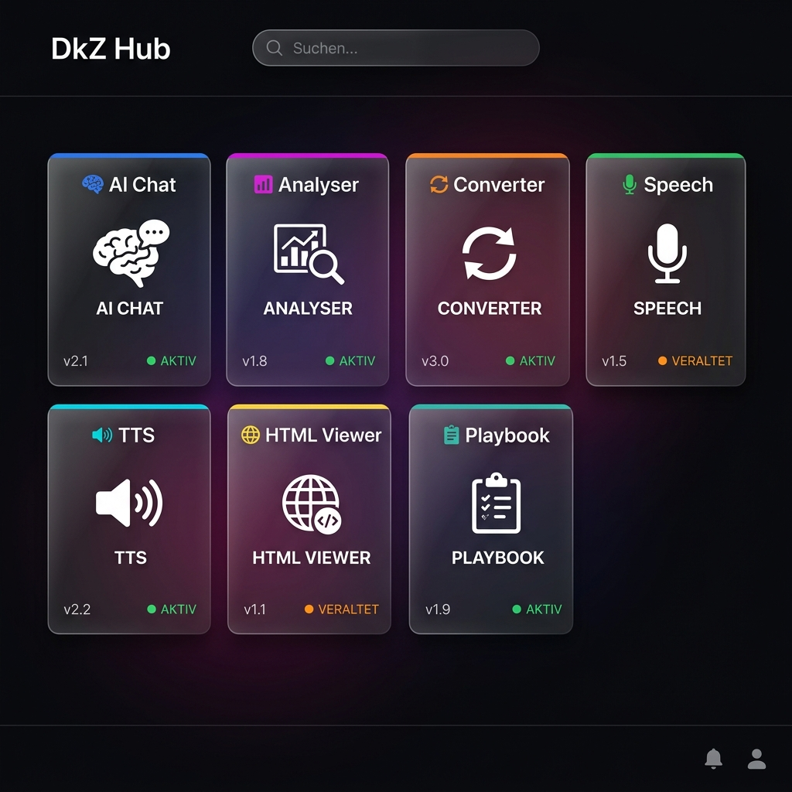
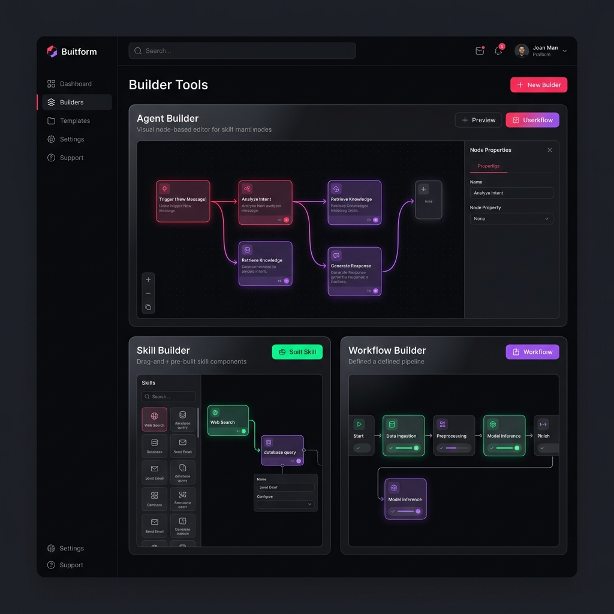

<div align="center">


# DEVKiTZ™

### ⚡ AI Developer Ecosystem — 130+ Module

[](https://7iked.github.io/devkitz-workspace/)
[](https://developer.mozilla.org/en-US/docs/Web/JavaScript)
[](#-module-galerie)
[](#)

<br>

**Das vollständige KI-Entwickler-Ökosystem.**
Kein React. Kein Framework. Nur Vanilla JS + CSS Custom Properties.

[🚀 **Live Demo**](https://7iked.github.io/devkitz-workspace/) · [📋 **Beta bewerben**](https://7iked.github.io/devkitz-workspace/hub/gate.html) · [💎 **Crowdfunding**](https://7iked.github.io/devkitz-workspace/hub/gate.html)

<br>


</div>

---

## 🎯 Was ist DEVKiTZ?

DEVKiTZ™ ist ein **komplettes Ökosystem für KI-gestützte Entwicklung** — gebaut als Vanilla HTML/CSS/JS Dashboard mit 130+ Modulen. Kein Framework-Overhead, kein npm-Dependency-Hell. Jedes Modul ist eine eigenständige HTML-Datei mit Glassmorphism-Design.

```
⚡ 130+ Module    🤖 NanoBot Schwarm    🚂 Rail-Loop Pipeline
🔐 Passkey Auth   📊 Auto-Health        🌐 Matrix Bridge
💎 DkZ Design v2  🎨 CSS Custom Props   📱 PWA-Ready
```

---

## ✨ Features

| Kategorie | Features |
|:----------|:---------|
| **🧠 AI & NLP** | Multi-Provider Chat, Text Analyse, Summarizer, Embeddings |
| **🛠️ Builder** | Agent Builder, Skill Builder, Workflow Builder, Team Builder |
| **📊 Dashboards** | Hub, Agenten Dashboard, SEO Dashboard, Loop Dashboard |
| **🔧 Tools** | Format Converter, HTML Viewer, Markdown, Speech-to-Text |
| **🔐 Security** | Passkey Auth, Security Scanner, Gate System, XSS-Schutz |
| **🤖 Automation** | NanoBot Schwarm, Tamagotchi Bot, AutoHealth, Watchdog |
| **📋 Management** | Kanban Board, Playbook Runner, Knowledge Hub, WissenHub |
| **🌐 Infrastructure** | MCP Dashboard, CI/CD Pipeline, VPS Monitor, Docker |

---

## 📸 Modul-Galerie

### 🏠 Hub — Zentrales Command Center



> Auto-Discovery Engine scannt alle Module, Health-Checks, Live-Status, Echtzeit-Suche und Kategorien-Filter.

### 🛠️ Builder — Visuelle Editoren



> Agent Builder (Node-basiert), Skill Builder, Workflow Builder, Action Builder — alles Drag & Drop.

---

## 🏗️ Architektur

```
DEVKiTZ/
├── 01_PROJECTS/
│   └── 01_dashboard/          # Haupt-Dashboard
│       ├── hub/               # Hub + Gate (Landing Page)
│       ├── modules/           # 130+ Module
│       │   ├── agent-builder/ # Visueller Agent-Editor
│       │   ├── ai_chat/       # Multi-Provider AI Chat
│       │   ├── graphify/      # Knowledge-Graph Visualizer
│       │   ├── wissen-hub/    # Wissens-Archiv + NLM
│       │   └── ...            # 126 weitere Module
│       └── shared/            # Shared Scripts + Design System
│           ├── dkz-theme.css  # CSS Custom Properties
│           ├── dkz-navbar.js  # Navigation
│           ├── dkz-debug.js   # Debug-Modus
│           ├── dkz-gate.js    # Auth-Guard
│           └── dkz-copilot.js # AI Assistent
├── 04_SYSTEM/
│   ├── BOTNET/                # NanoBot Docker Schwarm
│   └── DEVKITZ_WIKI/          # Dokumentation
├── ONTHERUN/
│   └── services/              # Backend Services
│       ├── rail-loop/         # 4-Stufen Text-Pipeline
│       ├── embeddings/        # MiniLM Embedding Server
│       └── matrix-bridge/     # Matrix Chat Bridge
└── docs/                      # Bilder + Dokumentation
```

---

## 🎨 Design System

DEVKiTZ nutzt ein eigenes **CSS Custom Properties Design System** — kein Tailwind, kein Bootstrap.

```css
:root {
    --accent: #fa1e4e;     /* Hot Pink */
    --bg:     #060608;     /* Deep Black */
    --green:  #00ff88;     /* Neon Green */
    --yellow: #ffb800;     /* Warning */
    --red:    #ff3b5c;     /* Error */
    --purple: #a855f7;     /* AI Purple */
    --font:   'Inter', sans-serif;
    --mono:   'JetBrains Mono', monospace;
}
```

**Glassmorphism-Karten** mit `backdrop-filter: blur(24px)` und subtilen Gradient-Borders. Jedes Modul erbt automatisch das Theme über `dkz-theme.css`.

---

## 📊 Modul-Status

| Status | Anzahl | Beschreibung |
|:-------|:-------|:-------------|
| ✅ **AKTIV** | 7 | Voll funktional, getestet |
| ⚠️ **VERALTET** | 13 | Laden, brauchen API-Updates |
| 🔵 **COMING SOON** | 5 | In aktiver Entwicklung |
| 🟡 **DEV** | 6 | Prototyp / Konzept |
| ⬜ **GEPLANT** | 4 | Roadmap |

**Gesamt: 35 registrierte Module im Hub + 96 weitere Module im Verzeichnis**

---

## 🚀 Quick Start

```bash
# Repository klonen
git clone https://github.com/7IKED/devkitz-workspace.git
cd devkitz-workspace

# Lokalen Server starten (Python)
python -m http.server 8080 -d 01_PROJECTS/01_dashboard

# Oder mit Node.js
npx serve 01_PROJECTS/01_dashboard

# Öffne http://localhost:8080
# Passphrase: dkz777
```

---

## 🤖 BMAD Methodik

DEVKiTZ nutzt die **BMAD™ Methodik** (Blueprint → Mapping → Analyse → Design) mit 7 spezialisierten Agenten:

| Agent | Rolle |
|:------|:------|
| 🎯 **James™** | Guardian — überwacht alle, coded nicht |
| 📋 **DkZ PM™** | Product Manager — Specs & User Stories |
| 🏗️ **Architekt™** | Architektur & Tech-Stack |
| 👨‍💻 **Developer™** | Code-Execution im Ralph-Loop |
| 🔍 **Reviewer™** | Qualitätsprüfung (CodeRabbit) |
| 🧪 **Tester™** | Tests & Validierung |
| 📚 **Dokumentar™** | README, Wiki, Learnings |

---

## 🔄 Ralph-Loop™

Jeder Task durchläuft den **Ralph-Loop™** — 6 Phasen für kontextfrischen Code:

```
1. LESEN    → Relevante Artefakte laden
2. SPAWN    → Frischer Kontext (kein Drift!)
3. EXECUTE  → Developer™ schreibt Code
4. VERIFY   → Tester™ + Reviewer™ prüfen
5. COMMIT   → Git + prd.json Update
6. LOOP     → Nächster Task
```

---

## 🛡️ Sicherheit

- **XSS-Schutz**: `esc()` bei jedem `innerHTML` — System-weit enforced
- **Gate-System**: Beta-Access mit Token-basierter Auth
- **Passkey Auth**: WebAuthn/FIDO2 für Biometrie-Login (Demo)
- **Security Scanner**: Automatische Vulnerability-Checks
- **CORS**: Kein externer API-Zugriff ohne Whitelist

---

## 💎 Unterstützen

DEVKiTZ™ ist ein Solo-Projekt. Jede Unterstützung hilft:

| Tier | Preis | Perks |
|:-----|:------|:------|
| 💚 **Supporter** | €5 | Name im README + Beta-Zugang |
| 🔨 **Builder** | €15 | Supporter + Priority Features + Discord |
| 🚀 **Pioneer** | €50 | Builder + Custom Modul + 1:1 Call |
| 👑 **Legend** | €100 | Pioneer + Lifetime Access + Co-Creator Badge |

[→ **Jetzt unterstützen**](https://7iked.github.io/devkitz-workspace/hub/gate.html)

---

## 📋 Tech Stack

| Bereich | Technologie |
|:--------|:------------|
| Frontend | Vanilla HTML5 + CSS3 + JS ES6+ |
| Design | DkZ Design System v2 (CSS Custom Properties) |
| Fonts | Inter (UI) + JetBrains Mono (Code) |
| Backend | Node.js 18+ / Express |
| Data | localStorage (Offline-First) + DuckDB |
| CI/CD | GitHub Actions + Docker |
| Hosting | GitHub Pages + Hostinger VPS |
| AI | Gemma 4, Qwen Coder, Deepseek R1 (lokal) |

---

## 📝 Lizenz

Proprietäre Lizenz — © 2026 777. Alle Rechte vorbehalten.
Beta-Zugang verfügbar über das [Gate-System](https://7iked.github.io/devkitz-workspace/).

---

<div align="center">

**Made with ❤️ by 777**

⚡ DEVKiTZ™ — *Build Different*

</div>
