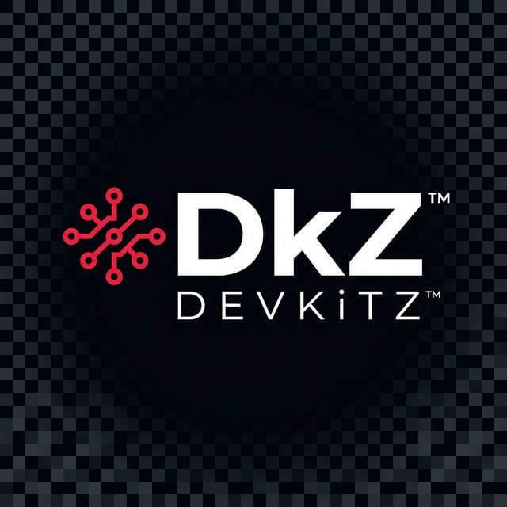
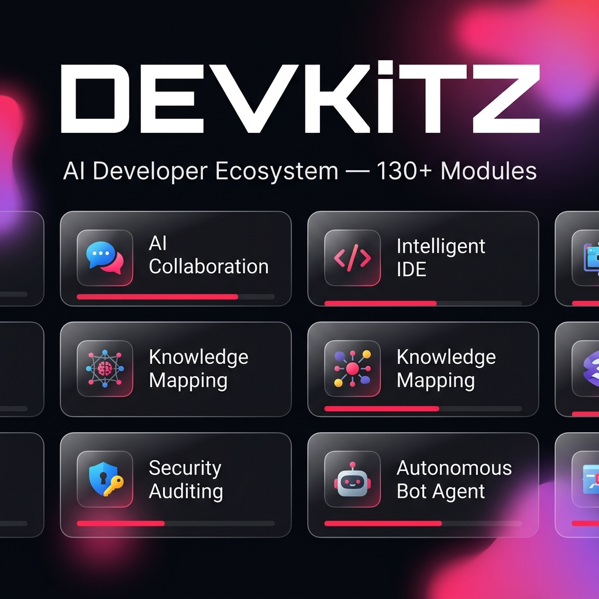

<div align="center">



# DEVKiTZ

**The Complete AI Developer Ecosystem**

[](https://devkitz.eu)
[](https://github.com/7IKED/devkitz-workspace/releases)
[](#license)
[](#)

[](https://developer.mozilla.org/en-US/docs/Web/JavaScript)
[](https://developer.mozilla.org/en-US/docs/Web/HTML)
[](https://developer.mozilla.org/en-US/docs/Web/CSS)
[](https://nodejs.org/)
[](https://duckdb.org/)
[](#module-overview)

<br>

**No React. No Framework. Pure Vanilla JS + CSS Custom Properties.**
**146 Modules. 7 AI Agents. 49 Domains. One Ecosystem.**

[**Live Demo**](https://7iked.github.io/devkitz-workspace/) | [**Beta Access**](https://7iked.github.io/devkitz-workspace/hub/gate.html) | [**Documentation**](https://github.com/7IKED/devkitz-workspace/wiki)

<br>

```
    ____  _______    __ __ _ _____ _____
   / __ \/ ____/ |  / // //_/  _/_  __/____
  / / / / __/  | | / // ,<  / /  / / /_  /
 / /_/ / /___  | |/ // /| |_/ /  / /   / /_
/_____/_____/  |___//_/ |_/___/  /_/   /___/

     AI Developer Ecosystem v2.0
```

<br>



</div>

---

## About

DEVKiTZ is a **complete AI-powered developer ecosystem** built entirely in Vanilla HTML5/CSS3/JavaScript ES6+. No framework overhead, no npm dependency hell. Each module is a self-contained HTML application with a unified Glassmorphism design system, connected through a central Hub with auto-discovery, health monitoring, and real-time search.

```
 146+ Modules       NanoBot Swarm       Rail-Loop Pipeline
 Passkey Auth       Auto-Health         Matrix Bridge
 DkZ Design v2     CSS Custom Props    PWA-Ready
```

---

## Ecosystem Architecture

```
                          +------------------+
                          |   devkitz.eu     |
                          |   Landing Page   |
                          +--------+---------+
                                   |
                    +--------------+--------------+
                    |                             |
           +--------+--------+          +--------+--------+
           |  dkz.app (VPS)  |          | GitHub Pages    |
           |  Hostinger      |          | Static Deploy   |
           +--------+--------+          +--------+--------+
                    |                             |
        +-----------+-----------+     +-----------+-----------+
        |           |           |     |                       |
   +----+----+ +----+----+ +---+---+  |   +----------------+
   | MCP     | | Rail    | | Matrix|  +---+ 146 Modules    |
   | Server  | | Loop    | | Bridge|      | Vanilla JS     |
   | 34 Tools| | Pipeline| | Chat  |      +----------------+
   +---------+ +---------+ +-------+
```

### VPS Infrastructure (Hostinger)

| Component | Port | Purpose |
|:----------|:-----|:--------|
| ONTHERUN MCP | 3030 | Model Context Protocol Server (34+ Tools) |
| NanoChat Bridge | 3040 | Agent-Dashboard Communication |
| Rail-Loop | 3050 | 4-Stage Text Processing Pipeline |
| Embeddings | 3060 | MiniLM Semantic Search |
| Matrix Bridge | 8008 | Encrypted Chat Federation |
| LibreChat | 3080 | Multi-Provider AI Chat |

### LLM Fleet

| Model | Type | Use Case |
|:------|:-----|:---------|
| Gemma 4 26B | Local | Code Generation, Analysis |
| Qwen 3.6 27B | Local | Reasoning, Planning |
| DeepSeek V3/R1 | Cloud | Complex Research |
| Gemini 2.5 Pro | Cloud | Agent Orchestration |
| Claude 4 Sonnet | Cloud | Code Review, Documentation |

---

## Module Overview

### 146 Modules across 12 Categories

| Category | Modules | Highlights |
|:---------|:--------|:-----------|
| **AI & NLP** | 18 | Multi-Provider Chat, Summarizer, Embeddings, Sentiment |
| **Builder** | 12 | Agent Builder, Skill Builder, Workflow Builder, Team Builder |
| **Dashboard** | 14 | Hub, Agent Dashboard, SEO Dashboard, Loop Dashboard |
| **Tools** | 16 | Format Converter, HTML Viewer, Markdown Editor, Diff Tool |
| **Security** | 8 | Passkey Auth (WebAuthn), Security Scanner, Gate System |
| **Automation** | 11 | NanoBot Swarm, Tamagotchi Bot, AutoHealth, Watchdog |
| **Management** | 15 | Kanban Board, Playbook Runner, Knowledge Hub, WissenHub |
| **Infrastructure** | 10 | MCP Dashboard, CI/CD Pipeline, VPS Monitor, Docker |
| **Content** | 12 | Flyer Engine, Doc Generator, NotebookLM, Blog System |
| **Analytics** | 9 | DuckDB Analytics, Iceberg Tables, SEO Tracker, Metrics |
| **Design** | 11 | Graphify (Knowledge Graph), Color Engine, Font Manager |
| **Communication** | 10 | Matrix Bridge, NanoChat, Webhook Dashboard, Notifications |

---

## Design System

DEVKiTZ uses a custom **CSS Custom Properties Design System** -- no Tailwind, no Bootstrap.

```css
:root {
    --accent:  #fa1e4e;     /* Hot Pink - Primary Brand    */
    --bg:      #060608;     /* Deep Black - Background     */
    --green:   #00ff88;     /* Neon Green - Success        */
    --yellow:  #ffb800;     /* Amber - Warning             */
    --red:     #ff3b5c;     /* Coral Red - Error           */
    --purple:  #a855f7;     /* AI Purple - Special         */

    --font-ui:   'Inter', sans-serif;
    --font-code: 'JetBrains Mono', monospace;

    --glass:     rgba(255,255,255,0.04);
    --blur:      blur(24px);
    --radius:    12px;
    --border:    1px solid rgba(255,255,255,0.08);
}
```

**Glassmorphism Cards** with `backdrop-filter: blur(24px)` and gradient borders. Every module inherits the theme via `dkz-theme.css`.

---

## BMAD Methodology

DEVKiTZ uses the **BMAD Methodology** (Blueprint - Mapping - Analysis - Design) with 7 specialized AI agents:

| # | Agent | Role |
|:--|:------|:-----|
| 1 | **James** | Guardian -- oversees all agents, never codes |
| 2 | **DkZ PM** | Product Manager -- specs & user stories |
| 3 | **Architect** | Architecture & tech stack decisions |
| 4 | **Developer** | Code execution in Ralph-Loop |
| 5 | **Reviewer** | Quality assurance (CodeRabbit integration) |
| 6 | **Tester** | Tests & validation (TestStrasse v3) |
| 7 | **Dokumentar** | README, Wiki, Learnings |

### Ralph-Loop (6 Phases)

Every task runs through the **Ralph-Loop** -- fresh context for every iteration:

```
1. READ     ->  Load relevant artifacts only
2. SPAWN    ->  Fresh context (no drift!)
3. EXECUTE  ->  Developer writes code
4. VERIFY   ->  Tester + Reviewer check
5. COMMIT   ->  Git + prd.json update
6. LOOP     ->  Next task
```

---

## Project Structure

```
DEVKiTZ/
|-- 01_PROJECTS/
|   |-- 01_dashboard/          # Main Dashboard
|       |-- hub/               # Hub + Gate (Landing Page)
|       |-- modules/           # 146+ Modules
|       |   |-- agent-builder/ # Visual Agent Editor
|       |   |-- ai_chat/       # Multi-Provider AI Chat
|       |   |-- graphify/      # Knowledge Graph Visualizer
|       |   |-- wissen-hub/    # Knowledge Archive + NLM
|       |   |-- trading/       # Trading Bot System
|       |   |-- ...            # 141 more modules
|       |-- shared/            # Shared Scripts + Design System
|           |-- dkz-theme.css  # CSS Custom Properties
|           |-- dkz-navbar.js  # Navigation
|           |-- dkz-debug.js   # Debug Mode
|           |-- dkz-gate.js    # Auth Guard
|           |-- dkz-copilot.js # AI Assistant
|-- 04_SYSTEM/
|   |-- BOTNET/                # NanoBot Docker Swarm
|   |-- DEVKITZ_WIKI/          # Documentation (4121 entries)
|-- ONTHERUN/
|   |-- services/              # Backend Services
|       |-- rail-loop/         # 4-Stage Text Pipeline
|       |-- embeddings/        # MiniLM Embedding Server
|       |-- matrix-bridge/     # Matrix Chat Bridge
|-- .agents/
|   |-- skills/                # 53 Agent Skills
|   |-- workflows/             # 77 Workflows
|-- docs/                      # Images + Documentation
```

---

## Quick Start

```bash
# Clone the repository
git clone https://github.com/7IKED/devkitz-workspace.git
cd devkitz-workspace

# Start a local server (Python)
python -m http.server 8080 -d 01_PROJECTS/01_dashboard

# Or with Node.js
npx serve 01_PROJECTS/01_dashboard

# Open http://localhost:8080
```

---

## Domain Network

| Domain | Purpose |
|:-------|:--------|
| **devkitz.eu** | Main Landing Page |
| **dkz.app** | VPS Application Server |
| **devkitz.de** | German Portal |
| **devkitz.at** | Austrian Portal |
| **+ 45 more** | Multi-Domain Network |

---

## Security

- **XSS Protection**: `esc()` on every `innerHTML` -- system-wide enforced
- **Gate System**: Beta access with token-based auth
- **Passkey Auth**: WebAuthn/FIDO2 biometric login
- **Security Scanner**: Automated vulnerability checks
- **CORS**: No external API access without whitelist

---

## Related Repositories

| Repository | Description |
|:-----------|:------------|
| [7IKED/aiaikirk](https://github.com/7IKED/aiaikirk) | AiAi Kirk -- Terminal Command Center & OSINT Dashboard |
| [7IKED/devkitz-runtime](https://github.com/7IKED/devkitz-runtime) | OpenCode Desktop Electron/Chromium Runtime |
| [7IKED/hermes-desktop](https://github.com/7IKED/hermes-desktop) | Hermes Agent Desktop Application |
| [7IKED/devkitz-vault](https://github.com/7IKED/devkitz-vault) | Obsidian Skills Vault (Second Brain) |
| [7IKED/dkz-ontherun](https://github.com/7IKED/dkz-ontherun) | MCP Server with 34+ Tools |
| [7IKED/dkz-dashboard](https://github.com/7IKED/dkz-dashboard) | 89+ Module Dashboard in Vanilla JS |
| [7IKED/dkz-graphify](https://github.com/7IKED/dkz-graphify) | Interactive Knowledge Graph |
| [D-VKITZ/dkz-design-system](https://github.com/D-VKITZ/dkz-design-system) | DkZ Design System v2 |

---

## Tech Stack

| Area | Technology |
|:-----|:-----------|
| Frontend | Vanilla HTML5 + CSS3 + JS ES6+ |
| Design | DkZ Design System v2 (CSS Custom Properties) |
| Fonts | Inter (UI) + JetBrains Mono (Code) |
| Backend | Node.js 18+ / Express |
| Data | localStorage (Offline-First) + DuckDB + Apache Iceberg |
| CI/CD | GitHub Actions + Docker |
| Hosting | GitHub Pages + Hostinger VPS |
| AI | Gemma 4, Qwen Coder, DeepSeek R1, Gemini, Claude |

---

## License

Proprietary License -- (c) 2026 777. All rights reserved.
Beta access available via the [Gate System](https://7iked.github.io/devkitz-workspace/).

---

<div align="center">

**Built with precision by 777**

[](https://devkitz.eu)
[](https://dkz.app)
[](https://github.com/D-VKITZ)
[](https://github.com/7IKED)

*DEVKiTZ -- Build Different.*

</div>
