# 🔄 Flussdiagramme — DEVKiTZ™ Ökosystem

> Architektur-Übersicht aller 20 Projekte · Stand: 2026-05-10

---

## 📊 Gesamt-Ökosystem

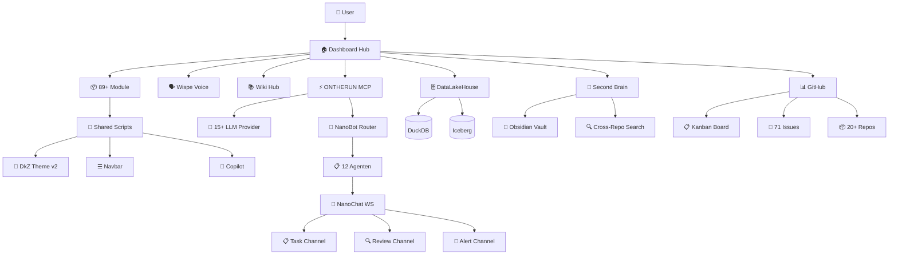

---

## 📦 Projekte (20)

### 1. Dashboard Hub

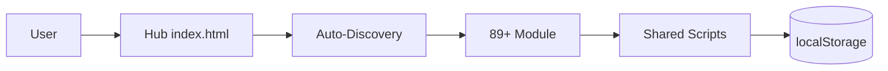

### 2. DataLakeHouse™

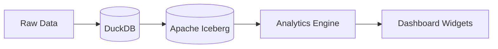

### 3. FlyerPRO™

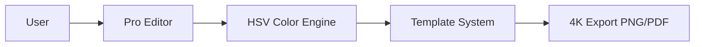

### 4. Flyer Engine

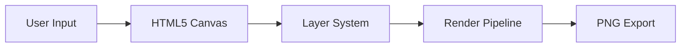

### 5. Domain Control

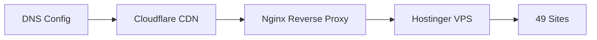

### 6. Doc Engine

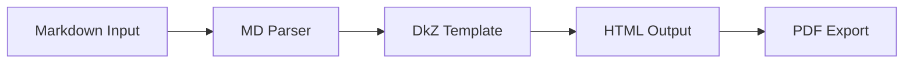

### 7. DkZ Core (OpenClaw)

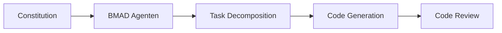

### 8. AiAiKirk

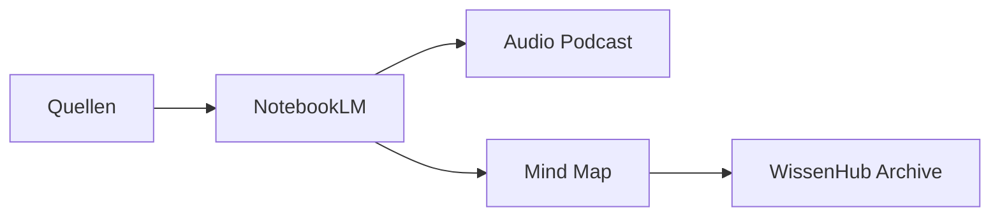

### 9. Autopilot

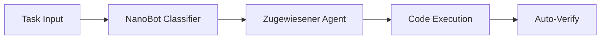

### 10. devkitz.eu Landing

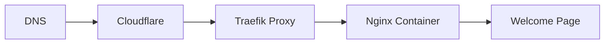

### 11. Wiki Hub™

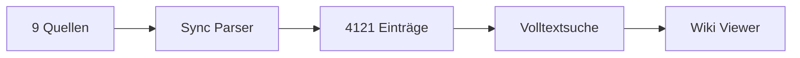

### 12. Wispe™ Voice Agent

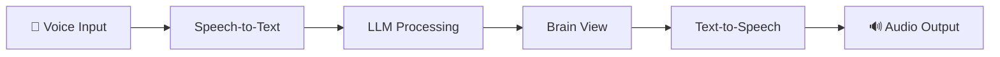

### 13. Trading Agents PRO

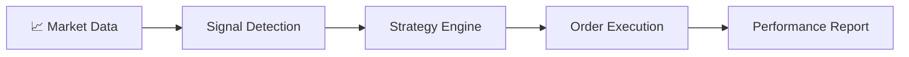

### 14. Chrome Extensions

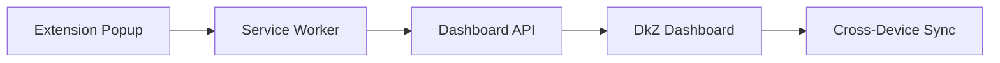

### 15. FishTTS

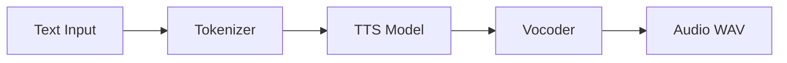

### 16. ComfyUI Bridge

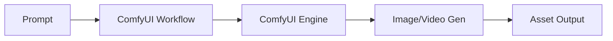

### 17. Passkeys

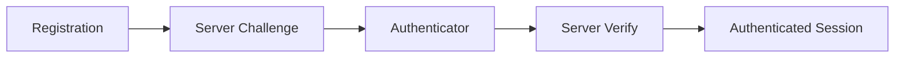

### 18. Second Brain

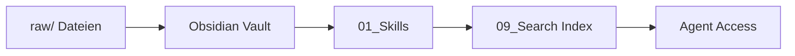

### 19. ONTHERUN™ MCP

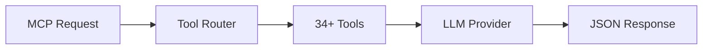

### 20. Graphify

```mermaid
graph LR
    Data[Knowledge Data] --> Nodes[Graph Nodes]
    Nodes --> Edges[Relationships]
    Edges --> Layout[Force Layout]
    Layout --> Interactive[Interactive UI]
```

---

## 📋 Repo-Registry

| # | Repo | Beschreibung | Visibility |
|:--|:-----|:-------------|:-----------|
| 1 | [dkz-dashboard](https://github.com/7IKED/dkz-dashboard) | 89+ Module Dashboard | 🔒 Private |
| 2 | [dkz-datalakehouse](https://github.com/7IKED/dkz-datalakehouse) | DuckDB + Iceberg | 🔒 Private |
| 3 | [dkz-flyer-pro](https://github.com/7IKED/dkz-flyer-pro) | FlyerPRO Design-Tool | 🔒 Private |
| 4 | [dkz-flyer-engine](https://github.com/7IKED/dkz-flyer-engine) | Canvas Flyer Generator | 🔒 Private |
| 5 | [dkz-domain-control](https://github.com/7IKED/dkz-domain-control) | 49 Domain Management | 🔒 Private |
| 6 | [dkz-doc-engine](https://github.com/7IKED/dkz-doc-engine) | Dokumenten-Generator | 🔒 Private |
| 7 | [dkz-core](https://github.com/7IKED/dkz-core) | Kern-Projekt OpenClaw | 🔒 Private |
| 8 | [dkz-aiaikirk](https://github.com/7IKED/dkz-aiaikirk) | NotebookLM + AI | 🔒 Private |
| 9 | [dkz-autopilot](https://github.com/7IKED/dkz-autopilot) | Agent-Workflow | 🔒 Private |
| 10 | [dkz-landing-eu](https://github.com/7IKED/dkz-landing-eu) | devkitz.eu | 🔒 Private |
| 11 | [dkz-wiki-hub](https://github.com/7IKED/dkz-wiki-hub) | Wissensbaum 4121 | 🔒 Private |
| 12 | [dkz-wispe](https://github.com/7IKED/dkz-wispe) | Voice Agent | 🔒 Private |
| 13 | [dkz-trading-agents](https://github.com/7IKED/dkz-trading-agents) | Trading PRO | 🔒 Private |
| 14 | [dkz-chrome-extensions](https://github.com/7IKED/dkz-chrome-extensions) | Chrome DkZ Hub | 🔒 Private |
| 15 | [dkz-fishtts](https://github.com/7IKED/dkz-fishtts) | Text-to-Speech | 🔒 Private |
| 16 | [dkz-comfyui-bridge](https://github.com/7IKED/dkz-comfyui-bridge) | ComfyUI Multimodal | 🔒 Private |
| 17 | [dkz-passkeys](https://github.com/7IKED/dkz-passkeys) | WebAuthn | 🔒 Private |
| 18 | [dkz-second-brain](https://github.com/7IKED/dkz-second-brain) | Obsidian Knowledge | 🔒 Private |
| 19 | [dkz-ontherun](https://github.com/7IKED/dkz-ontherun) | MCP Server | 🔒 Private |
| 20 | [dkz-graphify](https://github.com/7IKED/dkz-graphify) | Knowledge Graph | 🔒 Private |
| — | [devkitz-workspace](https://github.com/7IKED/devkitz-workspace) | **Hauptrepo (alles)** | 🔒 Private |

---

> **✨ DkZ devkitz** — 21 Repos · 71 Issues · Kanban Board
